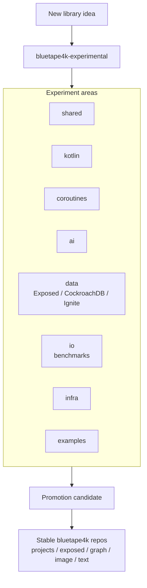

# bluetape4k-experimental

[](https://github.com/bluetape4k/bluetape4k-experimental/actions/workflows/ci.yml)
[](https://kotlinlang.org)
[](https://openjdk.org)
[](LICENSE)

[English](./README.md) | 한국어


안정 라이브러리로 옮기기 전 새로운 bluetape4k 아이디어를 검증하는 Kotlin/JVM 실험 모듈 모음입니다.

## 프로젝트 목적

`bluetape4k-experimental`은 Kotlin 2.3, Java 25, Spring Boot 4, Exposed, cache,
coroutine, data, I/O, benchmark 아이디어를 검증하는 공간입니다. 이 저장소의 모듈은 안정
artifact로 배포하지 않으며, 계약·빌드 동작·마이그레이션 경로를 확인한 뒤 승격합니다.

## 제공 기능

- **Prototype module** — Kotlin, coroutine, AI, data, I/O, infra 아이디어 빠른 검증
- **Spring Boot 4 실험** — 최신 Boot 라인의 auto-configuration/integration 확인
- **Exposed DB 실험** — CockroachDB, Ignite 계열 호환성 작업의 안정화 전 검증
- **Benchmark lane** — serializer/compressor와 infra 성능 근거 수집
- **Promotion staging** — stable repo로 옮기기 전 동작을 증명하는 안전한 공간

## 아키텍처



## 모듈 그룹

| 디렉토리 | 목적 |
|---|---|
| `shared/` | 공통 유틸리티 |
| `kotlin/` | Kotlin 언어 기능 실험 |
| `coroutines/` | Coroutine/Flow 실험 |
| `ai/` | AI/LLM 통합 실험 |
| `data/` | Exposed CockroachDB/Ignite 등 data-layer 실험 |
| `io/` | I/O, 직렬화, benchmark 실험 |
| `infra/` | 인프라/cache 실험 |
| `examples/` | 실행 가능한 예제 애플리케이션 |

## 요구사항

- Kotlin 2.3+
- Java 25
- 필요한 경우 Spring Boot 4.x
- Gradle 9.x

## 빌드

기본적으로 root 전체 빌드를 실행하지 말고, 영향을 받는 모듈만 검증합니다.

```bash
./gradlew :<module>:build
./gradlew :<module>:test
./gradlew :<module>:check
```

## 주요 실험

- `io/benchmarks`: serializer/compressor 성능과 크기 비교
- `data/exposed-cockroachdb`: CockroachDB JDBC dialect 실험
- `data/exposed-ignite3`: Ignite 계열 data integration 실험

## 모듈 등록

카테고리 디렉토리는 `settings.gradle.kts`에서 자동 감지합니다.

예: `data/exposed-cockroachdb/` -> `:exposed-cockroachdb`
