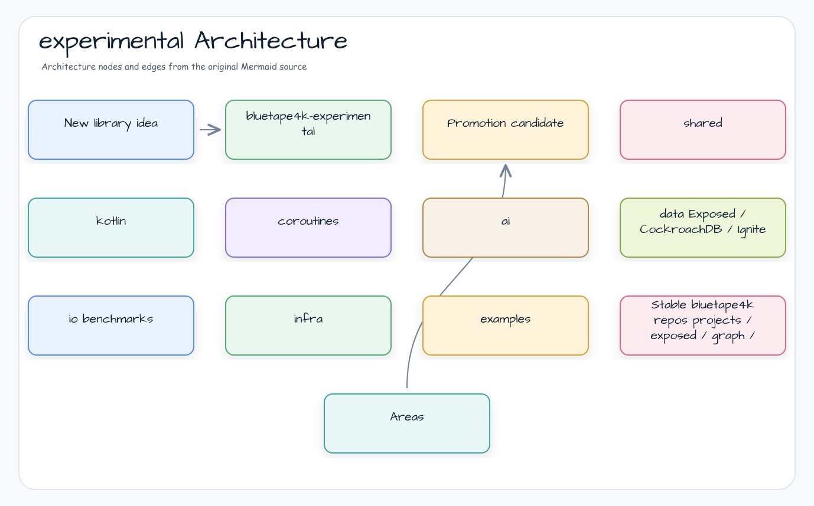

# bluetape4k-experimental

[](https://github.com/bluetape4k/bluetape4k-experimental/actions/workflows/ci.yml)
[](https://kotlinlang.org)
[](https://openjdk.org)
[](LICENSE)

English | [한국어](./README.ko.md)


Experimental Kotlin/JVM modules for validating new bluetape4k ideas before they
move into stable library repositories.

## Project Purpose

`bluetape4k-experimental` is the proving ground for Kotlin 2.3, Java 25, Spring
Boot 4, Exposed, cache, coroutine, data, I/O, and benchmark ideas. Modules here
are not published as stable artifacts; they are used to validate contracts,
build behavior, and migration paths before promotion.

## What It Provides

- **Prototype modules** — quick validation for Kotlin, coroutine, AI, data, I/O,
  and infrastructure ideas.
- **Spring Boot 4 experiments** — auto-configuration and integration checks
  against the newest Boot line.
- **Exposed database experiments** — CockroachDB and Ignite-style compatibility
  work before stable extraction.
- **Benchmark lanes** — serializer/compressor and infrastructure performance
  evidence.
- **Promotion staging** — a safe place to prove behavior before moving code into
  `bluetape4k-projects` or standalone bluetape4k repositories.

## Architecture



## Module Groups

| Directory | Purpose |
|---|---|
| `shared/` | Shared utilities |
| `kotlin/` | Kotlin language feature experiments |
| `coroutines/` | Coroutine and Flow experiments |
| `ai/` | AI/LLM integration experiments |
| `data/` | Data-layer experiments such as Exposed CockroachDB/Ignite |
| `io/` | I/O, serialization, and benchmark experiments |
| `infra/` | Infrastructure and cache experiments |
| `examples/` | Runnable example applications |

## Requirements

- Kotlin 2.3+
- Java 25
- Spring Boot 4.x where applicable
- Gradle 9.x

## Build

Do not run a full root build by default. Validate only the affected module.

```bash
./gradlew :<module>:build
./gradlew :<module>:test
./gradlew :<module>:check
```

## Notable Experiments

- `io/benchmarks`: serializer and compressor performance / size evidence.
- `data/exposed-cockroachdb`: CockroachDB JDBC dialect experiments.
- `data/exposed-ignite3`: Ignite-style data integration experiments.

## Module Registration

Category directories are auto-detected by `settings.gradle.kts`.

Example: `data/exposed-cockroachdb/` becomes `:exposed-cockroachdb`.
