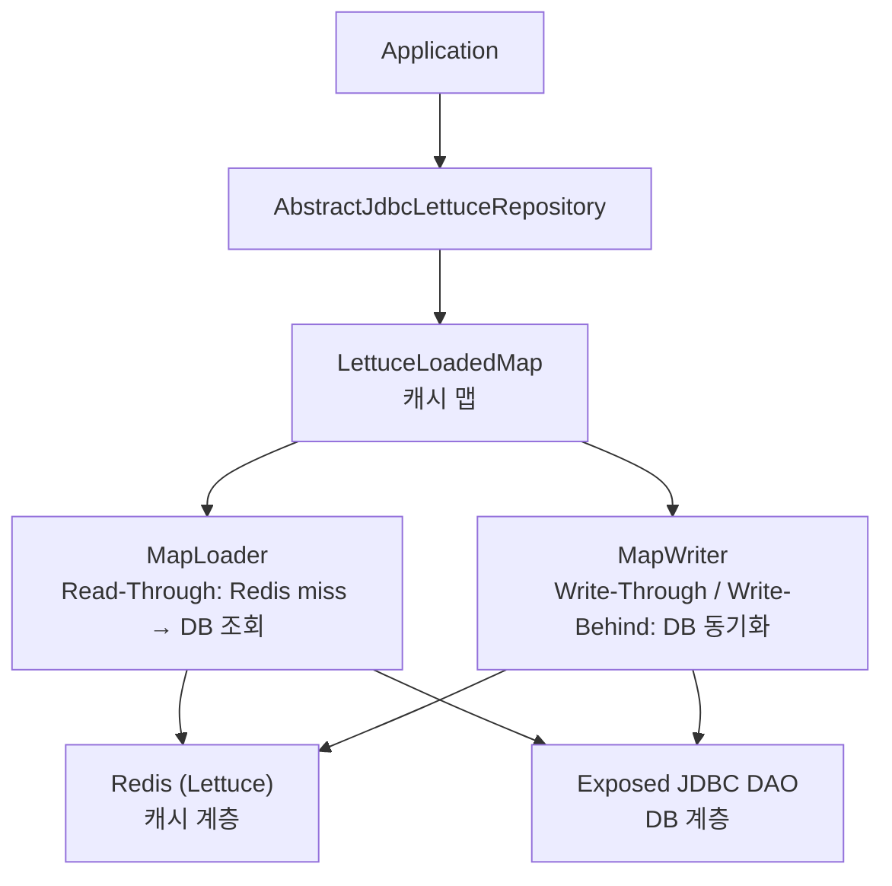
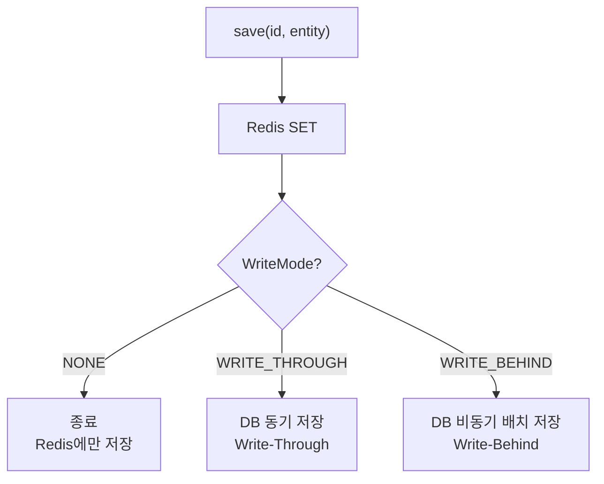

# data-exposed-lettuce

JetBrains Exposed JDBC DAO와 Lettuce Redis를 결합한 **Read-Through / Write-Through / Write-Behind 캐시** 레포지토리 모듈.

DB 조회 결과를 Redis에 자동으로 캐시하고, 쓰기 시 DB와 Redis를 동기화한다.

## 아키텍처



## 핵심 컴포넌트

| 클래스/인터페이스                              | 설명                                              |
|----------------------------------------|-------------------------------------------------|
| `AbstractJdbcLettuceRepository<ID, E>` | Exposed + Lettuce 결합 추상 레포지토리                   |
| `LettuceLoadedMap<K, V>`               | Read-Through + Write 전략이 적용된 Redis 기반 Map       |
| `MapLoader<K, V>`                      | 캐시 미스 시 DB에서 값을 로드하는 인터페이스                      |
| `MapWriter<K, V>`                      | 캐시 쓰기 시 DB에 동기화하는 인터페이스                         |
| `ExposedEntityMapLoader<ID, E>`        | Exposed Table 기반 `MapLoader` 구현체                |
| `ExposedEntityMapWriter<ID, E>`        | Exposed Table 기반 `MapWriter` 구현체                |
| `LettuceCacheConfig`                   | 캐시 동작 설정                                        |
| `WriteMode`                            | 쓰기 전략 (`NONE`, `WRITE_THROUGH`, `WRITE_BEHIND`) |

## 쓰기 전략



| WriteMode       | 동작                                |
|-----------------|-----------------------------------|
| `NONE`          | Redis에만 저장 (DB 미기록, Read-Only 캐시) |
| `WRITE_THROUGH` | Redis + DB 동시 저장 (기본값)            |
| `WRITE_BEHIND`  | Redis 즉시 저장 + DB 비동기 배치 저장        |

## 사용 방법

### 1. 엔티티 및 테이블 정의

```kotlin
object Products: LongIdTable("products") {
    val name = varchar("name", 255)
    val price = double("price")
}

data class ProductDto(val id: Long, val name: String, val price: Double)
```

### 2. Repository 구현

```kotlin
class ProductRepository(
    redisClient: RedisClient,
    config: LettuceCacheConfig = LettuceCacheConfig.READ_WRITE_THROUGH,
): AbstractJdbcLettuceRepository<Long, ProductDto>(redisClient, config) {

    override val table = Products

    override fun ResultRow.toEntity() = ProductDto(
        id = this[Products.id].value,
        name = this[Products.name],
        price = this[Products.price],
    )

    override fun UpdateStatement.updateEntity(entity: ProductDto) {
        this[Products.name] = entity.name
        this[Products.price] = entity.price
    }

    override fun BatchInsertStatement.insertEntity(entity: ProductDto) {
        this[Products.name] = entity.name
        this[Products.price] = entity.price
    }
}
```

### 3. 사용

```kotlin
val redisClient = RedisClient.create("redis://localhost:6379")
val repo = ProductRepository(redisClient)

// 조회 (캐시 미스 시 DB 자동 조회)
val product: ProductDto? = transaction { repo.findById(1L) }

// 저장 (Redis + DB 동시)
transaction { repo.save(1L, ProductDto(1L, "Widget", 9.99)) }

// 일괄 조회
val products: Map<Long, ProductDto> = transaction { repo.findAll(setOf(1L, 2L, 3L)) }

// 삭제
transaction { repo.delete(1L) }

// 캐시 비우기 (DB는 유지)
repo.clearCache()

repo.close()
redisClient.shutdown()
```

## LettuceCacheConfig 설정

```kotlin
LettuceCacheConfig(
    writeMode = WriteMode.WRITE_THROUGH,    // 쓰기 전략
    ttl = Duration.ofMinutes(30),           // Redis 항목 TTL
    keyPrefix = "cache",                    // Redis 키 prefix
    writeRetryAttempts = 3,                 // DB 쓰기 재시도 횟수
    writeRetryInterval = Duration.ofMillis(100),

    // Write-Behind 전용 설정
    writeBehindBatchSize = 50,
    writeBehindDelay = Duration.ofMillis(1000),
    writeBehindQueueCapacity = 10_000,
)

// 미리 정의된 설정
LettuceCacheConfig.READ_ONLY          // WriteMode.NONE
LettuceCacheConfig.READ_WRITE_THROUGH // WriteMode.WRITE_THROUGH (기본)
LettuceCacheConfig.WRITE_BEHIND       // WriteMode.WRITE_BEHIND
```

## 주의사항

- 모든 DB 연산은 `transaction {}` 블록 내에서 실행해야 한다.
- `LettuceBinaryCodecs`는 사용 금지 — `LettuceBinaryCodec(BinarySerializers.LZ4Fory)` 직접 사용.
- `fory-kotlin`, `lz4-java` 의존성을 명시적으로 추가해야 한다.

## 테스트

```bash
./gradlew :exposed-lettuce:test
```
