# README UML 다이어그램 추가 구현 계획

> **For agentic workers:** REQUIRED SUB-SKILL: Use superpowers:subagent-driven-development (recommended) or superpowers:executing-plans to implement this plan task-by-task. Steps use checkbox (`- [ ]`) syntax for tracking.

**Goal:** 13개 모듈 README에 Mermaid UML 다이어그램 22개를 추가하여 아키텍처와 동작 흐름을 시각적으로 설명한다.

**Architecture:** 기존 ASCII 아트 다이어그램은 동등한 Mermaid로 교체하고, 새 시퀀스/클래스 다이어그램은 기존 텍스트 설명 뒤에 삽입한다. 중복 설명은 추가하지 않는다.

**Tech Stack:** Mermaid (GitHub 렌더링 지원), Markdown

---

## 수정 대상 파일

| 파일 | 작업 | 다이어그램 수 |
|------|------|-------------|
| `infra/cache-lettuce/README.md` | ASCII → Mermaid 교체 + 시퀀스 2개 추가 | 3 |
| `infra/hibernate-cache-lettuce/README.md` | ASCII → Mermaid 교체 + 시퀀스 1개 추가 | 2 |
| `data/exposed-lettuce/README.md` | ASCII → Mermaid 교체 + 시퀀스/플로우 2개 추가 | 3 |
| `spring-boot/hibernate-lettuce/README.md` | 컴포넌트 + 플로우차트 2개 추가 | 2 |
| `spring-data/exposed-jdbc-spring-data/README.md` | 클래스 + 플로우차트 2개 추가 | 2 |
| `spring-data/exposed-r2dbc-spring-data/README.md` | 클래스 + 시퀀스 2개 추가 | 2 |
| `utils/ulid/README.md` | 클래스 + 플로우차트 2개 추가 | 2 |
| `examples/spring-boot-hibernate-lettuce-demo/README.md` | 시퀀스 1개 추가 | 1 |
| `examples/exposed-r2dbc-spring-data-webflux-demo/README.md` | 시퀀스 1개 추가 | 1 |
| `examples/exposed-jdbc-spring-data-mvc-demo/README.md` | 시퀀스 1개 추가 | 1 |
| `examples/exposed-jpa-benchmark/README.md` | 아키텍처 1개 추가 | 1 |
| `shared/README.md` | 컴포넌트 1개 추가 | 1 |
| `io/benchmarks/README.md` | 플로우차트 1개 추가 | 1 |

---

## Task 1: infra/cache-lettuce — 아키텍처 + 시퀀스 3개

**Files:**
- Modify: `infra/cache-lettuce/README.md`

- [ ] **Step 1: `## 아키텍처` 섹션의 ASCII 블록을 Mermaid로 교체**

`## 아키텍처` 아래 ` ```\nApplication\n... ``` ` 블록을 다음으로 교체:

````markdown
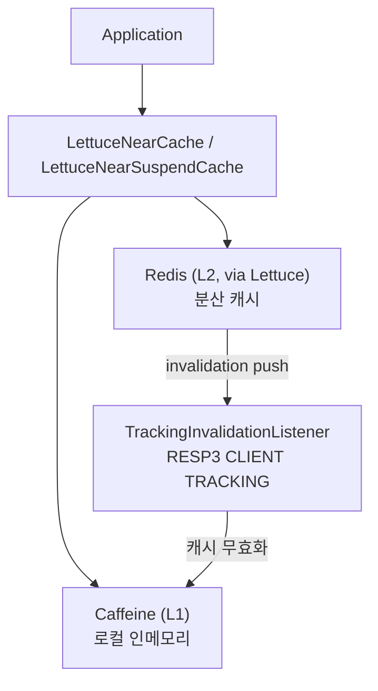
```mermaid
graph TD
    App["Application"]
    Cache["LettuceNearCache / LettuceNearSuspendCache"]
    L1["Caffeine (L1)\n로컬 인메모리"]
    L2["Redis (L2, via Lettuce)\n분산 캐시"]
    Tracking["TrackingInvalidationListener\nRESP3 CLIENT TRACKING"]

    App --> Cache
    Cache --> L1
    Cache --> L2
    L2 -->|"invalidation push"| Tracking
    Tracking -->|"캐시 무효화"| L1
```
````

- [ ] **Step 2: `### 읽기 전략 (Read-Through)` 앞에 시퀀스 다이어그램 삽입**

````markdown
#### Read-Through 흐름

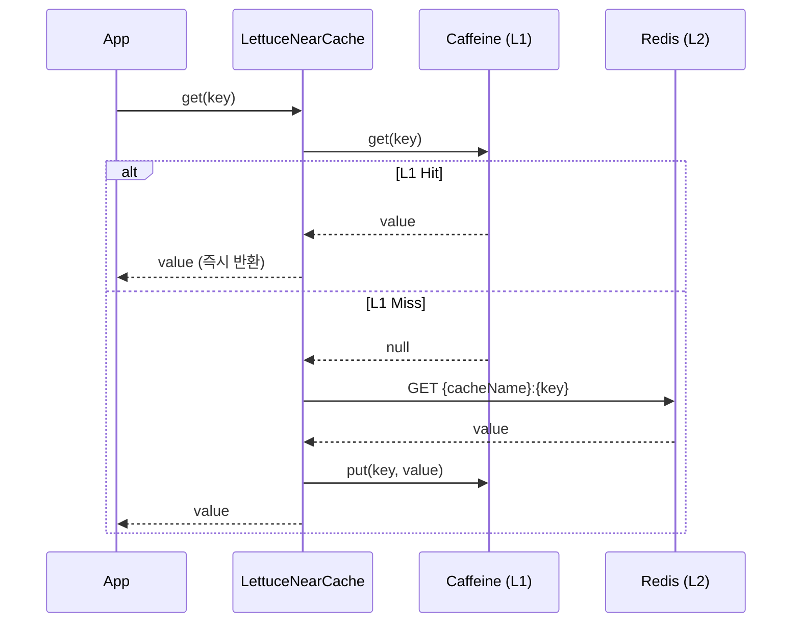
```mermaid
sequenceDiagram
    participant App
    participant Cache as LettuceNearCache
    participant L1 as Caffeine (L1)
    participant L2 as Redis (L2)

    App->>Cache: get(key)
    Cache->>L1: get(key)
    alt L1 Hit
        L1-->>Cache: value
        Cache-->>App: value (즉시 반환)
    else L1 Miss
        L1-->>Cache: null
        Cache->>L2: GET {cacheName}:{key}
        L2-->>Cache: value
        Cache->>L1: put(key, value)
        Cache-->>App: value
    end
```
````

- [ ] **Step 3: `## CLIENT TRACKING 동작 원리` 섹션의 ASCII를 Mermaid 시퀀스로 교체**

기존 ` ``` ` 블록(인스턴스 A / Redis 서버 / 인스턴스 B ASCII)을 다음으로 교체:

````markdown
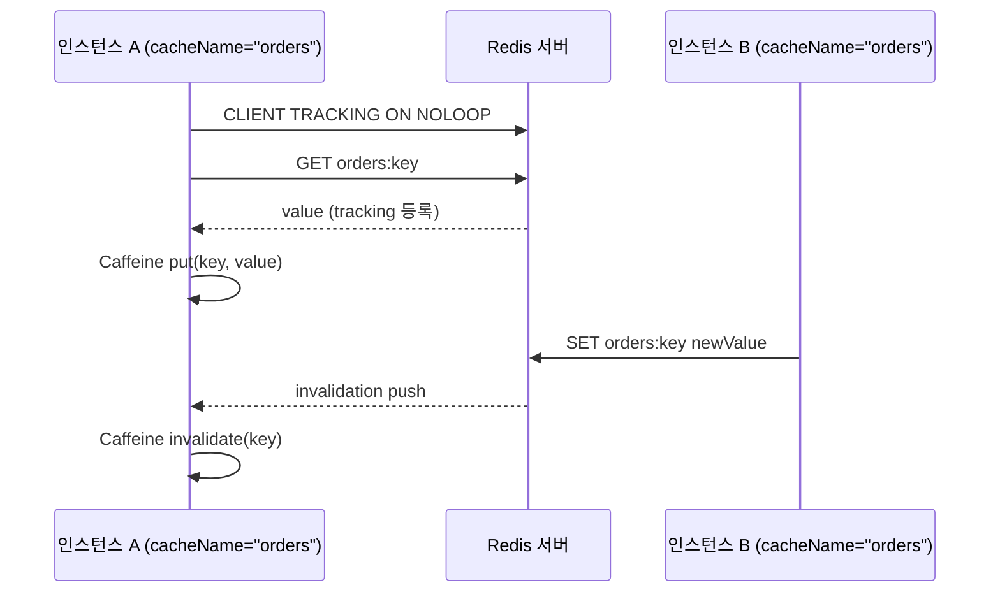
```mermaid
sequenceDiagram
    participant A as 인스턴스 A (cacheName="orders")
    participant Redis as Redis 서버
    participant B as 인스턴스 B (cacheName="orders")

    A->>Redis: CLIENT TRACKING ON NOLOOP
    A->>Redis: GET orders:key
    Redis-->>A: value (tracking 등록)
    A->>A: Caffeine put(key, value)
    B->>Redis: SET orders:key newValue
    Redis-->>A: invalidation push
    A->>A: Caffeine invalidate(key)
```
````

- [ ] **Step 4: 변경 내용 커밋**

```bash
git add infra/cache-lettuce/README.md
git commit -m "docs(cache-lettuce): README에 Mermaid 아키텍처·시퀀스 다이어그램 추가"
```

---

## Task 2: infra/hibernate-cache-lettuce — 아키텍처 + 시퀀스 2개

**Files:**
- Modify: `infra/hibernate-cache-lettuce/README.md`

- [ ] **Step 1: `## 아키텍처` 섹션 ASCII 블록을 Mermaid로 교체**

기존 ` ```\nHibernate ORM\n... ``` ` 블록을 다음으로 교체:

````markdown
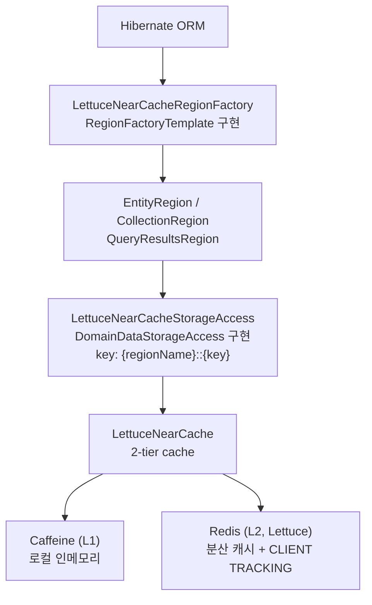
```mermaid
graph TD
    Hibernate["Hibernate ORM"]
    Factory["LettuceNearCacheRegionFactory\nRegionFactoryTemplate 구현"]
    Region["EntityRegion / CollectionRegion\nQueryResultsRegion"]
    Storage["LettuceNearCacheStorageAccess\nDomainDataStorageAccess 구현\nkey: {regionName}::{key}"]
    NearCache["LettuceNearCache\n2-tier cache"]
    L1["Caffeine (L1)\n로컬 인메모리"]
    L2["Redis (L2, Lettuce)\n분산 캐시 + CLIENT TRACKING"]

    Hibernate --> Factory
    Factory --> Region
    Region --> Storage
    Storage --> NearCache
    NearCache --> L1
    NearCache --> L2
```
````

- [ ] **Step 2: `## 동작 방식` 표 앞에 시퀀스 다이어그램 삽입**

````markdown
#### getFromCache / putIntoCache 흐름

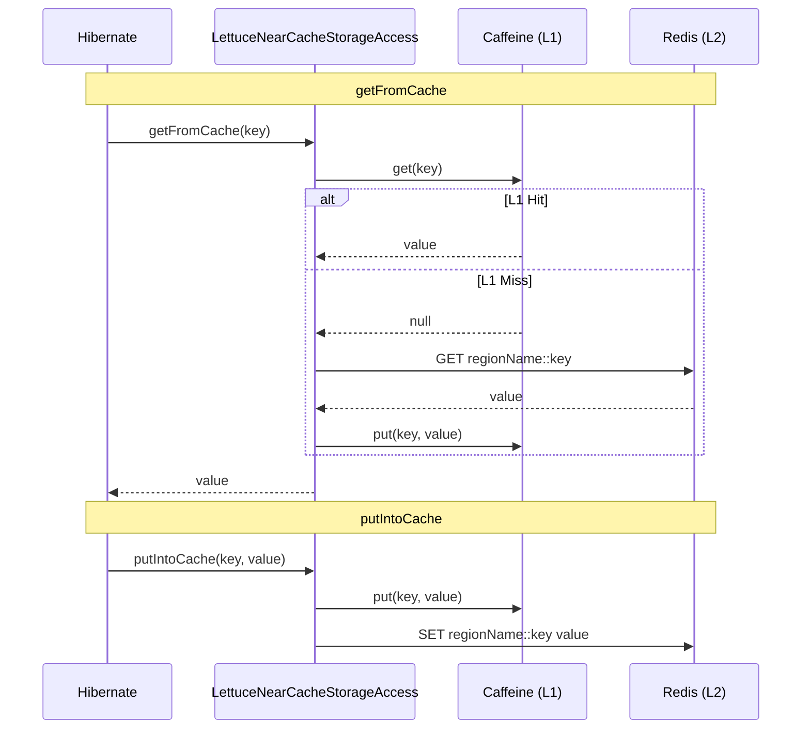
```mermaid
sequenceDiagram
    participant Hibernate
    participant Storage as LettuceNearCacheStorageAccess
    participant L1 as Caffeine (L1)
    participant L2 as Redis (L2)

    Note over Hibernate,L2: getFromCache
    Hibernate->>Storage: getFromCache(key)
    Storage->>L1: get(key)
    alt L1 Hit
        L1-->>Storage: value
    else L1 Miss
        L1-->>Storage: null
        Storage->>L2: GET regionName::key
        L2-->>Storage: value
        Storage->>L1: put(key, value)
    end
    Storage-->>Hibernate: value

    Note over Hibernate,L2: putIntoCache
    Hibernate->>Storage: putIntoCache(key, value)
    Storage->>L1: put(key, value)
    Storage->>L2: SET regionName::key value
```
````

- [ ] **Step 3: 커밋**

```bash
git add infra/hibernate-cache-lettuce/README.md
git commit -m "docs(hibernate-cache-lettuce): README에 Mermaid 아키텍처·시퀀스 다이어그램 추가"
```

---

## Task 3: data/exposed-lettuce — 아키텍처 + 시퀀스 + 플로우차트 3개

**Files:**
- Modify: `data/exposed-lettuce/README.md`

- [ ] **Step 1: `## 아키텍처` 섹션 ASCII 블록을 Mermaid로 교체**

````markdown
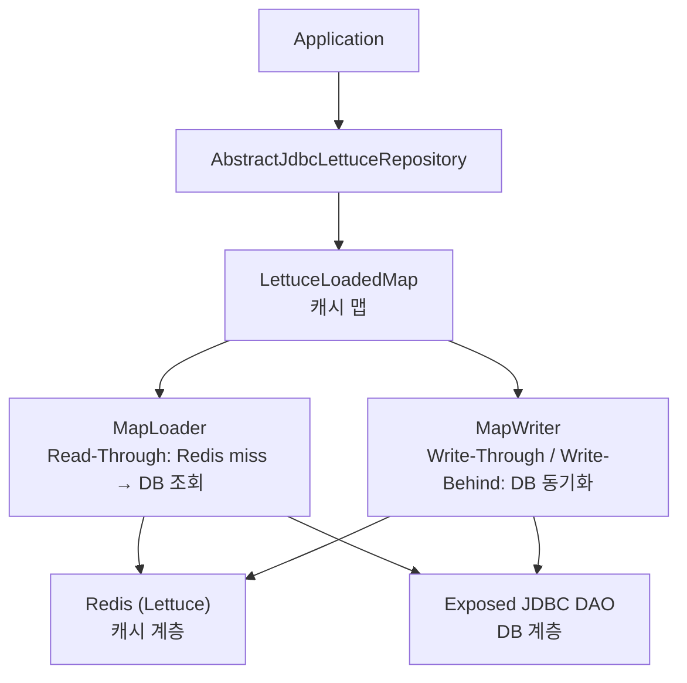
```mermaid
graph TD
    App["Application"]
    Repo["AbstractJdbcLettuceRepository"]
    Map["LettuceLoadedMap\n캐시 맵"]
    Loader["MapLoader\nRead-Through: Redis miss → DB 조회"]
    Writer["MapWriter\nWrite-Through / Write-Behind: DB 동기화"]
    Redis["Redis (Lettuce)\n캐시 계층"]
    DB["Exposed JDBC DAO\nDB 계층"]

    App --> Repo
    Repo --> Map
    Map --> Loader
    Map --> Writer
    Loader --> Redis
    Loader --> DB
    Writer --> Redis
    Writer --> DB
```
````

- [ ] **Step 2: `## 쓰기 전략` 표 앞에 WriteMode 플로우차트 삽입**

````markdown
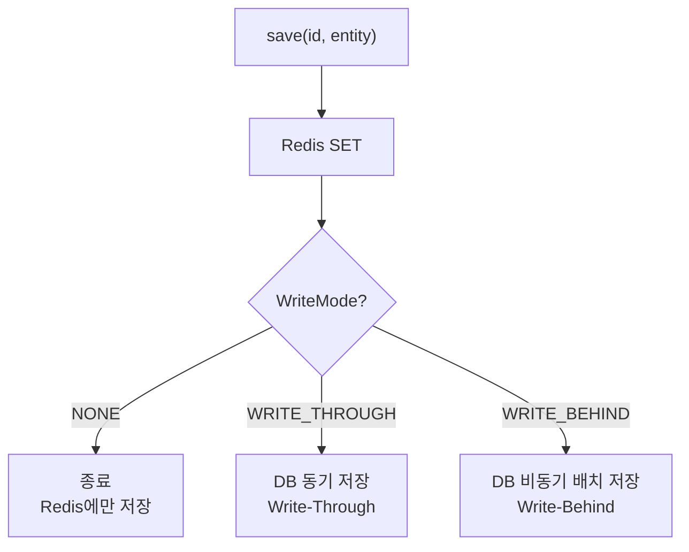
```mermaid
flowchart TD
    Write["save(id, entity)"]
    SetRedis["Redis SET"]
    Mode{WriteMode?}
    None["종료\nRedis에만 저장"]
    WT["DB 동기 저장\nWrite-Through"]
    WB["DB 비동기 배치 저장\nWrite-Behind"]

    Write --> SetRedis --> Mode
    Mode -->|NONE| None
    Mode -->|WRITE_THROUGH| WT
    Mode -->|WRITE_BEHIND| WB
```
````

- [ ] **Step 3: `## 사용 방법` 앞에 Read-Through 시퀀스 삽입**

````markdown
#### Read-Through 흐름

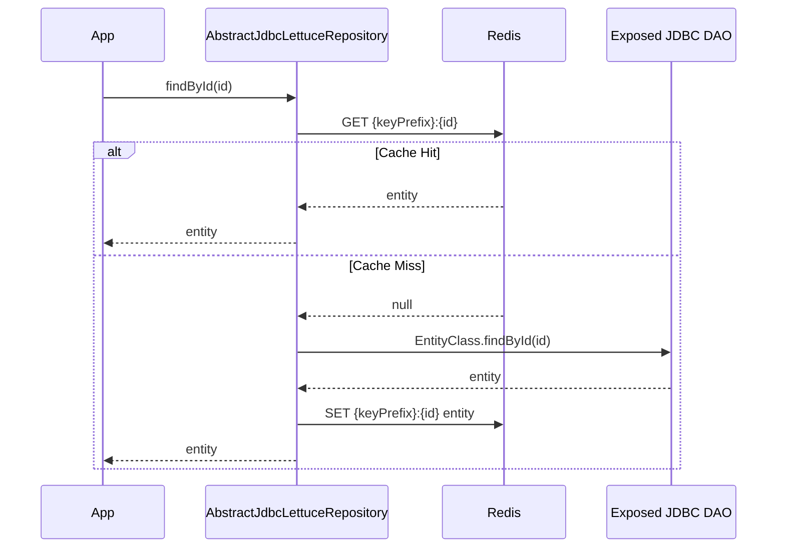
```mermaid
sequenceDiagram
    participant App
    participant Repo as AbstractJdbcLettuceRepository
    participant Redis
    participant DB as Exposed JDBC DAO

    App->>Repo: findById(id)
    Repo->>Redis: GET {keyPrefix}:{id}
    alt Cache Hit
        Redis-->>Repo: entity
        Repo-->>App: entity
    else Cache Miss
        Redis-->>Repo: null
        Repo->>DB: EntityClass.findById(id)
        DB-->>Repo: entity
        Repo->>Redis: SET {keyPrefix}:{id} entity
        Repo-->>App: entity
    end
```
````

- [ ] **Step 4: 커밋**

```bash
git add data/exposed-lettuce/README.md
git commit -m "docs(exposed-lettuce): README에 Mermaid 아키텍처·시퀀스·플로우차트 추가"
```

---

## Task 4: spring-boot/hibernate-lettuce — 컴포넌트 + 플로우차트 2개

**Files:**
- Modify: `spring-boot/hibernate-lettuce/README.md`

- [ ] **Step 1: `## Auto-Configuration 클래스` 표 앞에 컴포넌트 다이어그램 삽입**

````markdown
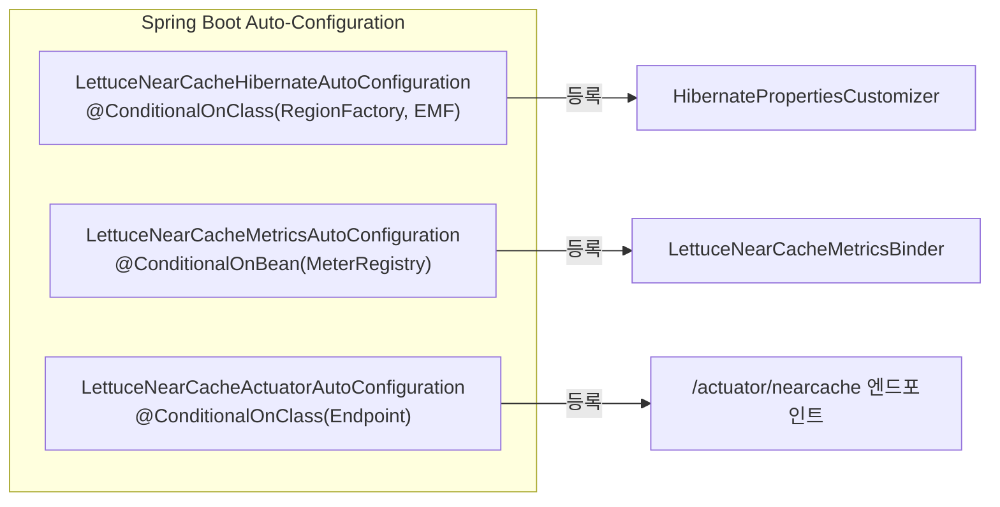
```mermaid
graph LR
    subgraph AutoConfig["Spring Boot Auto-Configuration"]
        H["LettuceNearCacheHibernateAutoConfiguration\n@ConditionalOnClass(RegionFactory, EMF)"]
        M["LettuceNearCacheMetricsAutoConfiguration\n@ConditionalOnBean(MeterRegistry)"]
        A["LettuceNearCacheActuatorAutoConfiguration\n@ConditionalOnClass(Endpoint)"]
    end

    H -->|등록| PC["HibernatePropertiesCustomizer"]
    M -->|등록| MB["LettuceNearCacheMetricsBinder"]
    A -->|등록| EP["/actuator/nearcache 엔드포인트"]
```
````

- [ ] **Step 2: `### 설정값 → Hibernate properties 매핑` 표 앞에 플로우차트 삽입**

````markdown
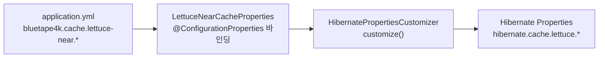
```mermaid
flowchart LR
    YAML["application.yml\nbluetape4k.cache.lettuce-near.*"]
    Props["LettuceNearCacheProperties\n@ConfigurationProperties 바인딩"]
    Customizer["HibernatePropertiesCustomizer\ncustomize()"]
    Hibernate["Hibernate Properties\nhibernate.cache.lettuce.*"]

    YAML --> Props --> Customizer --> Hibernate
```
````

- [ ] **Step 3: 커밋**

```bash
git add spring-boot/hibernate-lettuce/README.md
git commit -m "docs(hibernate-lettuce): README에 Mermaid 컴포넌트·플로우차트 추가"
```

---

## Task 5: spring-data/exposed-jdbc-spring-data — 클래스 + 플로우차트 2개

**Files:**
- Modify: `spring-data/exposed-jdbc-spring-data/README.md`

- [ ] **Step 1: `## 개요` 아래에 클래스 다이어그램 삽입**

````markdown
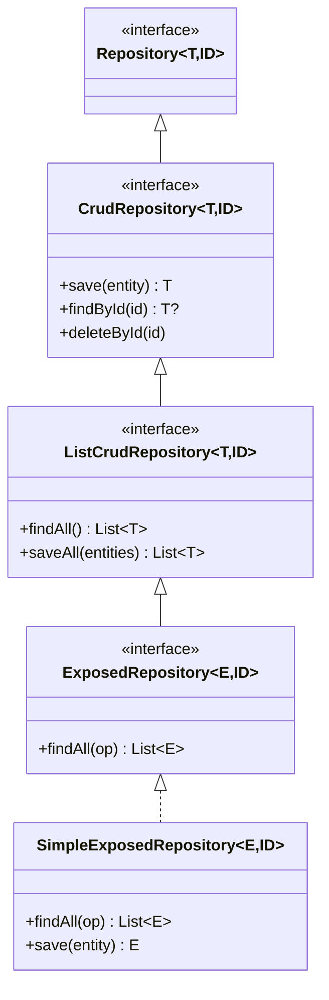
```mermaid
classDiagram
    class Repository~T,ID~ {
        <<interface>>
    }
    class CrudRepository~T,ID~ {
        <<interface>>
        +save(entity) T
        +findById(id) T?
        +deleteById(id)
    }
    class ListCrudRepository~T,ID~ {
        <<interface>>
        +findAll() List~T~
        +saveAll(entities) List~T~
    }
    class ExposedRepository~E,ID~ {
        <<interface>>
        +findAll(op) List~E~
    }
    class SimpleExposedRepository~E,ID~ {
        +findAll(op) List~E~
        +save(entity) E
    }

    Repository <|-- CrudRepository
    CrudRepository <|-- ListCrudRepository
    ListCrudRepository <|-- ExposedRepository
    ExposedRepository <|.. SimpleExposedRepository
```
````

- [ ] **Step 2: `## 지원하는 PartTree 키워드` 표 앞에 플로우차트 삽입**

````markdown
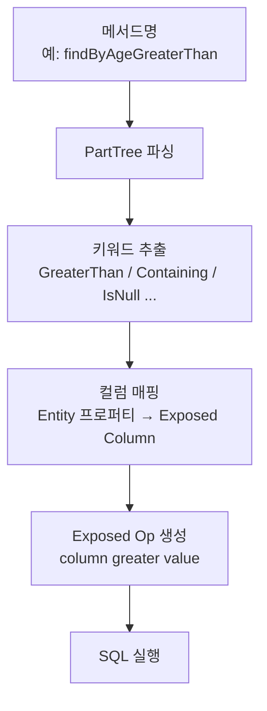
```mermaid
flowchart TD
    Method["메서드명\n예: findByAgeGreaterThan"]
    Parse["PartTree 파싱"]
    Keyword["키워드 추출\nGreaterThan / Containing / IsNull ..."]
    Column["컬럼 매핑\nEntity 프로퍼티 → Exposed Column"]
    Op["Exposed Op 생성\ncolumn greater value"]
    Query["SQL 실행"]

    Method --> Parse --> Keyword --> Column --> Op --> Query
```
````

- [ ] **Step 3: 커밋**

```bash
git add spring-data/exposed-jdbc-spring-data/README.md
git commit -m "docs(exposed-jdbc-spring-data): README에 Mermaid 클래스·플로우차트 추가"
```

---

## Task 6: spring-data/exposed-r2dbc-spring-data — 클래스 + 시퀀스 2개

**Files:**
- Modify: `spring-data/exposed-r2dbc-spring-data/README.md`

- [ ] **Step 1: `## 개요` 아래에 클래스 다이어그램 삽입**

````markdown
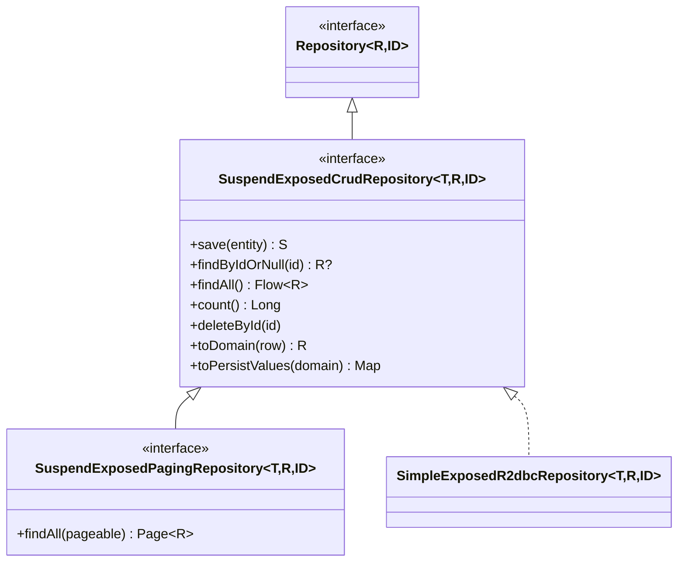
```mermaid
classDiagram
    class Repository~R,ID~ {
        <<interface>>
    }
    class SuspendExposedCrudRepository~T,R,ID~ {
        <<interface>>
        +save(entity) S
        +findByIdOrNull(id) R?
        +findAll() Flow~R~
        +count() Long
        +deleteById(id)
        +toDomain(row) R
        +toPersistValues(domain) Map
    }
    class SuspendExposedPagingRepository~T,R,ID~ {
        <<interface>>
        +findAll(pageable) Page~R~
    }
    class SimpleExposedR2dbcRepository~T,R,ID~

    Repository <|-- SuspendExposedCrudRepository
    SuspendExposedCrudRepository <|-- SuspendExposedPagingRepository
    SuspendExposedCrudRepository <|.. SimpleExposedR2dbcRepository
```
````

- [ ] **Step 2: `## 트랜잭션 경계` 앞에 시퀀스 다이어그램 삽입**

````markdown
#### save / findByIdOrNull 흐름

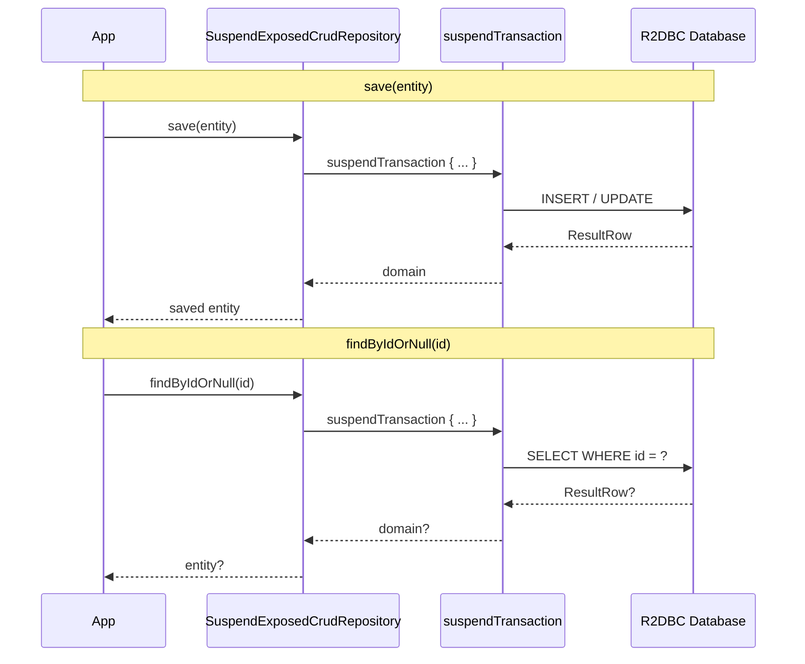
```mermaid
sequenceDiagram
    participant App
    participant Repo as SuspendExposedCrudRepository
    participant Tx as suspendTransaction
    participant DB as R2DBC Database

    Note over App,DB: save(entity)
    App->>Repo: save(entity)
    Repo->>Tx: suspendTransaction { ... }
    Tx->>DB: INSERT / UPDATE
    DB-->>Tx: ResultRow
    Tx-->>Repo: domain
    Repo-->>App: saved entity

    Note over App,DB: findByIdOrNull(id)
    App->>Repo: findByIdOrNull(id)
    Repo->>Tx: suspendTransaction { ... }
    Tx->>DB: SELECT WHERE id = ?
    DB-->>Tx: ResultRow?
    Tx-->>Repo: domain?
    Repo-->>App: entity?
```
````

- [ ] **Step 3: 커밋**

```bash
git add spring-data/exposed-r2dbc-spring-data/README.md
git commit -m "docs(exposed-r2dbc-spring-data): README에 Mermaid 클래스·시퀀스 다이어그램 추가"
```

---

## Task 7: utils/ulid — 클래스 + 플로우차트 2개

**Files:**
- Modify: `utils/ulid/README.md`

- [ ] **Step 1: `## 제공 API` 앞에 클래스 다이어그램 삽입**

````markdown
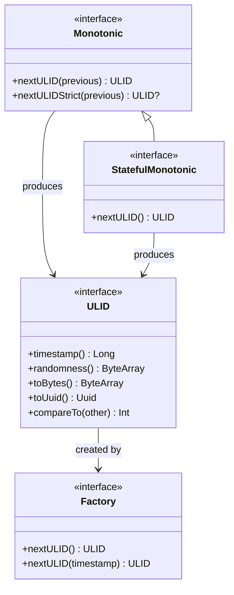
```mermaid
classDiagram
    class ULID {
        <<interface>>
        +timestamp() Long
        +randomness() ByteArray
        +toBytes() ByteArray
        +toUuid() Uuid
        +compareTo(other) Int
    }
    class Factory {
        <<interface>>
        +nextULID() ULID
        +nextULID(timestamp) ULID
    }
    class Monotonic {
        <<interface>>
        +nextULID(previous) ULID
        +nextULIDStrict(previous) ULID?
    }
    class StatefulMonotonic {
        <<interface>>
        +nextULID() ULID
    }

    ULID --> Factory : created by
    Monotonic --> ULID : produces
    StatefulMonotonic --> ULID : produces
    Monotonic <|-- StatefulMonotonic
```
````

- [ ] **Step 2: `## ULID vs UUID 비교` 앞에 생성기 선택 플로우차트 삽입**

````markdown
#### 생성기 선택 가이드

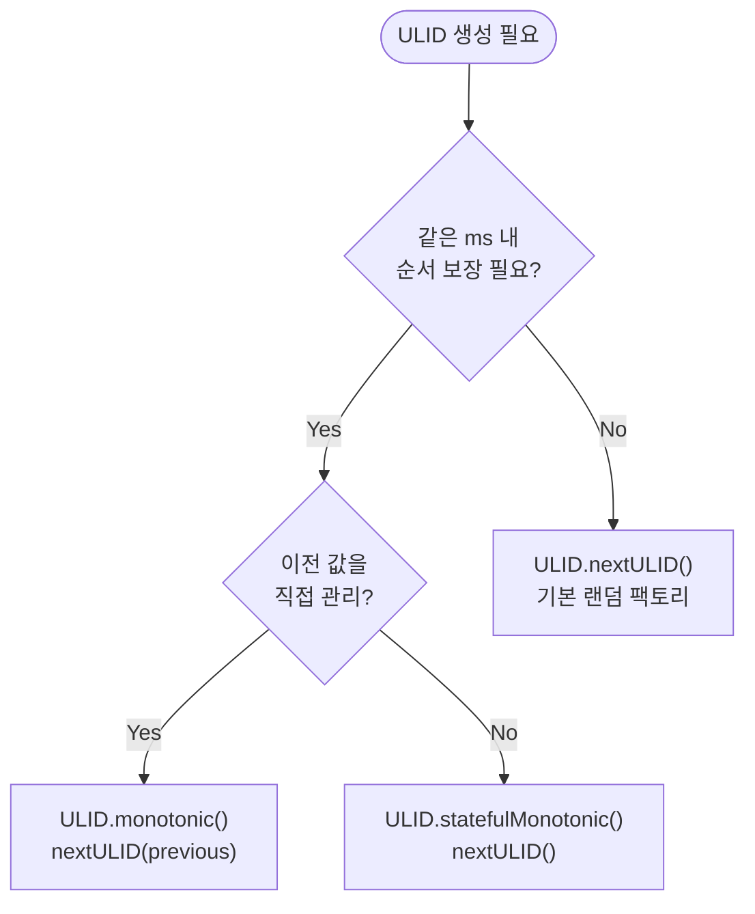
```mermaid
flowchart TD
    Start(["ULID 생성 필요"])
    Q1{"같은 ms 내\n순서 보장 필요?"}
    Q2{"이전 값을\n직접 관리?"}
    Basic["ULID.nextULID()\n기본 랜덤 팩토리"]
    Mono["ULID.monotonic()\nnextULID(previous)"]
    State["ULID.statefulMonotonic()\nnextULID()"]

    Start --> Q1
    Q1 -->|No| Basic
    Q1 -->|Yes| Q2
    Q2 -->|Yes| Mono
    Q2 -->|No| State
```
````

- [ ] **Step 3: 커밋**

```bash
git add utils/ulid/README.md
git commit -m "docs(ulid): README에 Mermaid 클래스·플로우차트 추가"
```

---

## Task 8: examples/spring-boot-hibernate-lettuce-demo — 시퀀스 1개

**Files:**
- Modify: `examples/spring-boot-hibernate-lettuce-demo/README.md`

- [ ] **Step 1: `## 아키텍처` 섹션 ASCII 블록을 Mermaid 시퀀스로 교체**

````markdown
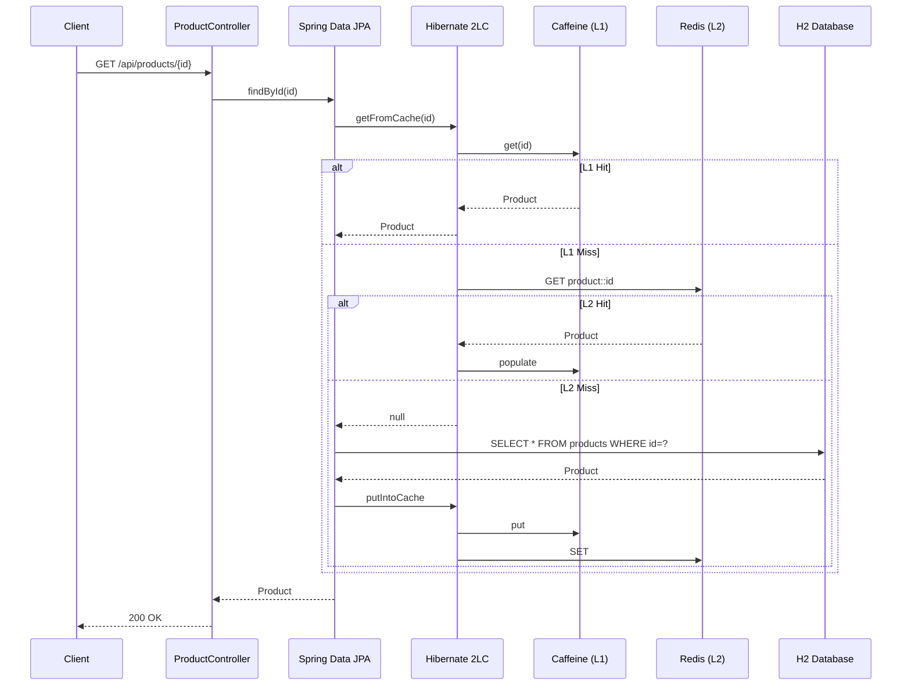
```mermaid
sequenceDiagram
    participant Client
    participant Controller as ProductController
    participant JPA as Spring Data JPA
    participant H2LC as Hibernate 2LC
    participant L1 as Caffeine (L1)
    participant L2 as Redis (L2)
    participant DB as H2 Database

    Client->>Controller: GET /api/products/{id}
    Controller->>JPA: findById(id)
    JPA->>H2LC: getFromCache(id)
    H2LC->>L1: get(id)
    alt L1 Hit
        L1-->>H2LC: Product
        H2LC-->>JPA: Product
    else L1 Miss
        H2LC->>L2: GET product::id
        alt L2 Hit
            L2-->>H2LC: Product
            H2LC->>L1: populate
        else L2 Miss
            H2LC-->>JPA: null
            JPA->>DB: SELECT * FROM products WHERE id=?
            DB-->>JPA: Product
            JPA->>H2LC: putIntoCache
            H2LC->>L1: put
            H2LC->>L2: SET
        end
    end
    JPA-->>Controller: Product
    Controller-->>Client: 200 OK
```
````

- [ ] **Step 2: 커밋**

```bash
git add examples/spring-boot-hibernate-lettuce-demo/README.md
git commit -m "docs(hibernate-lettuce-demo): README에 Mermaid 시퀀스 다이어그램 추가"
```

---

## Task 9: examples/exposed-r2dbc-spring-data-webflux-demo — 시퀀스 1개

**Files:**
- Modify: `examples/exposed-r2dbc-spring-data-webflux-demo/README.md`

- [ ] **Step 1: `## 프로젝트 구조` 앞에 시퀀스 다이어그램 삽입**

````markdown
## 요청 처리 흐름

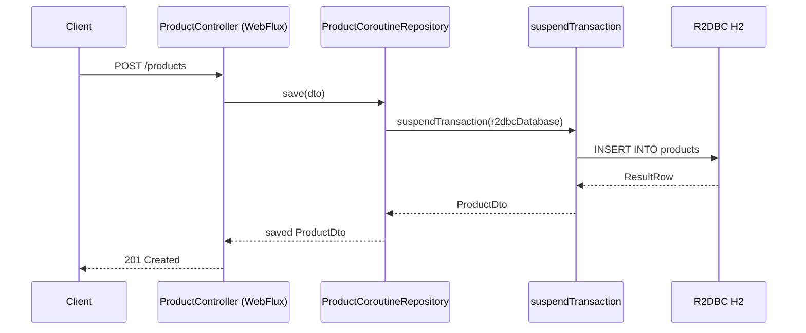
```mermaid
sequenceDiagram
    participant Client
    participant Controller as ProductController (WebFlux)
    participant Repo as ProductCoroutineRepository
    participant Tx as suspendTransaction
    participant DB as R2DBC H2

    Client->>Controller: POST /products
    Controller->>Repo: save(dto)
    Repo->>Tx: suspendTransaction(r2dbcDatabase)
    Tx->>DB: INSERT INTO products
    DB-->>Tx: ResultRow
    Tx-->>Repo: ProductDto
    Repo-->>Controller: saved ProductDto
    Controller-->>Client: 201 Created
```
````

- [ ] **Step 2: 커밋**

```bash
git add examples/exposed-r2dbc-spring-data-webflux-demo/README.md
git commit -m "docs(webflux-demo): README에 Mermaid 시퀀스 다이어그램 추가"
```

---

## Task 10: examples/exposed-jdbc-spring-data-mvc-demo — 시퀀스 1개

**Files:**
- Modify: `examples/exposed-jdbc-spring-data-mvc-demo/README.md`

- [ ] **Step 1: `## 프로젝트 구조` 앞에 시퀀스 다이어그램 삽입**

````markdown
## 요청 처리 흐름

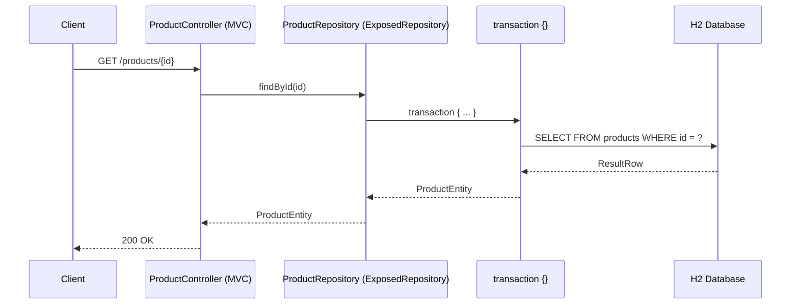
```mermaid
sequenceDiagram
    participant Client
    participant Controller as ProductController (MVC)
    participant Repo as ProductRepository (ExposedRepository)
    participant Tx as transaction {}
    participant DB as H2 Database

    Client->>Controller: GET /products/{id}
    Controller->>Repo: findById(id)
    Repo->>Tx: transaction { ... }
    Tx->>DB: SELECT FROM products WHERE id = ?
    DB-->>Tx: ResultRow
    Tx-->>Repo: ProductEntity
    Repo-->>Controller: ProductEntity
    Controller-->>Client: 200 OK
```
````

- [ ] **Step 2: 커밋**

```bash
git add examples/exposed-jdbc-spring-data-mvc-demo/README.md
git commit -m "docs(mvc-demo): README에 Mermaid 시퀀스 다이어그램 추가"
```

---

## Task 11: examples/exposed-jpa-benchmark — 아키텍처 1개

**Files:**
- Modify: `examples/exposed-jpa-benchmark/README.md`

- [ ] **Step 1: `## 아키텍처` 섹션 ASCII 블록을 Mermaid로 교체**

````markdown
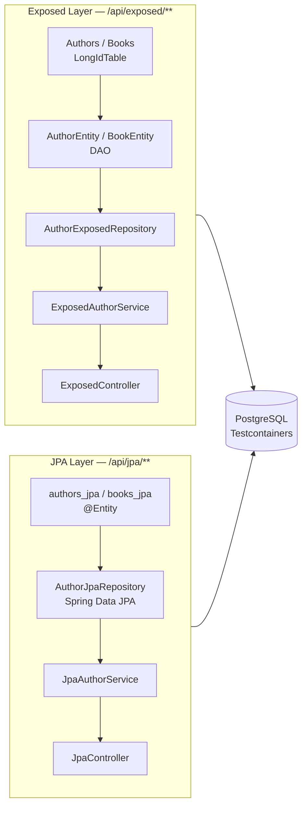
```mermaid
graph LR
    PG[("PostgreSQL\nTestcontainers")]

    subgraph Exposed["Exposed Layer — /api/exposed/**"]
        ET["Authors / Books\nLongIdTable"]
        EE["AuthorEntity / BookEntity\nDAO"]
        ER["AuthorExposedRepository"]
        ES["ExposedAuthorService"]
        EC["ExposedController"]
        ET --> EE --> ER --> ES --> EC
    end

    subgraph JPA["JPA Layer — /api/jpa/**"]
        JT["authors_jpa / books_jpa\n@Entity"]
        JR["AuthorJpaRepository\nSpring Data JPA"]
        JS["JpaAuthorService"]
        JC["JpaController"]
        JT --> JR --> JS --> JC
    end

    Exposed --> PG
    JPA --> PG
```
````

- [ ] **Step 2: 커밋**

```bash
git add examples/exposed-jpa-benchmark/README.md
git commit -m "docs(exposed-jpa-benchmark): README에 Mermaid 아키텍처 다이어그램 추가"
```

---

## Task 12: shared + io/benchmarks — 각 1개

**Files:**
- Modify: `shared/README.md`
- Modify: `io/benchmarks/README.md`

- [ ] **Step 1: shared README에 컴포넌트 다이어그램 삽입**

`## 의존성` 앞에 삽입:

````markdown
## 모듈 위치

```mermaid
graph LR
    shared["shared\n공통 유틸리티"]

    cache-lettuce --> shared
    hibernate-cache-lettuce --> shared
    exposed-jdbc-spring-data["exposed-jdbc-spring-data"] --> shared
    exposed-r2dbc-spring-data["exposed-r2dbc-spring-data"] --> shared
    exposed-lettuce --> shared
    hibernate-lettuce["hibernate-lettuce\nauto-config"] --> shared
```
````

- [ ] **Step 2: benchmarks README에 플로우차트 삽입**

`## 기본 실행` 앞에 삽입:

````markdown
## 벤치마크 실행 파이프라인

```mermaid
flowchart TD
    Q{"실행 목적"}
    Quick["benchmarkQuick\n빠른 회귀 확인"]
    Custom["benchmarkCustom\n특정 클래스 실행\n-Pbenchmark.include=..."]
    Suite["benchmarkSuite\n전체 스냅샷"]
    Json["jmhJson / comboJmhJson\n개선 전후 비교"]
    Report["benchmarkMarkdown\n결과 → Markdown"]
    Results[/"benchmark-results/*.md"/]

    Q -->|빠른 확인| Quick
    Q -->|특정 클래스| Custom
    Q -->|전체 스냅샷| Suite
    Q -->|전후 비교| Json

    Custom --> Report
    Json --> Report
    Quick --> Results
    Suite --> Results
    Report --> Results
```
````

- [ ] **Step 3: 커밋**

```bash
git add shared/README.md io/benchmarks/README.md
git commit -m "docs(shared,benchmarks): README에 Mermaid 다이어그램 추가"
```
