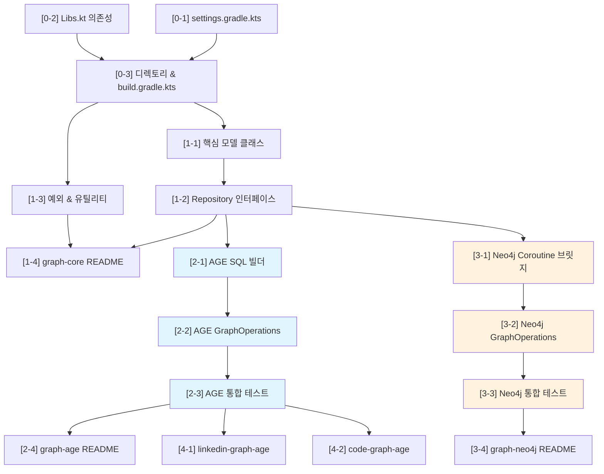

# Graph Database Library 구현 계획

**날짜**: 2026-03-24
**프로젝트**: bluetape4k-experimental
**상태**: 계획 확정

## 변경 이력
- 2026-03-24 v1.2: GraphElementId 전면 반영, GraphPath step 모델, DSL 타입 확장, AGE CREATE EXTENSION 책임 분리 (PostgreSQLAgeServer), Neo4j reactive API + kotlinx-coroutines-reactive 확정
- 2026-03-24 v1.1: FIX-1~5 반영 (초안)
- 2026-03-24 v1.0: 최초 작성

---

## Context

Graph Database(Apache AGE, Neo4j) 통합 라이브러리를 `graph/` 디렉토리 아래 구성한다.
graph-core에서 공통 추상화를 제공하고, graph-age와 graph-neo4j가 각각 구현체를 제공한다.
예제 모듈은 AGE 기반으로 LinkedIn 인맥관리와 소스코드 의존성 분석을 구현한다.

## Work Objectives

1. AGE와 Neo4j를 동시에 지원하는 Graph 추상화 계층 구축
2. Apache AGE + PostgreSQL + Exposed 통합 구현
3. Neo4j Java Driver + Kotlin Coroutine 브릿지 구현
4. 실용적인 예제 애플리케이션 2개 제작

## Guardrails

### Must Have
- graph-core 인터페이스는 AGE/Neo4j 양쪽 모두 자연스럽게 구현 가능해야 함
- 모든 Repository 인터페이스는 suspend 기반
- Testcontainers 기반 통합 테스트
- 각 모듈에 README.md 포함

### Must NOT Have
- 전체 빌드(`./gradlew build`) 실행 금지 -- 모듈 단위 빌드만
- graph-core에 특정 백엔드(AGE/Neo4j)에 종속된 코드 포함 금지
- runBlocking을 프로덕션 코드에서 사용 금지

---

## settings.gradle.kts 등록 전략

### 문제점
현재 `includeModules()` 함수는 `baseDir`의 **모든 직접 자식 디렉토리**를 모듈로 등록한다.
`includeModules("graph")` 호출 시 `graph/examples/` 디렉토리도 `:examples` 모듈로 등록되어,
루트 레벨 `includeModules("examples")` 와 **모듈명 충돌**이 발생한다.

### 해결 방안
`includeModules()` 함수 내부에 `build.gradle.kts` 존재 여부 체크를 추가한다:

```kotlin
?.filter { it.isDirectory && !it.name.startsWith(".") && File(it, "build.gradle.kts").exists() }
```

이 변경은 기존 모듈에 영향 없음 (모든 기존 모듈은 `build.gradle.kts`를 가지고 있음).
`graph/examples/` 디렉토리에는 `build.gradle.kts`를 두지 않으므로 모듈로 등록되지 않는다.

그 후 두 개의 `includeModules` 호출을 추가한다:

```kotlin
includeModules("graph", false, false)             // graph-core, graph-age, graph-neo4j 등록
includeModules("graph/examples", false, false)    // linkedin-graph-age, code-graph-age 등록
```

---

## Phase 0: 프로젝트 설정 (선행 조건)

#### [0-1] settings.gradle.kts 수정
- **complexity**: low
- **병렬 가능**: [0-2]와 병렬 가능
- **의존성**: 없음
- **설명**:
  - `includeModules()` 함수에 `build.gradle.kts` 존재 여부 필터 추가
  - `includeModules("graph", false, false)` 호출 추가
  - `includeModules("graph/examples", false, false)` 호출 추가
- **파일**:
  - `settings.gradle.kts` (수정)
- **완료 기준**:
  - `./gradlew projects` 실행 시 `:graph-core`, `:graph-age`, `:graph-neo4j`, `:linkedin-graph-age`, `:code-graph-age` 모듈이 표시됨
  - 기존 모듈 등록에 영향 없음

#### [0-2] Libs.kt에 의존성 추가
- **complexity**: low
- **병렬 가능**: [0-1]과 병렬 가능
- **의존성**: 없음
- **설명**:
  Versions 블록과 라이브러리 상수 추가:
  ```
  // Versions
  const val neo4j_driver = "5.28.4"

  // Libraries
  const val neo4j_java_driver = "org.neo4j.driver:neo4j-java-driver:${Versions.neo4j_driver}"
  val testcontainers_neo4j = testcontainersModule("neo4j")
  // AGE는 PostgreSQL 확장이므로 별도 라이브러리 불필요 -- postgresql_driver + exposed_jdbc 사용
  ```
- **파일**:
  - `buildSrc/src/main/kotlin/Libs.kt` (수정)
- **완료 기준**:
  - `Libs.neo4j_java_driver`, `Libs.testcontainers_neo4j` 참조 가능
  - buildSrc 컴파일 성공

#### [0-3] 디렉토리 구조 및 build.gradle.kts 생성
- **complexity**: low
- **병렬 가능**: 아니오
- **의존성**: [0-1], [0-2]
- **설명**:
  모든 모듈의 디렉토리, build.gradle.kts, src 구조, 테스트 리소스 생성.
  기존 모듈(`exposed-jdbc-spring-data`)의 build.gradle.kts 패턴 참고.
  `junit-platform.properties`와 `logback-test.xml`을 기존 모듈에서 복사.

  **graph-core build.gradle.kts:**
  ```kotlin
  dependencies {
      api(Libs.kotlinx_coroutines_core)
      testImplementation(Libs.bluetape4k_junit5)
      testImplementation(Libs.kotlinx_coroutines_test)
  }
  ```

  **graph-age build.gradle.kts:**
  ```kotlin
  dependencies {
      api(project(":graph-core"))
      api(Libs.exposed_core)
      api(Libs.exposed_dao)
      api(Libs.exposed_jdbc)
      api(Libs.exposed_java_time)
      api(Libs.postgresql_driver)
      testImplementation(Libs.bluetape4k_junit5)
      testImplementation(Libs.bluetape4k_testcontainers)
      testImplementation(Libs.testcontainers_postgresql)
      testImplementation(Libs.hikaricp)
      testImplementation(Libs.kotlinx_coroutines_test)
  }
  ```

  **graph-neo4j build.gradle.kts:**
  ```kotlin
  dependencies {
      api(project(":graph-core"))
      api(Libs.neo4j_java_driver)
      api(Libs.kotlinx_coroutines_reactive)   // Publisher<T>.asFlow(), Publisher<T>.awaitFirst()
      testImplementation(Libs.bluetape4k_junit5)
      testImplementation(Libs.bluetape4k_testcontainers)
      testImplementation(Libs.testcontainers_neo4j)
      testImplementation(Libs.kotlinx_coroutines_test)
  }
  ```
- **파일**:
  - `graph/graph-core/build.gradle.kts` (생성)
  - `graph/graph-age/build.gradle.kts` (생성)
  - `graph/graph-neo4j/build.gradle.kts` (생성)
  - `graph/examples/linkedin-graph-age/build.gradle.kts` (생성)
  - `graph/examples/code-graph-age/build.gradle.kts` (생성)
  - 각 모듈의 `src/main/kotlin/io/bluetape4k/graph/...` 및 `src/test/kotlin/...`
  - 각 모듈의 `src/test/resources/junit-platform.properties` (기존 모듈에서 복사)
  - 각 모듈의 `src/test/resources/logback-test.xml` (기존 모듈에서 복사)
- **완료 기준**:
  - `./gradlew :graph-core:compileKotlin` 성공
  - `./gradlew :graph-age:compileKotlin` 성공
  - `./gradlew :graph-neo4j:compileKotlin` 성공

---

## Phase 1: graph-core 구현

#### [1-1] 핵심 모델 클래스 정의
- **complexity**: high
- **병렬 가능**: [1-3]과 병렬 가능
- **의존성**: [0-3]
- **설명**:
  AGE와 Neo4j 양쪽을 자연스럽게 지원하는 데이터 모델 정의.

  ```kotlin
  // 백엔드 독립 ID value type
  // - AGE: Long 내부 ID → GraphElementId("$longId") 변환
  // - Neo4j: elementId() (String) → GraphElementId 직접 매핑
  @JvmInline
  value class GraphElementId(val value: String)

  // 핵심 데이터 클래스
  data class GraphVertex(val id: GraphElementId, val label: String, val properties: Map<String, Any?>)
  data class GraphEdge(
      val id: GraphElementId,
      val label: String,
      val startId: GraphElementId,
      val endId: GraphElementId,
      val properties: Map<String, Any?>,
  )

  // 순서 있는 step 기반 경로 모델 (정점-간선 교차 순서 보존, 재방문 표현 가능)
  sealed class PathStep {
      data class VertexStep(val vertex: GraphVertex) : PathStep()
      data class EdgeStep(val edge: GraphEdge) : PathStep()
  }

  data class GraphPath(
      val steps: List<PathStep>,  // [VertexStep, EdgeStep, VertexStep, EdgeStep, VertexStep, ...]
  ) {
      val vertices: List<GraphVertex> get() = steps.filterIsInstance<PathStep.VertexStep>().map { it.vertex }
      val edges: List<GraphEdge> get() = steps.filterIsInstance<PathStep.EdgeStep>().map { it.edge }
      val length: Int get() = edges.size
  }

  // 방향 열거형
  enum class Direction { OUTGOING, INCOMING, BOTH }

  // Vertex/Edge 스키마 정의 (Exposed Table 스타일, 백엔드 무관)
  abstract class VertexLabel(val label: String) {
      private val _properties = mutableListOf<PropertyDef<*>>()
      val properties: List<PropertyDef<*>> get() = _properties.toList()

      fun string(name: String) = PropertyDef<String>(name, String::class).also { _properties.add(it) }
      fun integer(name: String) = PropertyDef<Int>(name, Int::class).also { _properties.add(it) }
      fun long(name: String) = PropertyDef<Long>(name, Long::class).also { _properties.add(it) }
      fun boolean(name: String) = PropertyDef<Boolean>(name, Boolean::class).also { _properties.add(it) }
      // 예제 요구사항 (skills: List<String>, since: LocalDate, enum 등) 지원
      fun stringList(name: String) = PropertyDef<List<String>>(name, List::class).also { _properties.add(it) }
      fun json(name: String) = PropertyDef<Map<String, Any?>>(name, Map::class).also { _properties.add(it) }
      fun localDate(name: String) = PropertyDef<LocalDate>(name, LocalDate::class).also { _properties.add(it) }
      fun localDateTime(name: String) = PropertyDef<LocalDateTime>(name, LocalDateTime::class).also { _properties.add(it) }
      fun <E : Enum<E>> enum(name: String, type: KClass<E>) = PropertyDef<E>(name, type).also { _properties.add(it) }
  }

  abstract class EdgeLabel(val label: String, val from: VertexLabel, val to: VertexLabel)

  data class PropertyDef<T: Any>(val name: String, val type: KClass<T>)
  ```
- **파일**:
  - `graph/graph-core/src/main/kotlin/io/bluetape4k/graph/model/GraphElementId.kt`
  - `graph/graph-core/src/main/kotlin/io/bluetape4k/graph/model/GraphVertex.kt`
  - `graph/graph-core/src/main/kotlin/io/bluetape4k/graph/model/GraphEdge.kt`
  - `graph/graph-core/src/main/kotlin/io/bluetape4k/graph/model/GraphPath.kt`
  - `graph/graph-core/src/main/kotlin/io/bluetape4k/graph/model/Direction.kt`
  - `graph/graph-core/src/main/kotlin/io/bluetape4k/graph/schema/VertexLabel.kt`
  - `graph/graph-core/src/main/kotlin/io/bluetape4k/graph/schema/EdgeLabel.kt`
  - `graph/graph-core/src/main/kotlin/io/bluetape4k/graph/schema/PropertyDef.kt`
- **완료 기준**:
  - 모든 모델 클래스 컴파일 성공
  - 단위 테스트로 VertexLabel/EdgeLabel DSL 검증

#### [1-2] Repository 인터페이스 정의
- **complexity**: high
- **병렬 가능**: 아니오 ([1-1] 완료 후)
- **의존성**: [1-1]
- **설명**:
  suspend 기반 Repository 인터페이스. AGE(SQL 기반)와 Neo4j(Cypher 기반) 모두 구현 가능한 추상화 수준.

  ```kotlin
  // 그래프 세션 관리
  // 소유권: 외부 주입 Database/Driver를 close()에서 닫지 않음.
  // 연결 풀/드라이버 생명주기는 Spring 컨테이너 또는 호출자가 관리한다.
  interface GraphSession : AutoCloseable {
      suspend fun createGraph(name: String)
      suspend fun dropGraph(name: String)
      suspend fun graphExists(name: String): Boolean
  }

  // Vertex CRUD
  interface GraphVertexRepository {
      suspend fun create(label: String, properties: Map<String, Any?> = emptyMap()): GraphVertex
      suspend fun findById(label: String, id: GraphElementId): GraphVertex?
      suspend fun findByLabel(label: String, filter: Map<String, Any?> = emptyMap()): List<GraphVertex>
      suspend fun update(label: String, id: GraphElementId, properties: Map<String, Any?>): GraphVertex?
      suspend fun delete(label: String, id: GraphElementId): Boolean
      suspend fun count(label: String): Long
  }

  // Edge CRUD
  interface GraphEdgeRepository {
      suspend fun create(fromId: GraphElementId, toId: GraphElementId, label: String, properties: Map<String, Any?> = emptyMap()): GraphEdge
      suspend fun findByLabel(label: String, filter: Map<String, Any?> = emptyMap()): List<GraphEdge>
      suspend fun delete(label: String, id: GraphElementId): Boolean
  }

  // 그래프 순회
  interface GraphTraversalRepository {
      suspend fun neighbors(startId: GraphElementId, edgeLabel: String, direction: Direction = Direction.OUTGOING, depth: Int = 1): List<GraphVertex>
      suspend fun shortestPath(fromId: GraphElementId, toId: GraphElementId, edgeLabel: String? = null, maxDepth: Int = 10): GraphPath?
      suspend fun allPaths(fromId: GraphElementId, toId: GraphElementId, edgeLabel: String? = null, maxDepth: Int = 5): List<GraphPath>
  }

  // 통합 Facade
  interface GraphOperations : GraphSession, GraphVertexRepository, GraphEdgeRepository, GraphTraversalRepository
  ```
- **파일**:
  - `graph/graph-core/src/main/kotlin/io/bluetape4k/graph/repository/GraphSession.kt`
  - `graph/graph-core/src/main/kotlin/io/bluetape4k/graph/repository/GraphVertexRepository.kt`
  - `graph/graph-core/src/main/kotlin/io/bluetape4k/graph/repository/GraphEdgeRepository.kt`
  - `graph/graph-core/src/main/kotlin/io/bluetape4k/graph/repository/GraphTraversalRepository.kt`
  - `graph/graph-core/src/main/kotlin/io/bluetape4k/graph/repository/GraphOperations.kt`
- **완료 기준**:
  - 모든 인터페이스 컴파일 성공
  - `./gradlew :graph-core:build` 통과

#### [1-3] 예외 및 유틸리티 클래스
- **complexity**: low
- **병렬 가능**: [1-1]과 병렬 가능
- **의존성**: [0-3]
- **설명**:
  Graph 모듈 전용 예외 계층과 공통 유틸리티.

  ```kotlin
  // 예외 계층
  open class GraphException(message: String, cause: Throwable? = null) : RuntimeException(message, cause)
  class GraphNotFoundException(message: String) : GraphException(message)
  class GraphAlreadyExistsException(message: String) : GraphException(message)
  class GraphQueryException(message: String, cause: Throwable? = null) : GraphException(message, cause)

  // Property 변환 유틸리티
  object GraphProperties {
      fun toJsonString(properties: Map<String, Any?>): String
      fun fromJsonString(json: String): Map<String, Any?>
  }
  ```
- **파일**:
  - `graph/graph-core/src/main/kotlin/io/bluetape4k/graph/exceptions.kt`
  - `graph/graph-core/src/main/kotlin/io/bluetape4k/graph/utils/GraphProperties.kt`
- **완료 기준**:
  - 예외 클래스 컴파일 성공
  - GraphProperties JSON 변환 단위 테스트 통과

#### [1-4] graph-core README 작성
- **complexity**: low
- **병렬 가능**: [1-2] 완료 후
- **의존성**: [1-2]
- **파일**: `graph/graph-core/README.md`
- **완료 기준**: README에 모듈 설명, 클래스 다이어그램, 사용 예제 포함

---

## Phase 2: graph-age 구현 (Phase 1 완료 후)

#### [2-1] AGE SQL 빌더
- **complexity**: high
- **병렬 가능**: Phase 3과 병렬 가능
- **의존성**: [1-2]
- **설명**:
  Apache AGE의 Cypher-over-SQL 구문을 생성하는 빌더.
  AGE는 PostgreSQL에서 `SELECT * FROM cypher('graph_name', $$ MATCH (n) RETURN n $$) AS (v agtype)` 형태로 쿼리한다.

  ```kotlin
  object AgeSql {
      fun createGraph(graphName: String): String
      fun dropGraph(graphName: String): String
      fun cypher(graphName: String, cypherQuery: String, resultColumns: List<Pair<String, String>>): String
      fun createVertex(graphName: String, label: String, properties: Map<String, Any?>): String
      fun createEdge(graphName: String, label: String, fromId: Long, toId: Long, properties: Map<String, Any?>): String
      fun matchVertices(graphName: String, label: String, filter: Map<String, Any?>): String
      fun shortestPath(graphName: String, fromId: Long, toId: Long, edgeLabel: String?, maxDepth: Int): String
  }
  ```
- **파일**:
  - `graph/graph-age/src/main/kotlin/io/bluetape4k/graph/age/sql/AgeSql.kt`
  - `graph/graph-age/src/main/kotlin/io/bluetape4k/graph/age/sql/AgeTypeParser.kt` (agtype 파싱)
  - `graph/graph-age/src/test/kotlin/io/bluetape4k/graph/age/sql/AgeSqlTest.kt`
- **완료 기준**:
  - AgeSql이 올바른 AGE SQL 문자열 생성 (단위 테스트)
  - AgeTypeParser가 agtype 결과를 GraphVertex/GraphEdge로 변환 (단위 테스트)

#### [2-2] AGE GraphOperations 구현
- **complexity**: high
- **병렬 가능**: 아니오
- **의존성**: [2-1]
- **설명**:
  GraphOperations 인터페이스의 AGE 구현체. Exposed JDBC를 사용하여 PostgreSQL 연결.

  **AGE 연결 초기화 전략 (책임 분리):**
  - `CREATE EXTENSION IF NOT EXISTS age` → **Testcontainers bootstrap 또는 DB 설치/마이그레이션 책임**. AgeGraphOperations 런타임에서 실행하면 슈퍼유저 권한 가정이 생기므로 분리
  - connection마다 필요: `LOAD 'age'` + `SET search_path = ag_catalog, "$user", public`
  - `HikariDataSource`의 `connectionInitSql` 또는 Exposed `Database.connect()`의 `setupConnection` 콜백을 사용하여 connection bootstrap hook 구현
  - Hikari 풀 재사용 시 연결 상태에 따른 간헐 실패 방지를 위해 connection validation query 추가 고려

  **Dispatcher 경계:**
  - 모든 `suspend` 메서드는 내부적으로 `withContext(Dispatchers.IO) { transaction { ... } }` 패턴 적용
  - Exposed JDBC는 blocking이므로 suspend 선언만으로는 안전하지 않음

  ```kotlin
  class AgeGraphOperations(
      private val database: Database,  // Exposed Database
      private val graphName: String,
  ) : GraphOperations {
      // AGE 초기화: LOAD 'age', SET search_path
      // 각 메서드: AgeSql로 쿼리 생성 -> Exposed transaction에서 실행 -> AgeTypeParser로 결과 변환
  }
  ```
- **파일**:
  - `graph/graph-age/src/main/kotlin/io/bluetape4k/graph/age/AgeGraphOperations.kt`
  - `graph/graph-age/src/main/kotlin/io/bluetape4k/graph/age/AgeGraphSession.kt`
- **완료 기준**:
  - 모든 GraphOperations 메서드 구현 완료
  - 컴파일 성공

#### [2-3] PostgreSQLAgeServer 및 통합 테스트
- **complexity**: medium
- **병렬 가능**: 아니오
- **의존성**: [2-2]
- **설명**:
  `PostgreSQLServer` 패턴을 따라 `PostgreSQLAgeServer`를 `graph-age` 테스트 소스에 작성.
  `apache/age:PG16_latest` 이미지를 `asCompatibleSubstituteFor("postgres")`로 매핑하여
  `PostgreSQLContainer`를 그대로 상속.

  **책임 분리:**
  - `CREATE EXTENSION IF NOT EXISTS age` → `PostgreSQLAgeServer.start()` 오버라이드에서 실행 (DB 수준, 1회)
  - `LOAD 'age'` + `SET search_path` → `AgeGraphOperations` 내 connection init SQL (connection마다)

  ```kotlin
  class PostgreSQLAgeServer private constructor(
      imageName: DockerImageName,
      useDefaultPort: Boolean,
      reuse: Boolean,
      username: String,
      password: String,
  ) : PostgreSQLContainer<PostgreSQLAgeServer>(imageName) {

      companion object : KLogging() {
          const val IMAGE = "apache/age"
          const val TAG = "PG16_latest"
          const val NAME = "postgresql-age"

          @JvmStatic
          operator fun invoke(
              tag: String = TAG,
              useDefaultPort: Boolean = false,
              reuse: Boolean = true,
              username: String = PostgreSQLServer.USERNAME,
              password: String = PostgreSQLServer.PASSWORD,
          ): PostgreSQLAgeServer {
              // apache/age 이미지를 postgres 호환으로 등록
              val imageName = DockerImageName.parse("$IMAGE:$tag")
                  .asCompatibleSubstituteFor("postgres")
              return PostgreSQLAgeServer(imageName, useDefaultPort, reuse, username, password)
          }
      }

      init {
          addExposedPorts(5432)
          withUsername(username)
          withPassword(password)
          withReuse(reuse)
          setWaitStrategy(Wait.forListeningPort())
          if (useDefaultPort) exposeCustomPorts(5432)
      }

      override fun start() {
          super.start()
          // AGE extension 설치 (1회, 슈퍼유저 권한으로 실행)
          createStatement().use { stmt ->
              stmt.execute("CREATE EXTENSION IF NOT EXISTS age")
          }
          writeToSystemProperties(NAME, buildJdbcProperties())
      }

      object Launcher {
          val postgres: PostgreSQLAgeServer by lazy {
              PostgreSQLAgeServer().apply {
                  start()
                  ShutdownQueue.register(this)
              }
          }
      }
  }
  ```
- **파일**:
  - `graph/graph-age/src/test/kotlin/io/bluetape4k/graph/age/PostgreSQLAgeServer.kt`
  - `graph/graph-age/src/test/kotlin/io/bluetape4k/graph/age/AgeGraphOperationsTest.kt`
  - `graph/graph-age/src/test/kotlin/io/bluetape4k/graph/age/AgeGraphTraversalTest.kt`
- **완료 기준**:
  - `PostgreSQLAgeServer` 시작 후 AGE extension 설치 확인
  - connection bootstrap 테스트 통과 (`LOAD 'age'` + `SET search_path` 이후 Cypher 쿼리 정상 실행)
  - Vertex CRUD 통합 테스트 통과
  - Edge CRUD 통합 테스트 통과
  - 그래프 순회(neighbors, shortestPath) 통합 테스트 통과
  - `./gradlew :graph-age:test` 전체 통과

#### [2-4] graph-age README 작성
- **complexity**: low
- **병렬 가능**: [2-3] 완료 후
- **의존성**: [2-3]
- **파일**: `graph/graph-age/README.md`
- **완료 기준**: README에 Apache AGE 설명, 아키텍처 다이어그램, 사용 예제 포함

---

## Phase 3: graph-neo4j 구현 (Phase 1 완료 후, Phase 2와 병렬 가능)

#### [3-1] Neo4j Coroutine 브릿지
- **complexity**: high
- **병렬 가능**: Phase 2 전체와 병렬 가능
- **의존성**: [1-2]
- **설명**:
  Neo4j Java Driver의 **Reactive API**(`org.reactivestreams.Publisher<T>`)를 Kotlin Coroutine으로 브릿지.
  `kotlinx-coroutines-reactive`의 `Publisher<T>.asFlow()`, `Publisher<T>.awaitFirst()` 활용.
  (`kotlinx-coroutines-reactor`는 Reactor Flux/Mono 전용이므로 사용하지 않음)

  ```kotlin
  class Neo4jCoroutineSession(
      private val driver: Driver,
      private val database: String = "neo4j",
  ) : AutoCloseable {
      // driver.session(ReactiveSession::class.java).use { session ->
      //     session.run(query, params).records().asFlow().toList()
      //     session.run(query, params).records().awaitFirst()
      // }
      suspend fun <T> read(block: suspend (ReactiveTransactionContext) -> Publisher<T>): List<T>
      suspend fun <T> write(block: suspend (ReactiveTransactionContext) -> Publisher<T>): List<T>
      override fun close() { /* driver는 닫지 않음 - 외부 소유 */ }
  }
  ```
- **파일**:
  - `graph/graph-neo4j/src/main/kotlin/io/bluetape4k/graph/neo4j/Neo4jCoroutineSession.kt`
  - `graph/graph-neo4j/src/main/kotlin/io/bluetape4k/graph/neo4j/Neo4jRecordMapper.kt`
- **완료 기준**:
  - Coroutine 브릿지 컴파일 성공
  - Record -> GraphVertex/GraphEdge 매핑 단위 테스트 통과

#### [3-2] Neo4j GraphOperations 구현
- **complexity**: high
- **병렬 가능**: 아니오
- **의존성**: [3-1]
- **설명**:
  GraphOperations 인터페이스의 Neo4j 구현체. Cypher 쿼리를 직접 생성.

  ```kotlin
  class Neo4jGraphOperations(
      private val driver: Driver,
      private val database: String = "neo4j",
  ) : GraphOperations {
      // 각 메서드: Cypher 쿼리 생성 -> Neo4jCoroutineSession으로 실행 -> Neo4jRecordMapper로 결과 변환
  }
  ```
- **파일**:
  - `graph/graph-neo4j/src/main/kotlin/io/bluetape4k/graph/neo4j/Neo4jGraphOperations.kt`
  - `graph/graph-neo4j/src/main/kotlin/io/bluetape4k/graph/neo4j/cypher/CypherBuilder.kt`
- **완료 기준**:
  - 모든 GraphOperations 메서드 구현 완료
  - 컴파일 성공

#### [3-3] Neo4j Testcontainers 및 통합 테스트
- **complexity**: medium
- **병렬 가능**: 아니오
- **의존성**: [3-2]
- **설명**:
  Neo4j Testcontainer로 통합 테스트.

  ```kotlin
  class Neo4jServer {
      companion object {
          val instance: Neo4jContainer<*> by lazy {
              Neo4jContainer("neo4j:5-community")
                  .withoutAuthentication()
                  .also { it.start() }
          }
      }
  }
  ```
- **파일**:
  - `graph/graph-neo4j/src/test/kotlin/io/bluetape4k/graph/neo4j/Neo4jServer.kt`
  - `graph/graph-neo4j/src/test/kotlin/io/bluetape4k/graph/neo4j/Neo4jGraphOperationsTest.kt`
  - `graph/graph-neo4j/src/test/kotlin/io/bluetape4k/graph/neo4j/Neo4jGraphTraversalTest.kt`
- **완료 기준**:
  - Vertex/Edge CRUD 통합 테스트 통과
  - 그래프 순회 통합 테스트 통과
  - `./gradlew :graph-neo4j:test` 전체 통과

#### [3-4] graph-neo4j README 작성
- **complexity**: low
- **병렬 가능**: [3-3] 완료 후
- **의존성**: [3-3]
- **파일**: `graph/graph-neo4j/README.md`
- **완료 기준**: README에 Neo4j 설명, Coroutine 브릿지 아키텍처, 사용 예제 포함

---

## Phase 4: 예제 모듈 (Phase 2 완료 후)

#### [4-1] linkedin-graph-age 예제
- **complexity**: medium
- **병렬 가능**: [4-2]와 병렬 가능
- **의존성**: [2-3]
- **설명**:
  LinkedIn 스타일 인맥 관리 예제. AGE 기반 그래프로 사용자 관계를 모델링.

  **모델:**
  - `Person` vertex: name, title, company, skills (JSON array)
  - `KNOWS` edge: since (날짜), strength (1-5)
  - `WORKS_AT` edge: role, since
  - `Company` vertex: name, industry

  **기능:**
  - 1촌/2촌/3촌 인맥 탐색
  - 공통 인맥 찾기
  - 특정 스킬을 가진 인맥 검색
  - 최단 연결 경로

  ```kotlin
  class LinkedInGraphService(private val graph: GraphOperations) {
      suspend fun findConnectionsAtDegree(personId: GraphElementId, degree: Int): List<GraphVertex>
      suspend fun findMutualConnections(personId1: GraphElementId, personId2: GraphElementId): List<GraphVertex>
      suspend fun findShortestConnection(fromPersonId: GraphElementId, toPersonId: GraphElementId): GraphPath?
      suspend fun recommendConnections(personId: GraphElementId, limit: Int = 10): List<GraphVertex>
  }
  ```
- **파일**:
  - `graph/examples/linkedin-graph-age/build.gradle.kts`
  - `graph/examples/linkedin-graph-age/src/main/kotlin/io/bluetape4k/graph/examples/linkedin/model/` (스키마)
  - `graph/examples/linkedin-graph-age/src/main/kotlin/io/bluetape4k/graph/examples/linkedin/LinkedInGraphService.kt`
  - `graph/examples/linkedin-graph-age/src/test/kotlin/.../LinkedInGraphServiceTest.kt`
  - `graph/examples/linkedin-graph-age/README.md`
- **완료 기준**:
  - 인맥 탐색 (1촌/2촌/3촌) 테스트 통과
  - 공통 인맥 검색 테스트 통과
  - 최단 경로 테스트 통과
  - `./gradlew :linkedin-graph-age:test` 전체 통과

#### [4-2] code-graph-age 예제
- **complexity**: medium
- **병렬 가능**: [4-1]과 병렬 가능
- **의존성**: [2-3]
- **설명**:
  소스코드 의존성 분석 예제. 파일/클래스/패키지 간 의존성을 그래프로 모델링.

  **모델:**
  - `Package` vertex: name, path
  - `Class` vertex: name, package, type (class/interface/enum)
  - `Method` vertex: name, className, returnType
  - `DEPENDS_ON` edge: type (import/inheritance/composition)
  - `CONTAINS` edge: (Package -> Class, Class -> Method)
  - `CALLS` edge: (Method -> Method)

  **기능:**
  - 순환 의존성 탐지
  - 패키지 결합도 분석 (fan-in, fan-out)
  - 영향 분석 (특정 클래스 변경 시 영향받는 클래스 목록)
  - 레이어 위반 탐지

  ```kotlin
  class CodeGraphService(private val graph: GraphOperations) {
      suspend fun detectCyclicDependencies(): List<GraphPath>
      suspend fun calculateCoupling(packageName: String): CouplingMetrics
      suspend fun impactAnalysis(classId: GraphElementId, maxDepth: Int = 3): List<GraphVertex>
      suspend fun findLayerViolations(layers: List<String>): List<LayerViolation>
  }

  data class CouplingMetrics(val fanIn: Int, val fanOut: Int, val instability: Double)
  data class LayerViolation(val from: GraphVertex, val to: GraphVertex, val violationType: String)
  ```
- **파일**:
  - `graph/examples/code-graph-age/build.gradle.kts`
  - `graph/examples/code-graph-age/src/main/kotlin/io/bluetape4k/graph/examples/code/model/` (스키마)
  - `graph/examples/code-graph-age/src/main/kotlin/io/bluetape4k/graph/examples/code/CodeGraphService.kt`
  - `graph/examples/code-graph-age/src/test/kotlin/.../CodeGraphServiceTest.kt`
  - `graph/examples/code-graph-age/README.md`
- **완료 기준**:
  - 순환 의존성 탐지 테스트 통과
  - 결합도 계산 테스트 통과
  - 영향 분석 테스트 통과
  - `./gradlew :code-graph-age:test` 전체 통과

---

## 태스크 의존성 그래프



**파란색**: Phase 2 (AGE) | **주황색**: Phase 3 (Neo4j) -- 병렬 실행 가능

---

## 병렬 실행 요약

| 병렬 그룹 | 태스크 | 선행 조건 |
|-----------|--------|-----------|
| 그룹 A | [0-1] + [0-2] | 없음 |
| 그룹 B | [1-1] + [1-3] | [0-3] |
| 그룹 C | Phase 2 ([2-1]~[2-4]) + Phase 3 ([3-1]~[3-4]) | [1-2] |
| 그룹 D | [4-1] + [4-2] | [2-3] |

---

## Complexity 요약

| Complexity | 태스크 수 | 태스크 목록 |
|------------|----------|-------------|
| **HIGH** | 6 | [1-1], [1-2], [2-1], [2-2], [3-1], [3-2] |
| **MEDIUM** | 4 | [2-3], [3-3], [4-1], [4-2] |
| **LOW** | 7 | [0-1], [0-2], [0-3], [1-3], [1-4], [2-4], [3-4] |

---

## Success Criteria

1. `./gradlew :graph-core:build` 통과
2. `./gradlew :graph-age:test` 통과 (Testcontainers 기반 통합 테스트 포함)
3. `./gradlew :graph-neo4j:test` 통과 (Testcontainers 기반 통합 테스트 포함)
4. `./gradlew :linkedin-graph-age:test` 통과
5. `./gradlew :code-graph-age:test` 통과
6. graph-core 인터페이스가 AGE/Neo4j 양쪽에서 자연스럽게 구현됨 (불필요한 어댑터 없음)
7. 모든 모듈에 README.md 포함

---

## Open Questions

- [ ] Apache AGE Docker 이미지 ARM64(Apple Silicon) 환경에서 실제 pull 가능한 태그 검증 필요 → `apache/age:PG16_latest` 사용 예정 (Phase 0 또는 [2-3] 선행 시 검증)
- [ ] Neo4j reactive API + coroutine bridge: `kotlinx-coroutines-reactive` 기반 구현 시 reactive transaction retry 처리 방법 검증 필요
- [x] graph-core의 `GraphVertex.id` 타입 → `@JvmInline value class GraphElementId(val value: String)` 도입. AGE는 Long→GraphElementId("$longId") 변환, Neo4j는 `elementId()`→GraphElementId 직접 매핑
- [ ] AGE의 agtype 파싱: JDBC ResultSet에서 agtype을 직접 파싱할지, `ag_catalog` 함수를 사용할지 결정 필요
