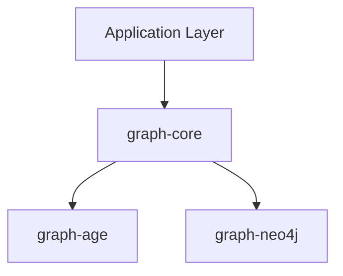

# Graph Expansion Spec - 2026-03-24

## 1. 추가할 Graph DB 선택 및 근거

### 후보 평가

| 기준 | Memgraph | JanusGraph | TinkerGraph (Apache TinkerPop) |
|------|----------|------------|-------------------------------|
| Java/Kotlin 드라이버 성숙도 | Neo4j Bolt 호환 (neo4j-java-driver 재사용 가능) | Gremlin Java Driver (TinkerPop 공식) | TinkerPop Gremlin (in-process, 드라이버 불필요) |
| Testcontainers 지원 | `testcontainers-memgraph` 공식 제공 | 비공식 (GenericContainer로 가능하나 Cassandra+ES 복합 스택) | 불필요 (in-memory, JVM 내장) |
| GraphOperations 구현 용이성 | openCypher 지원 -> Neo4j 구현체 거의 재사용 | Gremlin API -> 완전히 다른 쿼리 패러다임 | Gremlin API -> 다른 패러다임이지만 의존성 경량 |
| AGE+Neo4j 대비 차별화 | Cypher 계열 중복 (실험 가치 낮음) | 분산 그래프 + Gremlin 패러다임 (높은 차별화) | Gremlin 패러다임 + 인메모리 경량 (중간 차별화) |
| 실험 환경 운용 부담 | Docker 1개 (경량) | Docker 3+ (Cassandra/HBase + ES + JanusGraph) | 없음 (라이브러리 의존성만) |

### 선정: Apache TinkerPop (TinkerGraph)

**선정 이유:**

1. **쿼리 패러다임 차별화**: 기존 AGE(SQL/Cypher 변형)와 Neo4j(Cypher)는 모두 선언적 Cypher 계열. TinkerPop Gremlin은 절차적 순회(traversal) 패러다임으로, graph-core 추상화의 범용성을 검증할 수 있는 최적의 후보.
2. **제로 인프라**: TinkerGraph는 in-memory로 JVM 프로세스 내에서 동작. Docker/Testcontainers 불필요 -> 테스트 속도 극대화, CI 부담 제로.
3. **드라이버 성숙도 최상**: Apache TinkerPop은 그래프 DB 사실상의 표준 API. `gremlin-core` + `tinkergraph-gremlin` 아티팩트만으로 완결.
4. **JanusGraph 확장 경로**: TinkerGraph 구현이 완료되면 동일 Gremlin API로 JanusGraph 백엔드 확장이 자연스러움 (미래 확장성).
5. **학습 가치**: Gremlin traversal DSL은 Kotlin DSL과 결합 시 흥미로운 실험 가능 (builder 패턴, step 체이닝).

**탈락 사유:**
- **Memgraph**: openCypher 호환으로 Neo4j 구현체와 거의 동일. 차별화 낮음.
- **JanusGraph**: Gremlin 패러다임은 좋으나, Cassandra+ES+JanusGraph 복합 Docker 스택이 실험 프로젝트에 과도한 부담.
- **ArangoDB/OrientDB**: 멀티모델 DB로 그래프 전문 DB 대비 API가 범용적이어서 graph-core 추상화 검증에 부적합.

---

## 2. 신규 모듈 구조 (`graph/graph-tinkerpop/`)

### 모듈 메타데이터

| 항목 | 값 |
|------|-----|
| 디렉토리 | `graph/graph-tinkerpop/` |
| Gradle 모듈명 | `:graph-tinkerpop` (settings.gradle.kts 자동 감지) |
| 패키지 | `io.bluetape4k.graph.tinkerpop` |
| 핵심 의존성 | `org.apache.tinkerpop:gremlin-core`, `org.apache.tinkerpop:tinkergraph-gremlin` |

### 디렉토리 구조

```
graph/graph-tinkerpop/
  build.gradle.kts
  README.md
  src/main/kotlin/io/bluetape4k/graph/tinkerpop/
    TinkerGraphOperations.kt          # GraphOperations 구현 (동기)
    TinkerGraphSuspendOperations.kt   # GraphSuspendOperations 구현 (코루틴)
    GremlinRecordMapper.kt            # TinkerPop Vertex/Edge -> GraphVertex/GraphEdge 변환
  src/test/kotlin/io/bluetape4k/graph/tinkerpop/
    TinkerGraphOperationsTest.kt
    TinkerGraphSuspendOperationsTest.kt
  src/test/resources/
    junit-platform.properties         # 기존 모듈에서 복사
    logback-test.xml                  # 기존 모듈에서 복사
```

### build.gradle.kts (초안)

```kotlin
dependencies {
    api(project(":graph-core"))
    api(Libs.tinkerpop_gremlin_core)
    api(Libs.tinkergraph_gremlin)
    api(Libs.kotlinx_coroutines_core)

    testImplementation(Libs.bluetape4k_junit5)
    testImplementation(Libs.kotlinx_coroutines_test)
}
```

### Libs.kt 추가 항목

```kotlin
// Apache TinkerPop
const val tinkerpop_gremlin_core = "org.apache.tinkerpop:gremlin-core:3.7.3"
const val tinkergraph_gremlin = "org.apache.tinkerpop:tinkergraph-gremlin:3.7.3"
```

### 핵심 구현 매핑

| GraphOperations 메서드 | Gremlin Traversal 매핑 |
|-------------------------|------------------------|
| `createGraph(name)` | `TinkerGraph.open()` (인메모리, name은 메타데이터로 저장) |
| `graphExists(name)` | 내부 Map에서 graph 인스턴스 존재 여부 확인 |
| `dropGraph(name)` | `graph.close()` + Map에서 제거 |
| `createVertex(label, props)` | `graph.addVertex(T.label, label, ...props)` |
| `findVertexById(label, id)` | `g.V(id).hasLabel(label).next()` |
| `findVerticesByLabel(label, filter)` | `g.V().hasLabel(label).has(k, v)...toList()` |
| `createEdge(from, to, label, props)` | `g.V(from).addE(label).to(g.V(to)).property(...)` |
| `neighbors(startId, options)` | `g.V(startId).out/in/both(edgeLabel).repeat().times(maxDepth)` |
| `shortestPath(from, to, opts)` | `g.V(from).repeat(out(label).simplePath()).until(hasId(to)).path().limit(1)` |
| `allPaths(from, to, opts)` | `g.V(from).repeat(out(label).simplePath()).until(hasId(to)).path()` |

---

## 3. Neo4j 예제 모듈 설계

### 3-1. code-graph-neo4j

기존 `code-graph-age`와 **동일한 도메인**(코드 의존성 그래프)을 Neo4j 백엔드로 구현. 이를 통해 동일 `CodeGraphService`가 AGE/Neo4j 양쪽에서 동작함을 검증.

| 항목 | 값 |
|------|-----|
| 디렉토리 | `graph/examples/code-graph-neo4j/` |
| Gradle 모듈명 | `:code-graph-neo4j` |
| 패키지 | `io.bluetape4k.graph.examples.code` (AGE 예제와 동일) |

**핵심 포인트**: `CodeGraphService`와 `CodeGraphSchema`는 `code-graph-age`의 것을 **그대로 재사용**. Service 클래스는 `GraphOperations` 인터페이스에만 의존하므로, 백엔드만 `Neo4jGraphOperations`로 교체하면 됨.

#### 디렉토리 구조

```
graph/examples/code-graph-neo4j/
  build.gradle.kts
  README.md
  src/main/kotlin/io/bluetape4k/graph/examples/code/
    (schema/service는 code-graph-age 모듈을 의존해서 재사용하거나, 독립 복사)
  src/test/kotlin/io/bluetape4k/graph/examples/code/
    Neo4jCodeGraphTest.kt       # CodeGraphTest의 Neo4j 버전
    Neo4jServer.kt              # Testcontainers Neo4j 싱글턴
  src/test/resources/
    junit-platform.properties
    logback-test.xml
```

#### build.gradle.kts

```kotlin
dependencies {
    implementation(project(":graph-core"))
    implementation(project(":graph-neo4j"))
    implementation(project(":code-graph-age"))  // schema/service 재사용
    implementation(Libs.kotlinx_coroutines_core)

    testImplementation(Libs.bluetape4k_junit5)
    testImplementation(Libs.bluetape4k_testcontainers)
    testImplementation(Libs.testcontainers_neo4j)
    testImplementation(Libs.kotlinx_coroutines_test)
}
```

#### 테스트 시나리오 (CodeGraphTest와 동일)

1. 모듈 추가 및 의존성 관계 구성
2. 의존성 경로 탐색 (shortestPath)
3. 영향 범위 분석 (역방향 탐색)
4. 클래스 상속 계층 탐색
5. 함수 호출 체인 분석
6. 의존성 없는 경우 경로 null 검증

### 3-2. linkedin-graph-neo4j

동일 패턴으로 LinkedIn 소셜 그래프를 Neo4j로 구현.

| 항목 | 값 |
|------|-----|
| 디렉토리 | `graph/examples/linkedin-graph-neo4j/` |
| Gradle 모듈명 | `:linkedin-graph-neo4j` |
| 패키지 | `io.bluetape4k.graph.examples.linkedin` |

#### Vertex/Edge Labels (기존 LinkedInSchema 재사용)

**Vertex Labels:**
- `Person` (name, title, company, location, skills, connectionCount)
- `Company` (name, industry, size, location)
- `Skill` (name, category)

**Edge Labels:**
- `KNOWS` (since, strength)
- `WORKS_AT` (role, startDate, isCurrent)
- `FOLLOWS`
- `HAS_SKILL` (level)
- `ENDORSES` (skillName)

---

## 4. README Dark Theme 수정 방법

### 문제 분석

현재 Mermaid `style` 지시문에서 `fill:#4A90E2,color:#fff` 같은 하드코딩 색상을 사용. GitHub dark mode에서:
- 배경(fill)이 밝은 색 -> 다크 테마 배경과 충돌하지는 않음
- **문제**: `color:#fff`(흰색 텍스트) + 밝은 fill -> 텍스트가 잘 보임. 하지만 `color:#000`(검은 텍스트) + 밝은 fill인 경우, dark theme에서 박스 바깥 텍스트(화살표 라벨 등)가 보이지 않음
- `stroke` 색상이 fill과 유사할 경우 dark theme에서 박스 경계가 사라짐

### 해결 전략: style 지시문 제거 + Mermaid 테마 변수 사용

**방법 A (권장): 개별 style 지시문 제거**

GitHub Mermaid 렌더러는 자동으로 light/dark 테마를 적용. `style` 지시문을 제거하면 GitHub가 테마에 맞는 색상을 자동 선택.



단점: 노드 간 시각적 구분이 줄어듬.

**방법 B (절충안): 양쪽 테마에서 잘 보이는 색상 팔레트 사용**

Dark/Light 모두에서 가독성 좋은 중간 채도 색상 + 대비 높은 텍스트:

```
%% 양쪽 테마 호환 팔레트
style Core fill:#2563EB,stroke:#1E40AF,color:#FFFFFF
style AGE fill:#059669,stroke:#047857,color:#FFFFFF
style Neo4j fill:#DC2626,stroke:#B91C1C,color:#FFFFFF
style TinkerPop fill:#D97706,stroke:#B45309,color:#FFFFFF
```

핵심 원칙:
- fill은 **중간 채도** (너무 밝지도, 너무 어둡지도 않은 값)
- color는 **항상 #FFFFFF** (흰색 텍스트, fill이 충분히 진하므로)
- stroke는 fill보다 **한 단계 진하게** (dark 배경에서 경계 유지)

**방법 C: `%%{init:}%%` 테마 설정**


### 영향받는 파일 (6개)

1. `graph/graph-core/README.md` - 13개 style 지시문
2. `graph/graph-neo4j/README.md` - 31개 style 지시문
3. `graph/graph-age/README.md` - 36개 style 지시문
4. `graph/examples/code-graph-age/README.md` - 4개 style 지시문
5. `graph/examples/linkedin-graph-age/README.md` - 7개 style 지시문
6. `scheduling/README.md` - 11개 style 지시문

### 권장 팔레트 (Dark + Light 호환)

| 용도 | fill | stroke | color | 비고 |
|------|------|--------|-------|------|
| Primary (Core) | `#2563EB` | `#1E40AF` | `#FFFFFF` | Blue-600 / Blue-800 |
| Success (AGE) | `#059669` | `#047857` | `#FFFFFF` | Emerald-600 / Emerald-700 |
| Danger (Neo4j) | `#DC2626` | `#B91C1C` | `#FFFFFF` | Red-600 / Red-700 |
| Warning (TinkerPop) | `#D97706` | `#B45309` | `#FFFFFF` | Amber-600 / Amber-700 |
| Info | `#7C3AED` | `#6D28D9` | `#FFFFFF` | Violet-600 / Violet-700 |
| Neutral | `#4B5563` | `#374151` | `#FFFFFF` | Gray-600 / Gray-700 |

---

## 5. Task 목록 초안

### Task 1: Libs.kt에 TinkerPop 의존성 추가
- **Complexity**: LOW
- **파일**: `buildSrc/src/main/kotlin/Libs.kt`
- **내용**: `tinkerpop_gremlin_core`, `tinkergraph_gremlin` 상수 추가
- **수락 기준**: 상수가 컴파일 에러 없이 참조 가능

### Task 2: graph-tinkerpop 모듈 생성
- **Complexity**: HIGH
- **파일**: `graph/graph-tinkerpop/` 전체
- **내용**:
  - `build.gradle.kts` 작성
  - `TinkerGraphOperations` 구현 (GraphOperations 인터페이스)
  - `TinkerGraphSuspendOperations` 구현 (GraphSuspendOperations 인터페이스)
  - `GremlinRecordMapper` 구현 (Vertex/Edge 변환)
  - `README.md` 작성
- **수락 기준**: `./gradlew :graph-tinkerpop:test` 통과, 모든 GraphOperations 메서드가 TinkerGraph 인메모리로 동작

### Task 3: Neo4j 예제 모듈 생성 (code-graph-neo4j)
- **Complexity**: MEDIUM
- **파일**: `graph/examples/code-graph-neo4j/` 전체
- **내용**:
  - `build.gradle.kts` 작성
  - `Neo4jServer.kt` (Testcontainers 싱글턴)
  - `Neo4jCodeGraphTest.kt` (CodeGraphService + Neo4jGraphOperations 조합 테스트)
  - `README.md` 작성
- **수락 기준**: `./gradlew :code-graph-neo4j:test` 통과, AGE 예제와 동일한 6개 테스트 시나리오 통과

### Task 4: Neo4j 예제 모듈 생성 (linkedin-graph-neo4j)
- **Complexity**: MEDIUM
- **파일**: `graph/examples/linkedin-graph-neo4j/` 전체
- **내용**:
  - `build.gradle.kts` 작성
  - `Neo4jServer.kt` (Testcontainers 싱글턴)
  - `Neo4jLinkedInGraphTest.kt` (LinkedInGraphService + Neo4jGraphOperations 조합 테스트)
  - `README.md` 작성
- **수락 기준**: `./gradlew :linkedin-graph-neo4j:test` 통과

### Task 5: README dark theme 수정
- **Complexity**: LOW-MEDIUM
- **파일**: 6개 README.md 파일
- **내용**: 모든 Mermaid `style` 지시문을 dark/light 호환 팔레트로 교체
- **수락 기준**: GitHub dark mode에서 모든 다이어그램의 박스 경계, 텍스트가 명확히 구분됨

### Task 6: graph-core README 업데이트
- **Complexity**: LOW
- **파일**: `graph/graph-core/README.md`
- **내용**: 아키텍처 다이어그램에 TinkerPop 백엔드 노드 추가, 모듈 설명 갱신
- **수락 기준**: 다이어그램에 graph-tinkerpop이 표시되고 dark theme 호환

---

## 의존성 흐름

```
Task 1 (Libs.kt) --> Task 2 (graph-tinkerpop)
                      Task 3 (code-graph-neo4j)    -- 병렬 가능
                      Task 4 (linkedin-graph-neo4j) -- 병렬 가능
Task 2 완료 후 --> Task 6 (README 업데이트)
Task 5 (dark theme) -- 독립, 언제든 수행 가능
```

## 리스크

- **TinkerPop Gremlin API 버전**: TinkerPop 3.7.x의 Kotlin/Java 25 호환성 확인 필요
- **GraphElementId 매핑**: TinkerPop은 vertex ID를 Long으로 자동 생성 vs. AGE/Neo4j는 String 기반 -> `GraphElementId.of(Long)` 이미 존재하므로 호환 가능
- **Neo4j 예제에서 schema 재사용**: `code-graph-age` 모듈을 의존하면 AGE 의존성이 전이됨. Schema/Service 클래스를 별도 공통 모듈로 분리하거나, 소스 복사 방식 검토 필요
