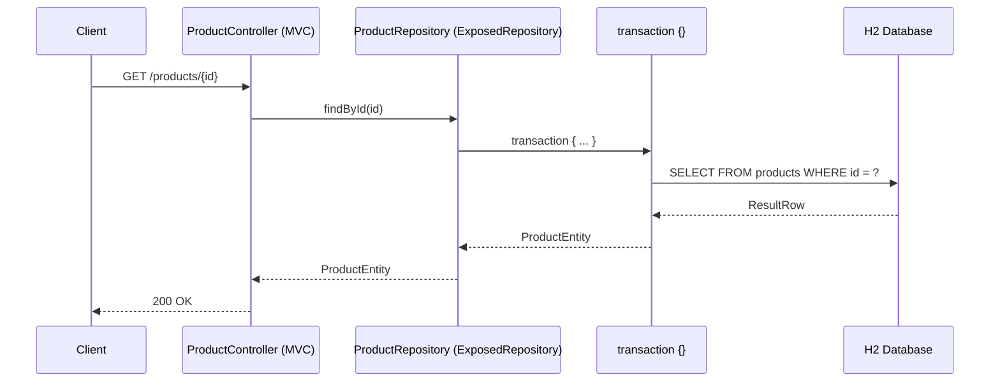

# exposed-spring-data-mvc-demo

`spring-data-exposed-spring-data` 모듈을 사용한 Spring MVC REST API 예제입니다.

## 기술 스택

- **Spring Boot 4** + **Spring MVC**
- **JetBrains Exposed 1.x** DAO 모드
- **`ExposedRepository`** — Spring Data 기반 CRUD
- **H2** 인메모리 데이터베이스

## 요청 처리 흐름



## 프로젝트 구조

```
src/main/kotlin/.../
├── DemoApplication.kt          # @SpringBootApplication + @EnableExposedRepositories
├── domain/
│   └── ProductEntity.kt        # Products 테이블 + ProductEntity + ProductDto
├── repository/
│   └── ProductRepository.kt    # ExposedRepository<ProductEntity, Long>
├── controller/
│   └── ProductController.kt    # REST CRUD 엔드포인트
└── config/
    └── DataInitializer.kt      # 초기 샘플 데이터 삽입
```

## API 엔드포인트

| Method | Path | 설명 |
|--------|------|------|
| `GET` | `/products` | 전체 목록 조회 |
| `GET` | `/products/{id}` | ID로 단건 조회 |
| `GET` | `/products/search?name={name}` | 이름으로 검색 |
| `POST` | `/products` | 새 상품 생성 |
| `PUT` | `/products/{id}` | 상품 수정 |
| `DELETE` | `/products/{id}` | 상품 삭제 |

## Repository 예시

```kotlin
interface ProductRepository : ExposedRepository<ProductEntity, Long> {
    fun findByName(name: String): List<ProductEntity>
}
```

## 실행

```bash
./gradlew :exposed-spring-data-mvc-demo:bootRun
```

## 테스트

```bash
./gradlew :exposed-spring-data-mvc-demo:test
```

테스트는 `@SpringBootTest(RANDOM_PORT)` + `RestClient`로 실제 HTTP 요청을 검증합니다.
`@TestMethodOrder` + `@Order(1)`로 초기 데이터 검증 테스트가 가장 먼저 실행됩니다.
