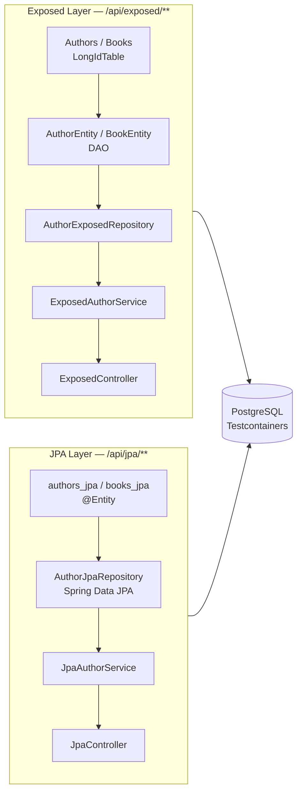

# Exposed vs JPA Benchmark

JetBrains Exposed DAO와 JPA(Hibernate 7)의 **Author(1):Book(N)** 관계 CRUD 성능을
PostgreSQL 실환경에서 Gatling으로 비교하는 Spring Boot 4 애플리케이션입니다.

## 기술 스택

| 항목 | 버전 |
|------|------|
| Kotlin | 2.3 |
| Java | 25 |
| Spring Boot | 4.x |
| JetBrains Exposed | 1.1.x (DAO) |
| Hibernate | 7 (JPA) |
| Database | PostgreSQL 18 (Testcontainers 자동 시작) |
| 부하 테스트 | Gatling 3.15.0 (Java DSL, Java 21 runtime) |

## 도메인 모델

```
Author (1) ──────── (N) Book
  - name               - title
  - email              - isbn
                       - price
                       - author (FK)
```

- **Exposed 테이블**: `authors` / `books` (`LongIdTable` + DAO Entity)
- **JPA 테이블**: `authors_jpa` / `books_jpa` (`@Entity` + Spring Data JPA)

두 ORM이 동일한 PostgreSQL 인스턴스를 공유하되, 테이블명을 분리해 충돌을 방지합니다.

## REST API

`{orm}` = `exposed` 또는 `jpa`

| Method | Endpoint | 설명 |
|--------|----------|------|
| POST   | `/api/{orm}/authors`       | Author + Book 생성 |
| GET    | `/api/{orm}/authors/{id}`  | Author 단건 조회 |
| GET    | `/api/{orm}/authors`       | Author 목록 조회 |
| PUT    | `/api/{orm}/authors/{id}`  | Author 수정 |
| DELETE | `/api/{orm}/authors/{id}`  | Author 삭제 |
| POST   | `/api/{orm}/authors/bulk`  | Author 일괄 생성 |

## 실행 방법

### 1. 애플리케이션 실행

PostgreSQL Testcontainer가 자동으로 시작됩니다.

```bash
./gradlew :exposed-jpa-benchmark:bootRun
```

시작 시 로그에서 아래 확인:
```
Database JDBC URL [jdbc:postgresql://localhost:<port>/test]
Tomcat started on port 8080
```

### 2. 단위 테스트

```bash
./gradlew :exposed-jpa-benchmark:test
```

### 3. Gatling 벤치마크

앱이 실행 중인 상태에서 **별도 터미널**에서 실행:

```bash
./gradlew :exposed-jpa-benchmark:gatlingRun
```

HTML 리포트 위치:
```
build/reports/gatling/comparisonsimulation-<timestamp>/index.html
```

## 아키텍처



### ExposedAutoConfiguration 제외 이유

Spring Boot 4에서 Exposed + JPA를 함께 사용하면 `transactionManager` 빈 충돌이 발생합니다.
`ExposedAutoConfiguration`을 제외하고 `DataInitializer`에서 `Database.connect(dataSource)`를
직접 호출해 Exposed 연결을 초기화합니다.

### N+1 방지

Exposed의 `findAll()` 및 `bulkCreate()`에서 `with()` 확장함수로 관계 eager-load:

```kotlin
AuthorEntity.all().with(AuthorEntity::books).map { it.toDto() }
```

## 벤치마크 시나리오

```
Exposed CRUD (300 users / 60s ramp):
  POST /api/exposed/authors → GET /api/exposed/authors/{id}
  → PUT /api/exposed/authors/{id} → DELETE /api/exposed/authors/{id}

JPA CRUD (300 users / 60s ramp):
  POST /api/jpa/authors → GET /api/jpa/authors/{id}
  → PUT /api/jpa/authors/{id} → DELETE /api/jpa/authors/{id}

Exposed List (50 users / 60s ramp):  GET /api/exposed/authors
JPA List     (50 users / 60s ramp):  GET /api/jpa/authors

Assertion: 전체 실패율 ≤ 1%
```

## 벤치마크 결과 요약 (PostgreSQL 18.3)

> 자세한 결과: [BENCHMARK_RESULTS.md](./BENCHMARK_RESULTS.md)

| 연산 | Exposed p99 | JPA p99 | 우위 |
|------|------------:|--------:|------|
| POST | 19 ms | 17 ms | **JPA** |
| GET  | 13 ms | 12 ms | **JPA** |
| PUT  | 15 ms | 16 ms | **Exposed** |
| DELETE | 13 ms | 21 ms | **Exposed ▲** |
| List | 11 ms | 12 ms | **Exposed** |

- **총 2,500 요청 / 실패율 0% / 평균 처리량 41.67 rps**
- 두 ORM 모두 p99 기준 25ms 이하로 실용적 수준에서 동등
- DELETE에서 Exposed가 JPA보다 **38% 빠름** (13ms vs 21ms)
- POST에서 JPA Batch Insert 최적화로 소폭 우위

## 주요 구현 사항

### Gatling Java 21 호환

Gatling 런타임이 Java 21 기반이므로 Gatling 소스만 Java 21 타겟으로 컴파일:

```kotlin
tasks.withType<JavaCompile>().configureEach {
    if (name.startsWith("compileGatling")) {
        options.release.set(21)
    }
}
```

### PostgreSQL Testcontainer

```kotlin
fun main(args: Array<String>) {
    val postgres = PostgreSQLServer.Launcher.postgres
    System.setProperty("spring.datasource.url", postgres.jdbcUrl)
    System.setProperty("spring.datasource.username", postgres.username)
    System.setProperty("spring.datasource.password", postgres.password)
    runApplication<BenchmarkApplication>(*args)
}
```

`PostgreSQLServer.Launcher.postgres`는 싱글턴으로, Spring 컨텍스트 초기화 전에 컨테이너를 시작합니다.
