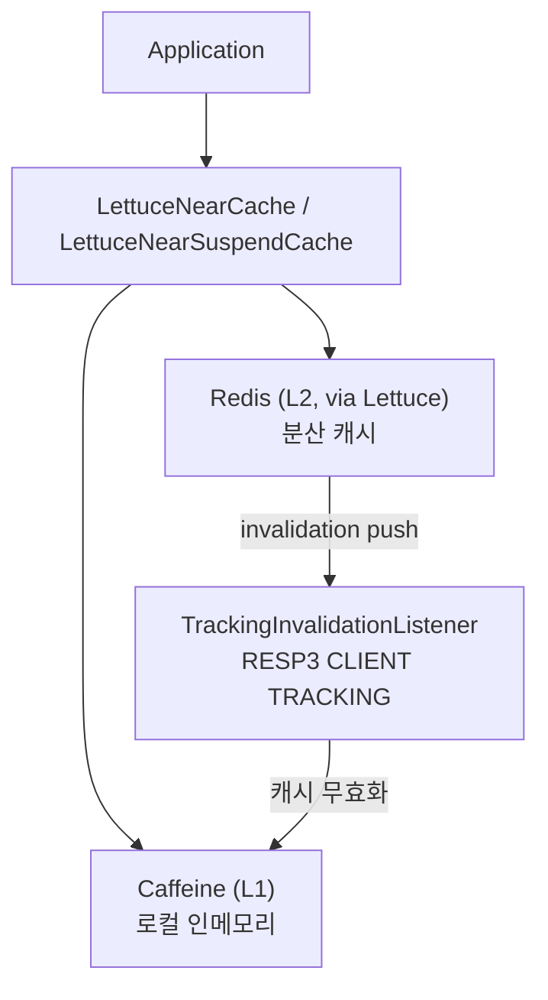
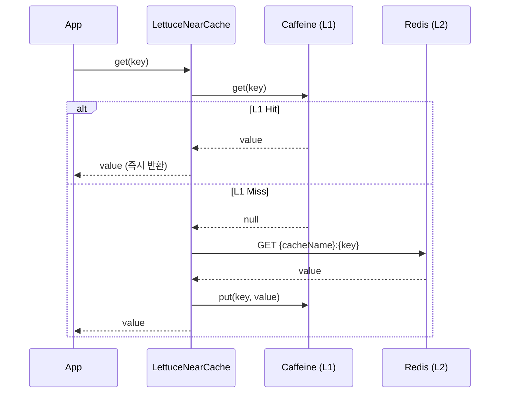
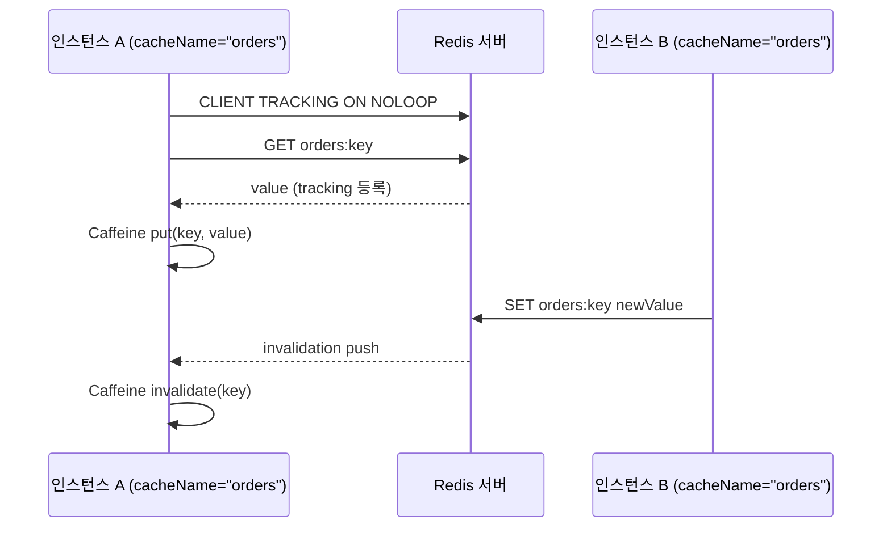

# infra-cache-lettuce-near

Lettuce 기반 **Near Cache (2-tier cache)** 구현체.
Caffeine(L1 로컬) + Redis(L2 원격)의 2계층 캐시를 제공하며, **RESP3 CLIENT TRACKING**으로 분산 환경에서 로컬 캐시 일관성을 자동으로 유지한다.

## 아키텍처



## 최근 변경

- `TrackingInvalidationListener`가 `ByteBuffer`, `ByteArray`, `String` payload를 모두 해석하도록 보강
- 코루틴 캐시 `put/putAll`의 tracking 등록 경로를 `async().get(...)` fire-and-forget으로 최적화

#### Read-Through 흐름



### 읽기 전략 (Read-Through)
1. L1(Caffeine) 히트 → 즉시 반환
2. L1 미스 → Redis GET (`{cacheName}:{key}`) → L1 populate → 반환

### 쓰기 전략 (Write-Through)
1. L1(Caffeine) put
2. Redis SET (`{cacheName}:{key}`, TTL 설정 시 SETEX)
3. async Redis GET → CLIENT TRACKING 활성화

### 무효화 전략 (Invalidation)
- RESP3 `CLIENT TRACKING ON NOLOOP` 활성화
- 다른 인스턴스가 키를 수정하면 Redis 서버가 invalidation push를 전송
- `PushListener`가 수신 즉시 `{cacheName}:` prefix를 제거한 원본 key로 Caffeine에서 해당 항목 제거

## Redis Key 격리 전략

각 캐시 인스턴스는 `{cacheName}:{key}` 형태로 Redis key를 사용한다.

```
캐시 A (cacheName="orders")
  orders:1001  → {"id":1001, "status":"PENDING"}
  orders:1002  → {"id":1002, "status":"SHIPPED"}

캐시 B (cacheName="products")
  products:sku-001  → {"name":"Widget", "price":9.99}
  products:sku-002  → {"name":"Gadget", "price":19.99}
```

이로써:
- **cacheName별 완전한 key 공간 격리** 보장
- **`clearAll()`이 SCAN 기반** (`{cacheName}:*` 패턴) → 다른 캐시 데이터 보존
- **CLIENT TRACKING이 key 단위**로 동작 → 정확한 per-key invalidation

### cacheName 제약

```kotlin
// ✅ 올바른 cacheName
NearCacheConfig(cacheName = "orders")
NearCacheConfig(cacheName = "product-cache")
NearCacheConfig(cacheName = "user_sessions")

// ❌ ':' 포함 불가 (prefix 충돌 위험)
NearCacheConfig(cacheName = "cache:v2")  // IllegalArgumentException
```

> **이유**: `"cache"` 와 `"cache:v2"` 가 동시에 존재하면 `"cache:"` prefix가 `"cache:v2:key"` 에도 매칭되어 잘못된 invalidation이 발생할 수 있음.

> **key는 `:`를 자유롭게 사용 가능**: `cache.put("user:123", value)` → Redis key `"orders:user:123"`

## 제공 클래스

| 클래스 | 설명 |
|--------|------|
| `LettuceNearCache<V>` | 동기(Blocking) Near Cache |
| `LettuceNearSuspendCache<V>` | 코루틴(Suspend) Near Cache |
| `NearCacheConfig<K, V>` | 설정 data class + DSL 빌더 |
| `CaffeineLocalCache<K, V>` | Caffeine 기반 L1 캐시 |
| `TrackingInvalidationListener<V>` | RESP3 CLIENT TRACKING 리스너 |

## 의존성

```kotlin
// build.gradle.kts
dependencies {
    implementation("io.github.bluetape4k:bluetape4k-experimental-infra-cache-lettuce-near")

    // 직렬화 런타임 (커스텀 타입 사용 시)
    implementation("org.apache.fory:fory-kotlin:0.15.0")
    implementation("org.lz4:lz4-java:1.8.0")
}
```

## 빠른 시작

### String 키/값 (동기)

```kotlin
val redisClient = RedisClient.create("redis://localhost:6379")

val cache = LettuceNearCache(
    redisClient = redisClient,
    config = NearCacheConfig(
        cacheName = "orders",          // ':' 포함 불가
        maxLocalSize = 10_000,
        localExpireAfterWrite = Duration.ofMinutes(30),
        redisTtl = Duration.ofSeconds(120),
    )
)

cache.put("key", "value")
val value = cache.get("key")          // L1 히트 시 Redis 미조회
cache.put("user:123", "Alice")        // key에는 ':' 사용 가능

cache.close()
redisClient.shutdown()
```

### 커스텀 타입 (동기)

```kotlin
val codec = LettuceBinaryCodec<Product>(BinarySerializers.LZ4Fory)

val config = nearCacheConfig<String, Product> {
    cacheName = "product-cache"
    maxLocalSize = 50_000
    localExpireAfterWrite = Duration.ofMinutes(10)
    redisTtl = Duration.ofMinutes(5)
    useRespProtocol3 = true
    recordStats = true
}

val cache = LettuceNearCache(redisClient, codec, config)
```

### 코루틴 (Suspend)

```kotlin
val cache = LettuceNearSuspendCache(
    redisClient = redisClient,
    config = NearCacheConfig(
        cacheName = "async-cache",
        redisTtl = Duration.ofMinutes(5),
    )
)

// suspend 함수 내에서 사용
coroutineScope {
    cache.put("key", "value")
    val value = cache.get("key")
    cache.remove("key")
}

cache.close()
```

### 멀티 캐시 (cacheName 격리)

```kotlin
// 같은 Redis DB에 여러 캐시를 독립적으로 운영
val orderCache = LettuceNearCache(
    redisClient, StringCodec.UTF8,
    NearCacheConfig(cacheName = "orders"),
)
val productCache = LettuceNearCache(
    redisClient, StringCodec.UTF8,
    NearCacheConfig(cacheName = "products"),
)

orderCache.put("1001", "order-data")
productCache.put("1001", "product-data")

// clearAll()은 해당 cacheName의 key만 삭제
orderCache.clearAll()
orderCache.get("1001")    // null
productCache.get("1001")  // "product-data" → 영향 없음
```

### 멀티-get / 멀티-put

```kotlin
// 일괄 조회 (L1 히트는 Redis를 조회하지 않음)
val results: Map<String, String> = cache.getAll(setOf("k1", "k2", "k3"))

// 일괄 저장
cache.putAll(mapOf("k1" to "v1", "k2" to "v2"))
```

## NearCacheConfig 설정 옵션

| 옵션 | 기본값 | 설명 |
|------|--------|------|
| `cacheName` | `"lettuce-near-cache"` | 캐시 이름 (`:` 포함 불가) |
| `maxLocalSize` | `10_000` | Caffeine 최대 항목 수 |
| `localExpireAfterWrite` | `30분` | Caffeine write 후 만료 시간 |
| `localExpireAfterAccess` | `null` | Caffeine access 후 만료 시간 (null = 비활성) |
| `redisTtl` | `null` | Redis TTL (null = 만료 없음) |
| `useRespProtocol3` | `true` | RESP3 + CLIENT TRACKING 활성화 |
| `recordStats` | `false` | Caffeine 통계 수집 활성화 |

## 통계 수집

```kotlin
val config = NearCacheConfig(cacheName = "stats-cache", recordStats = true)
val cache = LettuceNearCache(redisClient, codec, config)

// ... 사용 후
val stats = cache.localStats()   // CacheStats? (null if recordStats = false)
println("Hit rate: ${stats?.hitRate()}")
println("Miss count: ${stats?.missCount()}")
println("Eviction count: ${stats?.evictionCount()}")

// Redis key 개수 확인 (SCAN 기반)
println("Redis key count: ${cache.redisSize()}")
```

## CLIENT TRACKING 동작 원리



- **같은 cacheName** 인스턴스끼리만 invalidation이 전파됨 (key prefix가 일치해야 함)
- **다른 cacheName** 인스턴스의 쓰기는 영향 없음 (prefix 불일치로 필터링)
- `NOLOOP` 옵션: 자신이 변경한 키의 invalidation은 수신하지 않음
- Redis 6+ 및 RESP3 프로토콜 필요

## API 참조

### LettuceNearCache\<V\> / LettuceNearSuspendCache\<V\>

| 메서드 | 설명 |
|--------|------|
| `get(key)` | 키 조회 (L1 미스 시 Redis 조회) |
| `getAll(keys)` | 멀티-get |
| `put(key, value)` | write-through 저장 |
| `putAll(map)` | 일괄 저장 |
| `putIfAbsent(key, value)` | 없을 때만 저장, 기존 값 반환 |
| `remove(key)` | L1 + Redis 삭제 |
| `removeAll(keys)` | 일괄 삭제 |
| `replace(key, value)` | 기존 값 교체 |
| `replace(key, oldValue, newValue)` | CAS 교체 |
| `getAndRemove(key)` | 조회 후 삭제 |
| `getAndReplace(key, value)` | 조회 후 교체 |
| `containsKey(key)` | L1 또는 Redis 존재 확인 |
| `clearLocal()` | L1만 비움 (Redis 유지) |
| `clearAll()` | L1 + Redis 모두 비움 (SCAN 기반, 이 캐시만) |
| `localSize()` | L1 추정 항목 수 |
| `redisSize()` | Redis에서 이 cacheName의 key 개수 (SCAN 기반) |
| `localStats()` | Caffeine 통계 (recordStats = true 시) |
| `cacheName` | 이 인스턴스의 cacheName |
| `close()` | 리소스 해제 |

## 제약 사항

- Redis 6 이상 + RESP3 지원 필요 (CLIENT TRACKING 사용 시)
- RESP3를 지원하지 않는 Redis 환경에서는 `useRespProtocol3 = false`로 설정 (invalidation 비활성화)
- `cacheName`에 `:` 포함 불가 (다른 cacheName과 prefix 충돌 방지)
- `clearAll()`은 SCAN 기반으로 이 캐시의 key만 삭제하므로 key 수가 매우 많으면 성능 주의
