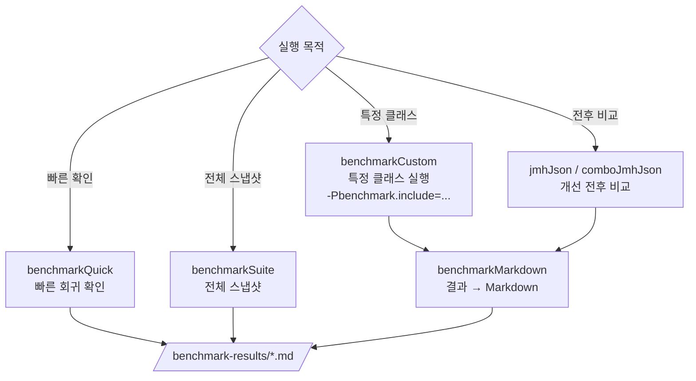

# Benchmarks

`io/benchmarks` 모듈은 앞으로 성능 개선 전후를 비교할 때 사용할 공용 벤치마크 실행 지점을 제공합니다.

## 벤치마크 실행 파이프라인



## 기본 실행

스크립트로 바로 실행:

```bash
./io/benchmarks/benchmark-serializer.sh
./io/benchmarks/benchmark-combo.sh
./io/benchmarks/benchmark-near-cache.sh
./io/benchmarks/benchmark-near-suspend.sh
./io/benchmarks/benchmark-exposed-r2dbc.sh
./io/benchmarks/benchmark-all.sh
```

스크립트 실행 결과는 `io/benchmarks/benchmark-results/` 아래에 `.json` 과 `.md` 로 생성됩니다.

짧게 회귀만 보고 싶을 때:

```bash
./gradlew :benchmarks:benchmarkQuick
```

serializer JMH JSON 결과:

```bash
./gradlew :benchmarks:jmhJson
```

serializer + compressor 조합 JMH JSON 결과:

```bash
./gradlew :benchmarks:comboJmhJson
```

snapshot + JMH를 한 번에 수행:

```bash
./gradlew :benchmarks:benchmarkSuite
```

near cache benchmark 만 실행:

```bash
./gradlew :benchmarks:benchmarkCustom \
  -Pbenchmark.include='.*LettuceNearCacheBenchmark.*' \
  -Pbenchmark.warmups=2 \
  -Pbenchmark.iterations=5 \
  -Pbenchmark.tag=near-cache-baseline
```

suspend near cache benchmark 만 실행:

```bash
./gradlew :benchmarks:benchmarkCustom \
  -Pbenchmark.include='.*LettuceNearSuspendCacheBenchmark.*' \
  -Pbenchmark.warmups=2 \
  -Pbenchmark.iterations=5 \
  -Pbenchmark.tag=near-suspend-baseline
```

Exposed R2DBC repository benchmark 만 실행:

```bash
./gradlew :benchmarks:benchmarkCustom \
  -Pbenchmark.include='.*SimpleExposedR2dbcRepository.*Benchmark.*' \
  -Pbenchmark.warmups=2 \
  -Pbenchmark.iterations=5 \
  -Pbenchmark.tag=exposed-r2dbc-baseline
```

사용 가능한 벤치마크 task와 override 목록 확인:

```bash
./gradlew :benchmarks:benchmarkInfo
```

JSON 결과를 Markdown 으로 변환:

```bash
./gradlew :benchmarks:benchmarkMarkdown \
  -Pbenchmark.inputJson=build/reports/benchmarks/custom-jmh-results-near-suspend-smoke.json \
  -Pbenchmark.outputMd=build/reports/benchmarks/custom-jmh-results-near-suspend-smoke.md \
  -Pbenchmark.title="Near Suspend Cache Benchmark"
```

실행과 Markdown 변환을 한 번에:

```bash
./gradlew :benchmarks:benchmarkCustomReport \
  -Pbenchmark.include='.*LettuceNearSuspendCacheBenchmark.*' \
  -Pbenchmark.tag=near-suspend \
  -Pbenchmark.title="Near Suspend Cache Benchmark"
```

## 공용 Override

모든 JMH task(`benchmarkCustom`, `jmhJson`, `jmhGc`, `comboJmhJson`, `comboJmhGc`, `benchmarkQuick`)는
다음 `-Pbenchmark.*` 속성을 공유합니다.

```bash
./gradlew :benchmarks:benchmarkCustom \
  -Pbenchmark.include='.*BinarySerializerBenchmark.*' \
  -Pbenchmark.warmups=5 \
  -Pbenchmark.iterations=10 \
  -Pbenchmark.warmupSeconds=1s \
  -Pbenchmark.measureSeconds=2s \
  -Pbenchmark.forks=1 \
  -Pbenchmark.mode=avgt \
  -Pbenchmark.timeUnit=us \
  -Pbenchmark.format=json \
  -Pbenchmark.tag=baseline
```

지원 속성:

- `benchmark.include`: 실행할 JMH 클래스/메서드 regex
- `benchmark.warmups`: warmup iteration 수
- `benchmark.iterations`: measurement iteration 수
- `benchmark.warmupSeconds`: warmup time
- `benchmark.measureSeconds`: measurement time
- `benchmark.forks`: fork 수
- `benchmark.mode`: JMH mode (`avgt`, `thrpt`, `sample`, `ss`)
- `benchmark.timeUnit`: 결과 단위 (`ns`, `us`, `ms`, `s`)
- `benchmark.format`: 결과 포맷 (`json`, `text`, `csv`, `scsv`, `latex`)
- `benchmark.resultFile`: 결과 파일 경로. `io/benchmarks` 기준 상대 경로
- `benchmark.tag`: 기본 결과 파일명 뒤에 붙일 suffix

## 결과 파일

기본 결과는 `io/benchmarks/build/reports/benchmarks/` 아래에 저장됩니다.

- `quick-jmh-results.json`
- `jmh-results.json`
- `jmh-gc-results.json`
- `combo-jmh-results.json`
- `combo-jmh-gc-results.json`
- `serialized-size.json`
- `combo-serialized-size.json`

`-Pbenchmark.tag=after-cache-fix` 를 주면 기본 결과 파일명에 tag가 붙습니다.

예:

- `jmh-results-after-cache-fix.json`
- `quick-jmh-results-after-cache-fix.json`

## 운영 원칙

- 짧은 회귀 확인은 `benchmarkQuick`
- 개선 전/후 비교용 수집은 `jmhJson`, `comboJmhJson`
- cache 계열 회귀나 atomic 연산 비교는 `benchmarkCustom -Pbenchmark.include='.*LettuceNearCacheBenchmark.*'`
- suspend cache 회귀는 `benchmarkCustom -Pbenchmark.include='.*LettuceNearSuspendCacheBenchmark.*'`
- Exposed R2DBC CRUD/paging 비교는 `benchmarkCustom -Pbenchmark.include='.*SimpleExposedR2dbcRepository.*Benchmark.*'`
- 메모리 pressure 확인은 `jmhGc`, `comboJmhGc`
- CI에 넣기 전에는 로컬에서 최소 2회 이상 재실행해 분산을 확인
- 결과 비교 시 JDK 버전, Mac/CI 머신, 실행 옵션을 함께 기록
