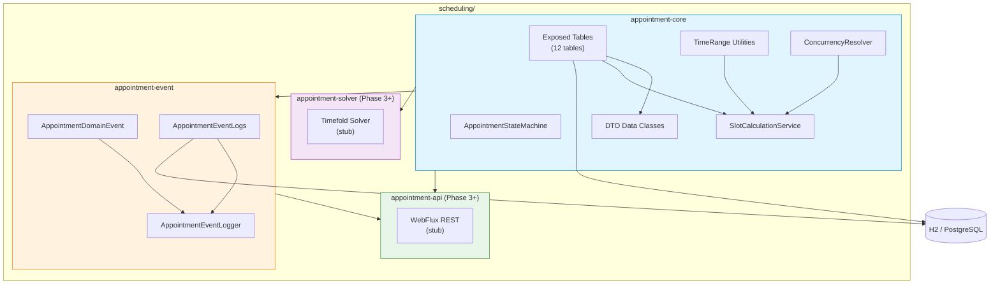
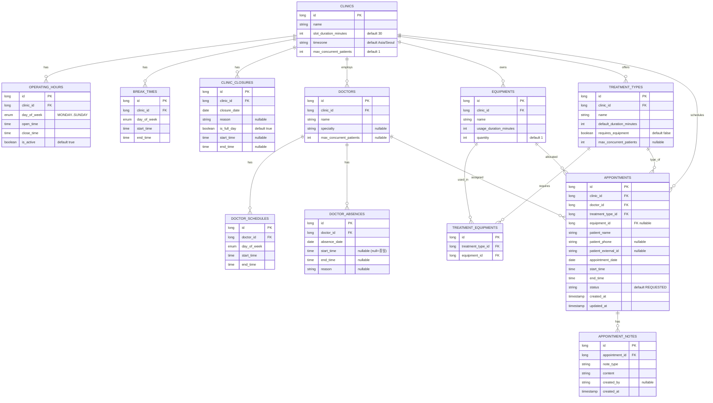
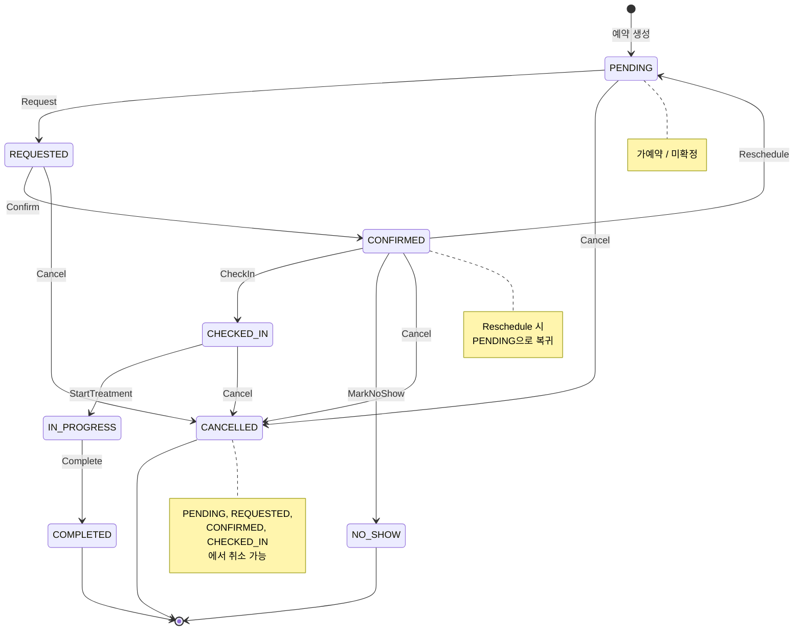
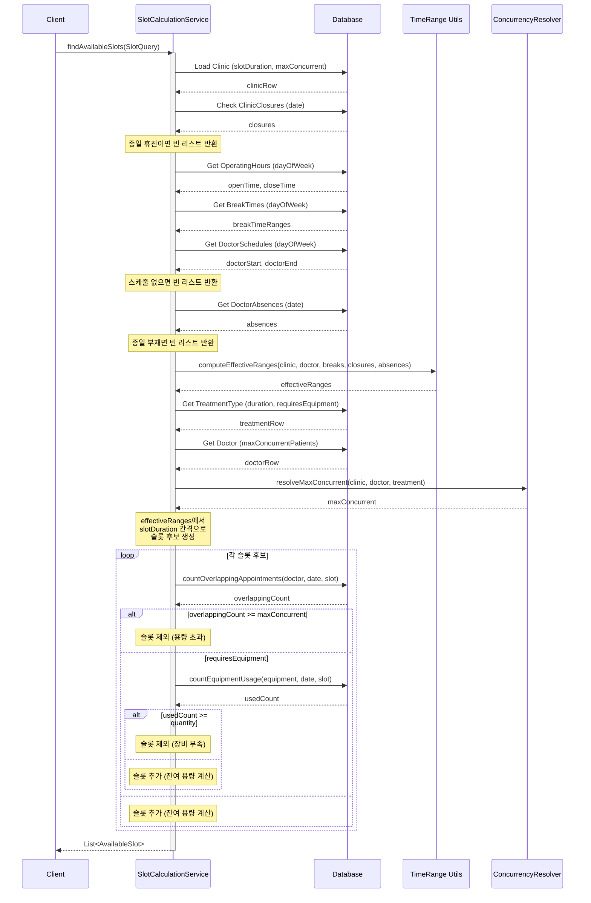
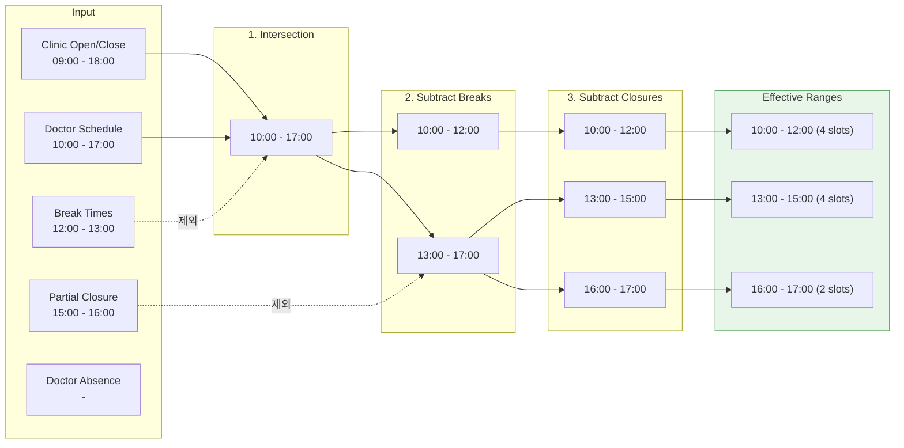
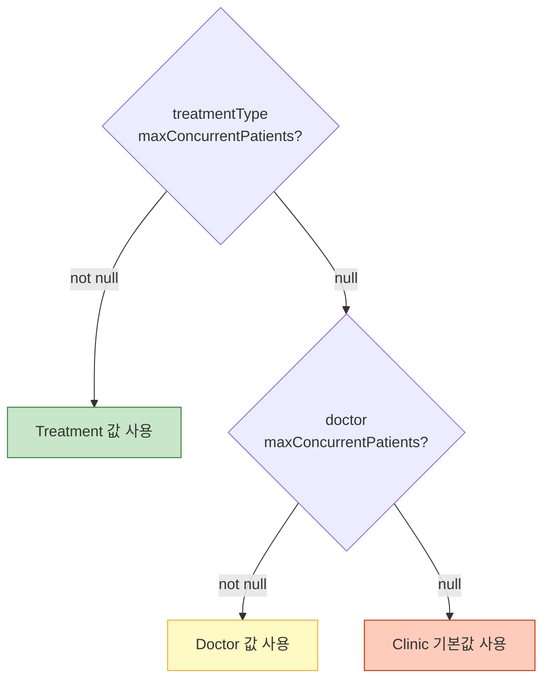
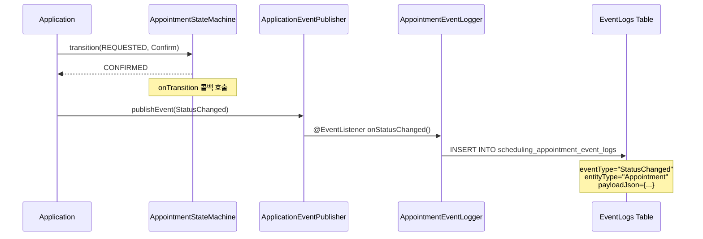
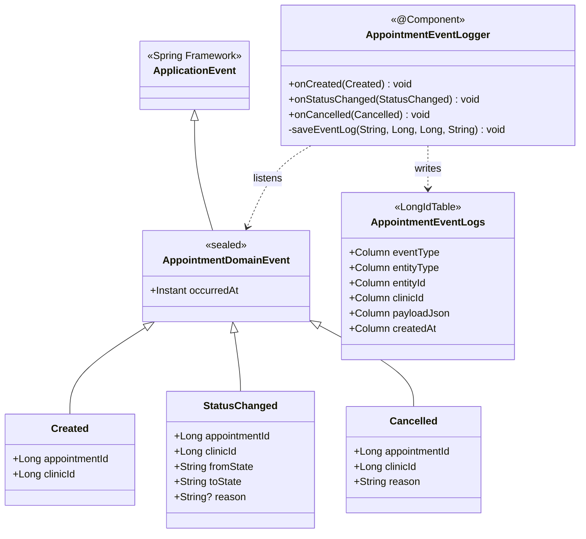

# Appointment Scheduling System

병원 진료 예약 스케줄링 시스템의 백엔드 구현체입니다.
멀티 병원(Clinic) 환경을 지원하며, 의사 스케줄 / 장비 가용성 / 동시 수용 인원을 고려한 **가용 슬롯 조회** 기능을 제공합니다.

---

## System Architecture



### Module Dependencies

| Module | Gradle ID | 역할 | 상태 |
|--------|-----------|------|------|
| `appointment-core` | `:appointment-core` | 도메인 모델 + 상태 머신 + 슬롯 계산 | **Phase 1-2 완료** |
| `appointment-event` | `:appointment-event` | 이벤트 정의 + 이벤트 로그 DB 저장 | **Phase 1 완료** |
| `appointment-solver` | `:appointment-solver` | Timefold 기반 최적화 | Phase 3+ stub |
| `appointment-api` | `:appointment-api` | WebFlux REST API | Phase 3+ stub |

---

## Data Model (ER Diagram)



---

## Appointment State Transition Diagram



### State & Event 매핑

| 현재 상태 | 이벤트 | 다음 상태 |
|-----------|--------|-----------|
| `PENDING` | `Request` | `REQUESTED` |
| `PENDING` | `Cancel(reason)` | `CANCELLED` |
| `REQUESTED` | `Confirm` | `CONFIRMED` |
| `REQUESTED` | `Cancel(reason)` | `CANCELLED` |
| `CONFIRMED` | `CheckIn` | `CHECKED_IN` |
| `CONFIRMED` | `MarkNoShow` | `NO_SHOW` |
| `CONFIRMED` | `Cancel(reason)` | `CANCELLED` |
| `CONFIRMED` | `Reschedule` | `PENDING` |
| `CHECKED_IN` | `StartTreatment` | `IN_PROGRESS` |
| `CHECKED_IN` | `Cancel(reason)` | `CANCELLED` |
| `IN_PROGRESS` | `Complete` | `COMPLETED` |

---

## Slot Calculation Service

### Class Diagram

```mermaid
classDiagram
    class SlotQuery {
        +Long clinicId
        +Long doctorId
        +Long treatmentTypeId
        +LocalDate date
        +Int? requestedDurationMinutes
    }

    class AvailableSlot {
        +LocalDate date
        +LocalTime startTime
        +LocalTime endTime
        +Long doctorId
        +List~Long~ equipmentIds
        +Int remainingCapacity
    }

    class TimeRange {
        +LocalTime start
        +LocalTime end
        +contains(LocalTime) Boolean
        +overlaps(TimeRange) Boolean
        +duration() Duration
    }

    class SlotCalculationService {
        +findAvailableSlots(SlotQuery) List~AvailableSlot~
        -countOverlappingAppointments(Long, LocalDate, LocalTime, LocalTime) Int
        -countEquipmentUsage(Long, LocalDate, LocalTime, LocalTime) Int
    }

    class ConcurrencyResolver {
        +resolveMaxConcurrent(Int, Int?, Int?) Int
    }

    SlotCalculationService ..> SlotQuery : input
    SlotCalculationService ..> AvailableSlot : output
    SlotCalculationService ..> TimeRange : uses
    SlotCalculationService ..> ConcurrencyResolver : uses

    class AppointmentStateMachine {
        -Map transitions
        -onTransition suspend callback
        +transition(AppointmentState, AppointmentEvent) AppointmentState
        +canTransition(AppointmentState, AppointmentEvent) Boolean
        +allowedEvents(AppointmentState) Set~Class~
    }

    class AppointmentState {
        <<sealed>>
        +String name
    }
    AppointmentState <|-- PENDING
    AppointmentState <|-- REQUESTED
    AppointmentState <|-- CONFIRMED
    AppointmentState <|-- CHECKED_IN
    AppointmentState <|-- IN_PROGRESS
    AppointmentState <|-- COMPLETED
    AppointmentState <|-- NO_SHOW
    AppointmentState <|-- CANCELLED

    class AppointmentEvent {
        <<sealed>>
    }
    AppointmentEvent <|-- Request
    AppointmentEvent <|-- Confirm
    AppointmentEvent <|-- CheckIn
    AppointmentEvent <|-- StartTreatment
    AppointmentEvent <|-- Complete
    AppointmentEvent <|-- Cancel
    AppointmentEvent <|-- MarkNoShow
    AppointmentEvent <|-- Reschedule

    AppointmentStateMachine ..> AppointmentState : manages
    AppointmentStateMachine ..> AppointmentEvent : processes
```



### Slot Calculation Sequence Diagram



### Effective Time Range Calculation



### Max Concurrent Patients Resolution (3-Level Cascade)



---

## Event Module

### Event Flow Diagram



### Domain Event Class Diagram



---

## Project Structure

```
scheduling/
├── README.md
├── appointment-core/
│   ├── build.gradle.kts
│   └── src/
│       ├── main/kotlin/io/bluetape4k/scheduling/appointment/
│       │   ├── model/
│       │   │   ├── tables/          # 12 Exposed Table objects
│       │   │   │   ├── Clinics.kt
│       │   │   │   ├── OperatingHoursTable.kt
│       │   │   │   ├── BreakTimes.kt
│       │   │   │   ├── ClinicClosures.kt
│       │   │   │   ├── Doctors.kt
│       │   │   │   ├── DoctorSchedules.kt
│       │   │   │   ├── DoctorAbsences.kt
│       │   │   │   ├── Equipments.kt
│       │   │   │   ├── TreatmentTypes.kt
│       │   │   │   ├── TreatmentEquipments.kt
│       │   │   │   ├── Appointments.kt
│       │   │   │   └── AppointmentNotes.kt
│       │   │   └── dto/             # 12 DTO data classes
│       │   │       ├── ClinicDto.kt
│       │   │       ├── OperatingHoursDto.kt
│       │   │       ├── BreakTimeDto.kt
│       │   │       ├── ClinicClosureDto.kt
│       │   │       ├── DoctorDto.kt
│       │   │       ├── DoctorScheduleDto.kt
│       │   │       ├── DoctorAbsenceDto.kt
│       │   │       ├── EquipmentDto.kt
│       │   │       ├── TreatmentTypeDto.kt
│       │   │       ├── TreatmentEquipmentDto.kt
│       │   │       ├── AppointmentDto.kt
│       │   │       └── AppointmentNoteDto.kt
│       │   ├── statemachine/        # 상태 머신
│       │   │   ├── AppointmentState.kt
│       │   │   ├── AppointmentEvent.kt
│       │   │   └── AppointmentStateMachine.kt
│       │   └── service/             # 슬롯 계산 서비스
│       │       ├── SlotCalculationService.kt
│       │       ├── ConcurrencyResolver.kt
│       │       └── model/
│       │           ├── TimeRange.kt
│       │           ├── SlotQuery.kt
│       │           └── AvailableSlot.kt
│       └── test/kotlin/io/bluetape4k/scheduling/appointment/
│           ├── model/tables/TableSchemaTest.kt
│           ├── statemachine/AppointmentStateMachineTest.kt
│           └── service/
│               ├── SlotCalculationServiceTest.kt
│               ├── ResolveMaxConcurrentTest.kt
│               └── model/TimeRangeTest.kt
├── appointment-event/
│   ├── build.gradle.kts
│   └── src/
│       ├── main/kotlin/io/bluetape4k/scheduling/appointment/event/
│       │   ├── AppointmentDomainEvent.kt
│       │   ├── AppointmentEventLogs.kt
│       │   ├── AppointmentEventLogDto.kt
│       │   └── AppointmentEventLogger.kt
│       └── test/kotlin/io/bluetape4k/scheduling/appointment/event/
│           └── EventLogTest.kt
├── appointment-solver/               # Phase 3+ stub
│   └── build.gradle.kts
└── appointment-api/                   # Phase 3+ stub
    └── build.gradle.kts
```

---

## Getting Started

### Prerequisites

- JDK 25+
- Gradle 9.4+

### Build & Test

```bash
# appointment-core 테스트 (63 tests)
./gradlew :appointment-core:test

# appointment-event 테스트 (5 tests)
./gradlew :appointment-event:test

# 개별 테스트 실행
./gradlew :appointment-core:test --tests "*.TableSchemaTest"
./gradlew :appointment-core:test --tests "*.AppointmentStateMachineTest"
./gradlew :appointment-core:test --tests "*.TimeRangeTest"
./gradlew :appointment-core:test --tests "*.ResolveMaxConcurrentTest"
./gradlew :appointment-core:test --tests "*.SlotCalculationServiceTest"
./gradlew :appointment-event:test --tests "*.EventLogTest"
```

### Usage Example

```kotlin
import io.bluetape4k.scheduling.appointment.service.SlotCalculationService
import io.bluetape4k.scheduling.appointment.service.model.SlotQuery
import org.jetbrains.exposed.v1.jdbc.Database
import java.time.LocalDate

// 1. DB 연결
Database.connect("jdbc:h2:mem:test;DB_CLOSE_DELAY=-1", driver = "org.h2.Driver")

// 2. 슬롯 조회
val service = SlotCalculationService()
val slots = service.findAvailableSlots(
    SlotQuery(
        clinicId = 1L,
        doctorId = 1L,
        treatmentTypeId = 1L,
        date = LocalDate.of(2026, 3, 20)
    )
)

// 3. 결과 활용
slots.forEach { slot ->
    println("${slot.startTime}-${slot.endTime} (잔여: ${slot.remainingCapacity}명)")
}
```

### State Machine Usage

```kotlin
import io.bluetape4k.scheduling.appointment.statemachine.*

val sm = AppointmentStateMachine { from, event, to ->
    println("$from --[$event]--> $to")
}

// 예약 흐름
var state: AppointmentState = AppointmentState.PENDING
state = sm.transition(state, AppointmentEvent.Request)      // → REQUESTED
state = sm.transition(state, AppointmentEvent.Confirm)       // → CONFIRMED
state = sm.transition(state, AppointmentEvent.CheckIn)       // → CHECKED_IN
state = sm.transition(state, AppointmentEvent.StartTreatment) // → IN_PROGRESS
state = sm.transition(state, AppointmentEvent.Complete)       // → COMPLETED

// 허용된 이벤트 확인
val allowed = sm.allowedEvents(AppointmentState.CONFIRMED)
// → {CheckIn, MarkNoShow, Cancel, Reschedule}

// 전이 가능 여부 확인
sm.canTransition(AppointmentState.COMPLETED, AppointmentEvent.Cancel("test"))
// → false (완료 후 취소 불가)
```

---

## Design Decisions

| 항목 | 결정 | 이유 |
|------|------|------|
| 환자 모델 | 인라인 (patient_name, patient_phone 등) | 별도 테이블 불필요, 예약에 직접 포함 |
| 멀티 병원 | 공유 DB + clinic_id FK | 단순하면서 병원 간 데이터 격리 |
| 상태 관리 | Kotlin sealed class | 컴파일 타임 안전성, StateMachine 마이그레이션 가능 |
| 동시 예약 | 3단계 cascade (Clinic > Doctor > TreatmentType) | 세밀한 제어 가능 |
| 이벤트 | Spring ApplicationEvent + DB 로그 | 느슨한 결합 + 감사 추적 |
| 데이터 접근 | Exposed JDBC (서비스) + R2DBC (API 준비) | 서비스 계층은 동기, API는 비동기 지원 |
| 테이블 접두사 | `scheduling_` | 다른 모듈과 네임스페이스 충돌 방지 |

---

## Roadmap

- [x] **Phase 1**: 도메인 모델 (Tables, DTOs, State Machine, Events)
- [x] **Phase 2**: 가용 슬롯 조회 서비스
- [ ] **Phase 3**: Timefold Solver 기반 자동 스케줄 최적화
- [ ] **Phase 4**: WebFlux REST API + 예약 CRUD
- [ ] **Phase 5**: Spring Boot Auto-Configuration + 알림 연동
