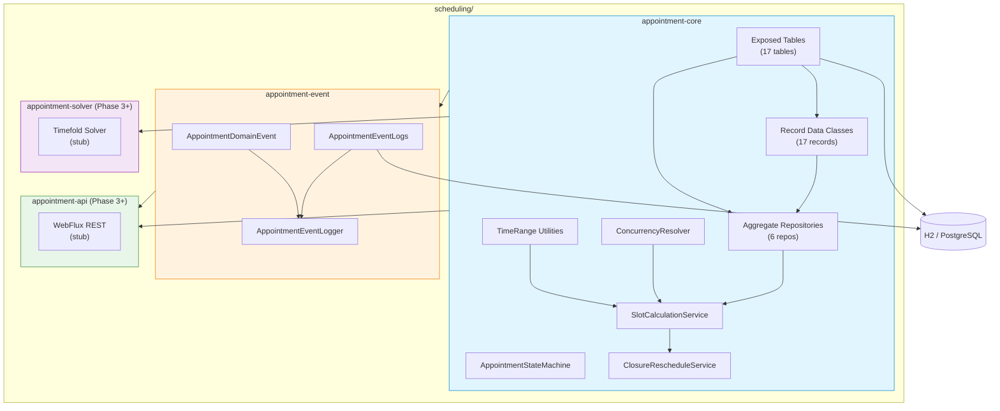
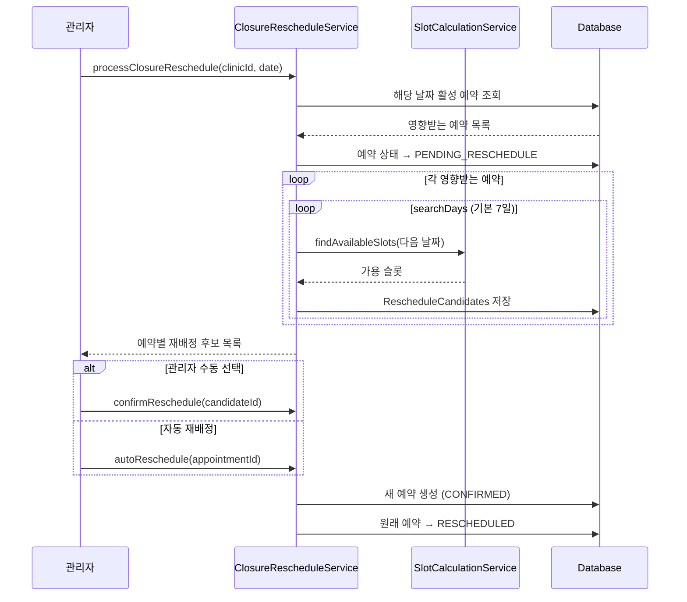
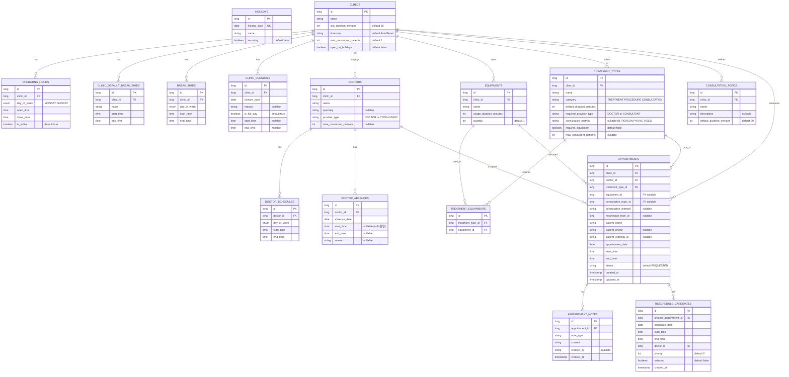
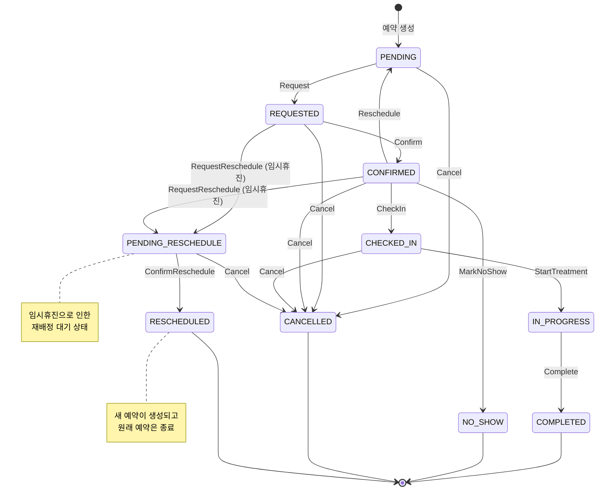
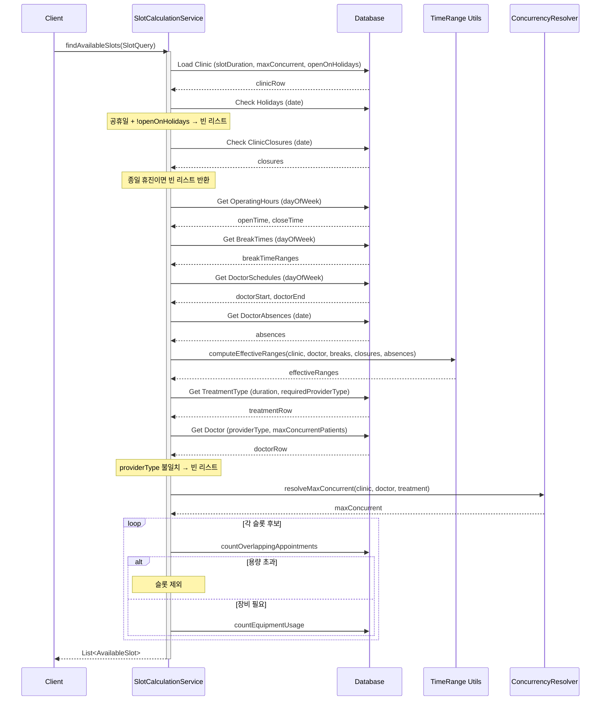
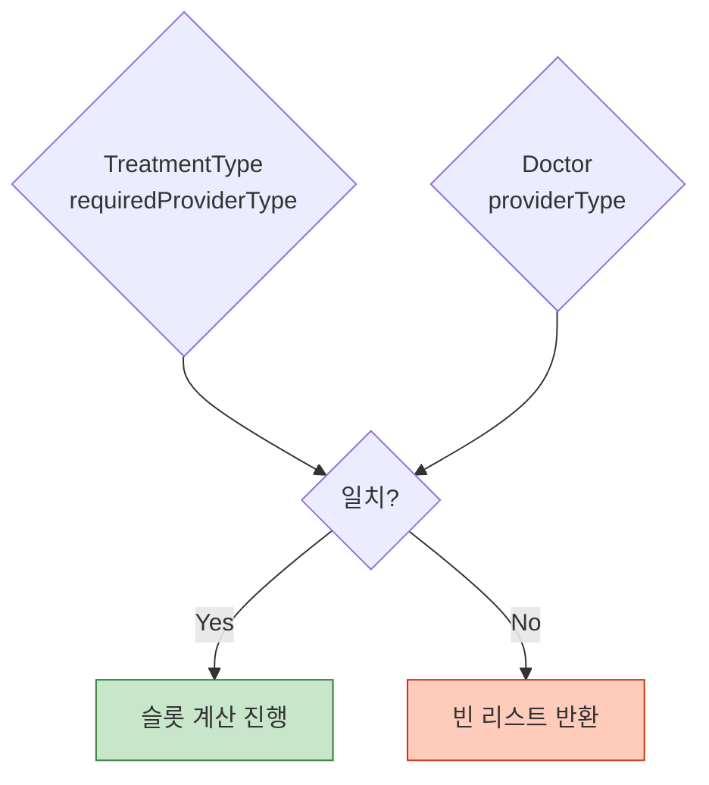
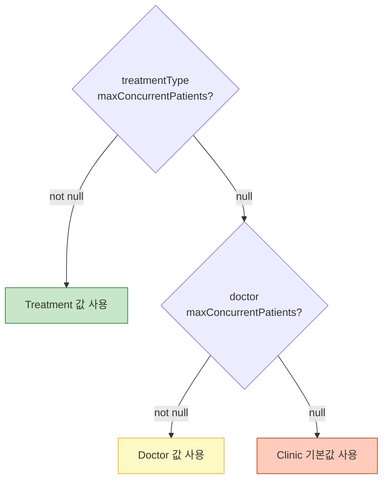
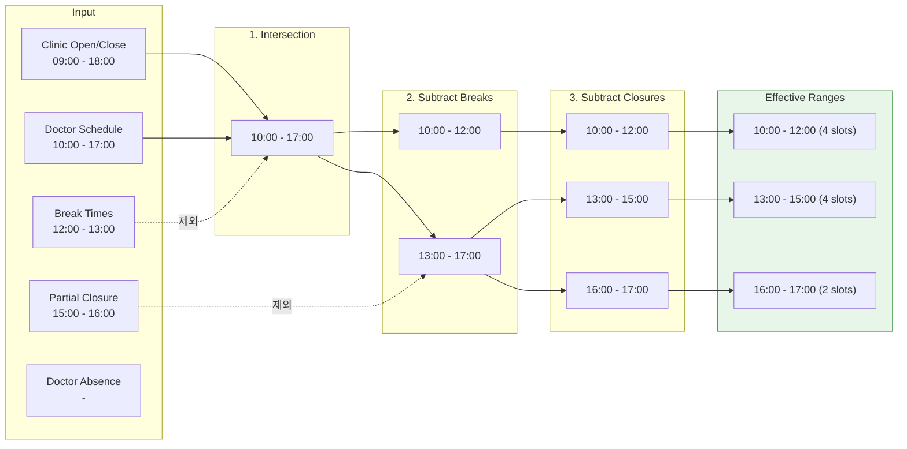
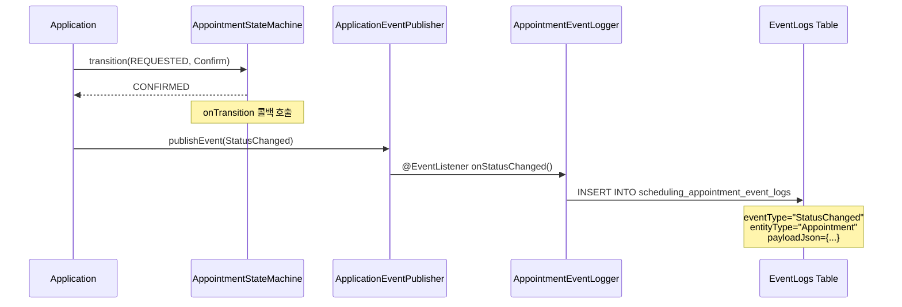

# Appointment Scheduling System

병원 진료 예약 스케줄링 시스템의 백엔드 구현체입니다.
멀티 병원(Clinic) 환경을 지원하며, 의사/전문상담사 스케줄 / 장비 가용성 / 동시 수용 인원 / 공휴일을 고려한 **가용 슬롯 조회** 기능을 제공합니다.

---

## System Architecture



### Module Dependencies

| Module | Gradle ID | 역할 | 상태 |
|--------|-----------|------|------|
| `appointment-core` | `:appointment-core` | 도메인 모델 + 상태 머신 + 슬롯 계산 + 재배정 | **Phase 1-2 완료** |
| `appointment-event` | `:appointment-event` | 이벤트 정의 + 이벤트 로그 DB 저장 | **Phase 1 완료** |
| `appointment-solver` | `:appointment-solver` | Timefold 기반 최적화 | Phase 3+ stub |
| `appointment-api` | `:appointment-api` | WebFlux REST API | Phase 3+ stub |

---

## 주요 기능

### 의사 / 전문상담사 구분

진료 제공자를 유형별로 구분하여 적절한 진료 유형에만 배정합니다.

| Provider Type | 수행 가능 | 설명 |
|---------------|-----------|------|
| `DOCTOR` | 진료(TREATMENT), 시술(PROCEDURE) | 의사 |
| `CONSULTANT` | 상담(CONSULTATION) | 전문상담사 |

### 진료 카테고리 & 상담 방식

| 카테고리 | 필요 Provider | 설명 |
|----------|---------------|------|
| `TREATMENT` | DOCTOR | 일반 진료 |
| `PROCEDURE` | DOCTOR | 시술 |
| `CONSULTATION` | CONSULTANT | 상담 (시술안내, 진료비 안내 등) |

상담 방식 (`ConsultationMethod`):
- `IN_PERSON` — 오프라인 대면 상담
- `PHONE` — 전화 상담
- `VIDEO` — 영상통화 상담

### 국가 공휴일 관리

- `Holidays` 테이블에 공휴일 등록
- 기본적으로 모든 병원 휴진 (`openOnHolidays = false`)
- 예외적으로 영업하는 병원은 `openOnHolidays = true` 설정

### 임시휴진 시 예약 재배정

임시휴진 선언 시 기존 예약을 자동으로 처리합니다.



---

## Data Model (ER Diagram)



---

## Appointment State Transition Diagram



### State & Event 매핑

| 현재 상태 | 이벤트 | 다음 상태 |
|-----------|--------|-----------|
| `PENDING` | `Request` | `REQUESTED` |
| `PENDING` | `Cancel(reason)` | `CANCELLED` |
| `REQUESTED` | `Confirm` | `CONFIRMED` |
| `REQUESTED` | `RequestReschedule(reason)` | `PENDING_RESCHEDULE` |
| `REQUESTED` | `Cancel(reason)` | `CANCELLED` |
| `CONFIRMED` | `CheckIn` | `CHECKED_IN` |
| `CONFIRMED` | `MarkNoShow` | `NO_SHOW` |
| `CONFIRMED` | `Reschedule` | `PENDING` |
| `CONFIRMED` | `RequestReschedule(reason)` | `PENDING_RESCHEDULE` |
| `CONFIRMED` | `Cancel(reason)` | `CANCELLED` |
| `CHECKED_IN` | `StartTreatment` | `IN_PROGRESS` |
| `CHECKED_IN` | `Cancel(reason)` | `CANCELLED` |
| `IN_PROGRESS` | `Complete` | `COMPLETED` |
| `PENDING_RESCHEDULE` | `ConfirmReschedule` | `RESCHEDULED` |
| `PENDING_RESCHEDULE` | `Cancel(reason)` | `CANCELLED` |

---

## Slot Calculation Service

### 슬롯 계산 흐름



### Provider Type 검증



### Max Concurrent Patients Resolution (3-Level Cascade)



### Effective Time Range Calculation



---

## Event Module

### Event Flow Diagram



---

## Project Structure

```
scheduling/
├── README.md
├── appointment-core/
│   ├── README.md
│   ├── build.gradle.kts
│   └── src/
│       ├── main/kotlin/io/bluetape4k/scheduling/appointment/
│       │   ├── model/
│       │   │   ├── tables/                # 17 Exposed Table objects
│       │   │   │   ├── Holidays.kt
│       │   │   │   ├── Clinics.kt
│       │   │   │   ├── ClinicDefaultBreakTimes.kt
│       │   │   │   ├── OperatingHoursTable.kt
│       │   │   │   ├── BreakTimes.kt
│       │   │   │   ├── ClinicClosures.kt
│       │   │   │   ├── Doctors.kt
│       │   │   │   ├── DoctorSchedules.kt
│       │   │   │   ├── DoctorAbsences.kt
│       │   │   │   ├── Equipments.kt
│       │   │   │   ├── TreatmentTypes.kt
│       │   │   │   ├── TreatmentEquipments.kt
│       │   │   │   ├── ConsultationTopics.kt
│       │   │   │   ├── Appointments.kt
│       │   │   │   ├── AppointmentNotes.kt
│       │   │   │   └── RescheduleCandidates.kt
│       │   │   └── dto/                   # 17 Record data classes
│       │   │       ├── HolidayRecord.kt
│       │   │       ├── ClinicRecord.kt
│       │   │       ├── ClinicDefaultBreakTimeRecord.kt
│       │   │       ├── OperatingHoursRecord.kt
│       │   │       ├── BreakTimeRecord.kt
│       │   │       ├── ClinicClosureRecord.kt
│       │   │       ├── DoctorRecord.kt
│       │   │       ├── DoctorScheduleRecord.kt
│       │   │       ├── DoctorAbsenceRecord.kt
│       │   │       ├── EquipmentRecord.kt
│       │   │       ├── TreatmentTypeRecord.kt
│       │   │       ├── TreatmentEquipmentRecord.kt
│       │   │       ├── ConsultationTopicRecord.kt
│       │   │       ├── AppointmentRecord.kt
│       │   │       ├── AppointmentNoteRecord.kt
│       │   │       └── RescheduleCandidateRecord.kt
│       │   ├── repository/               # Aggregate Root Repository (6개)
│       │   │   ├── RecordMappers.kt         # ResultRow → Record 변환
│       │   │   ├── ClinicRepository.kt
│       │   │   ├── DoctorRepository.kt
│       │   │   ├── TreatmentTypeRepository.kt
│       │   │   ├── AppointmentRepository.kt
│       │   │   ├── HolidayRepository.kt
│       │   │   └── RescheduleCandidateRepository.kt
│       │   ├── statemachine/              # 상태 머신 (10 states, 13 events)
│       │   │   ├── AppointmentState.kt
│       │   │   ├── AppointmentEvent.kt
│       │   │   └── AppointmentStateMachine.kt
│       │   └── service/                   # 슬롯 계산 + 재배정 서비스
│       │       ├── SlotCalculationService.kt
│       │       ├── ClosureRescheduleService.kt
│       │       ├── ConcurrencyResolver.kt
│       │       └── model/
│       │           ├── TimeRange.kt
│       │           ├── SlotQuery.kt
│       │           └── AvailableSlot.kt
│       └── test/kotlin/io/bluetape4k/scheduling/appointment/
│           ├── model/tables/TableSchemaTest.kt
│           ├── statemachine/AppointmentStateMachineTest.kt
│           └── service/
│               ├── SlotCalculationServiceTest.kt       # 21 tests
│               ├── ClosureRescheduleServiceTest.kt     # 6 tests
│               ├── ResolveMaxConcurrentTest.kt
│               └── model/TimeRangeTest.kt
├── appointment-event/
│   ├── README.md
│   ├── build.gradle.kts
│   └── src/
│       ├── main/kotlin/io/bluetape4k/scheduling/appointment/event/
│       │   ├── AppointmentDomainEvent.kt
│       │   ├── AppointmentEventLogs.kt
│       │   ├── AppointmentEventLogRecord.kt
│       │   └── AppointmentEventLogger.kt
│       └── test/kotlin/io/bluetape4k/scheduling/appointment/event/
│           └── EventLogTest.kt
├── appointment-solver/
│   ├── README.md
│   └── build.gradle.kts
└── appointment-api/
    ├── README.md
    └── build.gradle.kts
```

---

## Getting Started

### Prerequisites

- JDK 25+
- Gradle 9.4+

### Build & Test

```bash
# appointment-core 테스트
./gradlew :appointment-core:test

# appointment-event 테스트
./gradlew :appointment-event:test

# 개별 테스트 실행
./gradlew :appointment-core:test --tests "*.SlotCalculationServiceTest"
./gradlew :appointment-core:test --tests "*.ClosureRescheduleServiceTest"
./gradlew :appointment-core:test --tests "*.AppointmentStateMachineTest"
./gradlew :appointment-core:test --tests "*.TimeRangeTest"
./gradlew :appointment-core:test --tests "*.ResolveMaxConcurrentTest"
./gradlew :appointment-core:test --tests "*.TableSchemaTest"
./gradlew :appointment-event:test --tests "*.EventLogTest"
```

### Usage Example

```kotlin
import io.bluetape4k.scheduling.appointment.service.SlotCalculationService
import io.bluetape4k.scheduling.appointment.service.ClosureRescheduleService
import io.bluetape4k.scheduling.appointment.service.model.SlotQuery
import org.jetbrains.exposed.v1.jdbc.Database
import java.time.LocalDate

// 1. DB 연결
Database.connect("jdbc:h2:mem:test;DB_CLOSE_DELAY=-1", driver = "org.h2.Driver")

// 2. 슬롯 조회
val slotService = SlotCalculationService()
val slots = slotService.findAvailableSlots(
    SlotQuery(
        clinicId = 1L,
        doctorId = 1L,          // 의사 또는 상담사 ID
        treatmentTypeId = 1L,   // provider type 자동 검증
        date = LocalDate.of(2026, 3, 20)
    )
)

slots.forEach { slot ->
    println("${slot.startTime}-${slot.endTime} (잔여: ${slot.remainingCapacity}명)")
}

// 3. 임시휴진 재배정
val rescheduleService = ClosureRescheduleService(slotService)

// 후보 생성
val candidates = rescheduleService.processClosureReschedule(
    clinicId = 1L,
    closureDate = LocalDate.of(2026, 3, 23),
    searchDays = 7
)

// 관리자 수동 선택
rescheduleService.confirmReschedule(candidateId = 42L)

// 또는 자동 재배정 (최우선순위 후보 선택)
rescheduleService.autoReschedule(originalAppointmentId = 1L)
```

### State Machine Usage

```kotlin
import io.bluetape4k.scheduling.appointment.statemachine.*

val sm = AppointmentStateMachine { from, event, to ->
    println("$from --[$event]--> $to")
}

// 일반 예약 흐름
var state: AppointmentState = AppointmentState.PENDING
state = sm.transition(state, AppointmentEvent.Request)        // → REQUESTED
state = sm.transition(state, AppointmentEvent.Confirm)         // → CONFIRMED
state = sm.transition(state, AppointmentEvent.CheckIn)         // → CHECKED_IN
state = sm.transition(state, AppointmentEvent.StartTreatment)  // → IN_PROGRESS
state = sm.transition(state, AppointmentEvent.Complete)         // → COMPLETED

// 임시휴진 재배정 흐름
var state2: AppointmentState = AppointmentState.CONFIRMED
state2 = sm.transition(state2, AppointmentEvent.RequestReschedule("임시휴진"))
// → PENDING_RESCHEDULE
state2 = sm.transition(state2, AppointmentEvent.ConfirmReschedule)
// → RESCHEDULED
```

---

## Design Decisions

| 항목 | 결정 | 이유 |
|------|------|------|
| 환자 모델 | 인라인 (patient_name, patient_phone 등) | 별도 테이블 불필요, 예약에 직접 포함 |
| 멀티 병원 | 공유 DB + clinic_id FK | 단순하면서 병원 간 데이터 격리 |
| 상태 관리 | Kotlin sealed class | 컴파일 타임 안전성, StateMachine 마이그레이션 가능 |
| 동시 예약 | 3단계 cascade (Clinic > Doctor > TreatmentType) | 세밀한 제어 가능 |
| 이벤트 | Spring ApplicationEvent + DB 로그 | 느슨한 결합 + 감사 추적 |
| 데이터 접근 패턴 | Aggregate Root Repository (LongJdbcRepository) | DDD 원칙 준수, 서비스에서 직접 쿼리 제거 |
| 테이블 접두사 | `scheduling_` | 다른 모듈과 네임스페이스 충돌 방지 |
| Provider 구분 | Doctors 테이블에 providerType 컬럼 | 테이블 리네이밍 없이 유형 구분 |
| 공휴일 | 별도 Holidays 테이블 + 병원별 opt-in | 전체 적용 + 예외 허용 |
| 병원 휴식시간 | ClinicDefaultBreakTimes 별도 테이블 | 하루 여러 번 휴식 지원, 요일 무관 적용 |
| 재배정 | 후보군 생성 + 관리자 선택/자동 모드 | 유연한 운영 정책 지원 |

---

## Roadmap

- [x] **Phase 1**: 도메인 모델 (Tables, DTOs, State Machine, Events)
- [x] **Phase 2**: 가용 슬롯 조회 서비스
- [x] **Phase 2.5**: 의사/상담사 구분, 상담 방식/주제, 공휴일, 임시휴진 재배정
- [ ] **Phase 3**: Timefold Solver 기반 자동 스케줄 최적화
- [ ] **Phase 4**: WebFlux REST API + 예약 CRUD
- [ ] **Phase 5**: Spring Boot Auto-Configuration + 알림 연동
