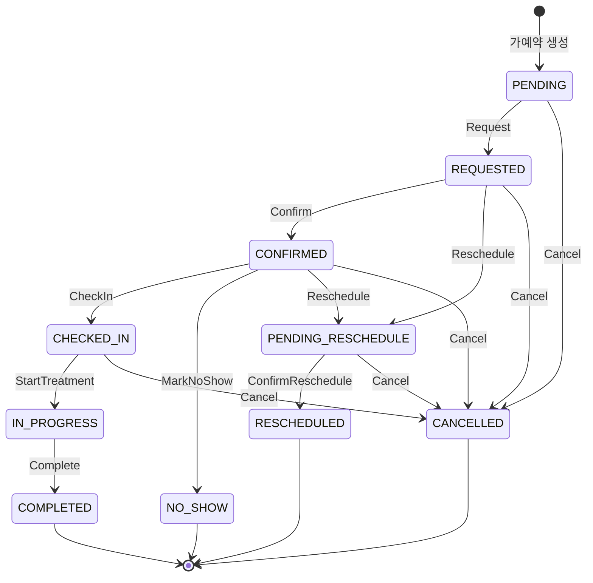
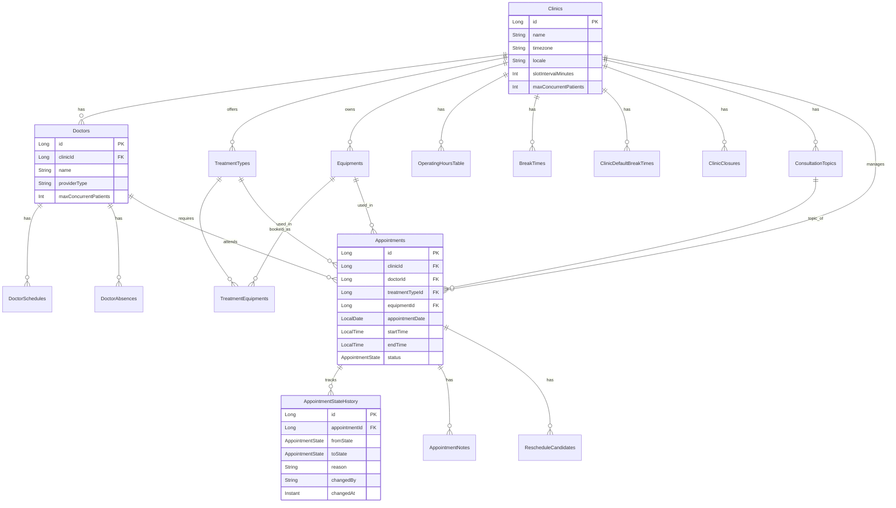
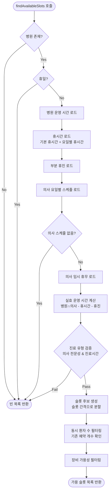
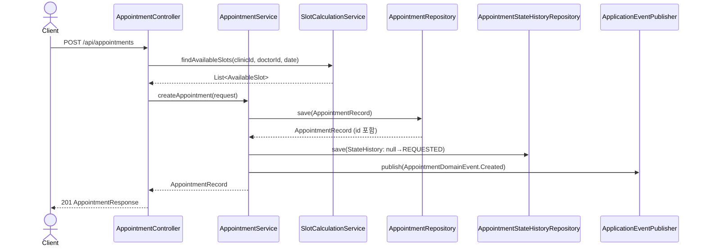

# scheduling 모듈

Exposed v1 기반 의료 예약 관리 시스템. 병원, 의사, 진료 유형, 장비를 고려한 예약 슬롯 계산 및 상태 관리를 제공합니다.

---

## 모듈 구조

```
scheduling/
├── appointment-core
│   ├── 도메인 모델 (Entity, Record)
│   ├── 테이블 정의 (Exposed Table)
│   ├── 저장소 (Repository)
│   ├── 상태 머신 (AppointmentStateMachine)
│   └── 서비스 (SlotCalculationService, ClosureRescheduleService)
├── appointment-api
│   ├── REST 컨트롤러 (AppointmentController, SlotController, RescheduleController)
│   ├── DTO (요청/응답)
│   ├── 보안 (JWT, 역할 기반 접근 제어)
│   └── 설정 (OpenAPI, 데이터 시드)
├── appointment-event
│   ├── 도메인 이벤트 (AppointmentDomainEvent)
│   └── 이벤트 리스너
└── appointment-solver
    ├── OptaPlanner/Timefold 기반 최적화
    └── 휴진 예약 자동 재배정
```

---

## 핵심 도메인 개념

### 예약 상태 전이 (AppointmentState)



### 엔터티 관계도 (ERD)



### 주요 엔터티

| 엔터티 | 설명 |
|--------|------|
| `Clinic` | 병원 기본 정보, 슬롯 간격, 최대 동시 환자 수 |
| `Doctor` | 의사/전문상담사 정보, 제공자 유형, 동시 환자 수 제한 |
| `DoctorSchedule` | 의사의 요일별 운영 시간 |
| `DoctorAbsence` | 의사의 임시 휴무 (날짜/시간대) |
| `Appointment` | 예약 정보, 상태, 예약 시간 |
| `AppointmentStateHistory` | 예약 상태 변경 이력 (감사) |
| `ClinicClosure` | 병원 휴진 (전일/부분) |
| `OperatingHours` | 병원 요일별 운영 시간 |
| `BreakTime` | 병원 요일별 휴시간 |
| `TreatmentType` | 진료 유형, 필요 장비, 기본 소요 시간 |
| `Equipment` | 진료 장비, 수량 |

---

## 주요 테이블 및 인덱스

### 예약 테이블 (`scheduling_appointments`)

**인덱스:**
- `idx_appointments_doctor_date` — 의사별 날짜 조회 (중복 체크, 슬롯 조회)
- `idx_appointments_clinic_date_status` — 병원별 날짜+상태 조회 (활성 예약 목록, 상태 일괄 업데이트)
- `idx_appointments_equipment_date` — 장비별 날짜 조회 (장비 사용량 체크)
- `idx_appointments_date_status` — 날짜+상태 조회 (전체 활성 예약 조회, 리마인더 스케줄러)

### 상태 이력 테이블 (`scheduling_appointment_state_history`)

**인덱스:**
- `idx_appointment_state_history_appointment_changed_at` — 예약별 상태 이력 시간순 조회

---

## API 엔드포인트

### 예약 관리 (`/api/appointments`)

| 메서드 | 경로 | 설명 |
|--------|------|------|
| `GET` | `/api/appointments` | 기간별 예약 조회 |
| `GET` | `/api/appointments/{id}` | 예약 단건 조회 |
| `POST` | `/api/appointments` | 예약 생성 |
| `PATCH` | `/api/appointments/{id}/status` | 상태 변경 |
| `DELETE` | `/api/appointments/{id}` | 예약 취소 |

**예시 요청:**

```bash
# 예약 생성
curl -X POST http://localhost:8080/api/appointments \
  -H "Content-Type: application/json" \
  -d '{
    "clinicId": 1,
    "doctorId": 1,
    "treatmentTypeId": 1,
    "patientName": "김환자",
    "patientPhone": "010-1234-5678",
    "appointmentDate": "2026-04-15",
    "startTime": "09:00:00",
    "endTime": "09:30:00"
  }'

# 상태 변경
curl -X PATCH http://localhost:8080/api/appointments/1/status \
  -H "Content-Type: application/json" \
  -d '{
    "status": "CONFIRMED",
    "reason": "의사 확인 완료"
  }'
```

### 슬롯 조회 (`/api/clinics/{clinicId}/slots`)

| 메서드 | 경로 | 설명 |
|--------|------|------|
| `GET` | `/api/clinics/{clinicId}/slots` | 가용 슬롯 조회 |

**쿼리 파라미터:**
- `doctorId` (필수) — 의사 ID
- `treatmentTypeId` (필수) — 진료 유형 ID
- `date` (필수) — 조회 날짜 (YYYY-MM-DD)
- `requestedDurationMinutes` (optional) — 요청 진료 시간 (분)

**예시 요청:**

```bash
curl "http://localhost:8080/api/clinics/1/slots?doctorId=1&treatmentTypeId=1&date=2026-04-15"
```

**응답 예:**

```json
{
  "success": true,
  "data": [
    {
      "date": "2026-04-15",
      "startTime": "09:00:00",
      "endTime": "09:30:00",
      "doctorId": 1,
      "equipmentIds": [],
      "remainingCapacity": 5
    },
    {
      "date": "2026-04-15",
      "startTime": "09:30:00",
      "endTime": "10:00:00",
      "doctorId": 1,
      "equipmentIds": [],
      "remainingCapacity": 5
    }
  ]
}
```

### 재배정 (`/api/appointments/{id}/reschedule`)

| 메서드 | 경로 | 설명 |
|--------|------|------|
| `POST` | `/api/appointments/{id}/reschedule/closure` | 휴진 일괄 재배정 |
| `GET` | `/api/appointments/{id}/reschedule/candidates` | 재배정 후보 조회 |
| `POST` | `/api/appointments/{id}/reschedule/confirm/{candidateId}` | 수동 재배정 확정 |
| `POST` | `/api/appointments/{id}/reschedule/auto` | 자동 재배정 |

---

## 설정 프로퍼티

### JWT 보안 (`scheduling.security.jwt.*`)

```yaml
scheduling:
  security:
    jwt:
      enabled: true              # 기본값: false (dev/test)
      secret: base64-encoded-key # 최소 256bit
      issuer: appointment-auth-service
      audience: scheduling-api   # (optional)
```

**역할 기반 접근 제어:**

| 역할 | GET (읽기) | POST/PATCH/DELETE (쓰기) |
|------|-----------|-------------------------|
| ADMIN | ✓ | ✓ |
| STAFF | ✓ | ✓ |
| DOCTOR | ✓ | ✗ |
| PATIENT | ✓ | ✗ |

---

## 빠른 시작

### 로컬 실행

```bash
# 1. appointment-api 모듈 빌드
./gradlew :appointment-api:build

# 2. 앱 시작 (개발 프로파일, JWT 비활성화)
./gradlew :appointment-api:bootRun

# 3. Swagger UI 접속
# http://localhost:8080/swagger-ui/index.html

# 4. API 호출
curl "http://localhost:8080/api/appointments"
```

### 테스트 실행

```bash
# 모듈 전체 테스트
./gradlew :appointment-core:test
./gradlew :appointment-api:test

# 특정 테스트만 실행
./gradlew :appointment-api:test --tests "AppointmentControllerTest"
```

### Gatling 스트레스 테스트

```bash
# 앱 시작
./gradlew :appointment-api:bootRun

# 전체 Gatling 실행
./gradlew :appointment-api:gatlingRun

# 특정 시뮬레이션만 실행
./gradlew :appointment-api:gatlingRun \
  --simulation io.bluetape4k.scheduling.appointment.api.ClosureRescheduleSimulation
```

---

## 슬롯 계산 알고리즘

[SlotCalculationService](./appointment-core/src/main/kotlin/io/bluetape4k/scheduling/appointment/service/SlotCalculationService.kt)의 `findAvailableSlots()` 메서드는 다음 순서로 유효한 슬롯을 필터링합니다:



**복잡도:** O(n) (n = 슬롯 간격당 후보 개수)

---

## 상태 머신 (AppointmentStateMachine)

[AppointmentStateMachine](./appointment-core/src/main/kotlin/io/bluetape4k/scheduling/appointment/statemachine/AppointmentStateMachine.kt)은 모든 예약 상태 전이를 검증합니다.

**전이 규칙 예시:**

```kotlin
// PENDING → REQUESTED (요청)
PENDING + Request → REQUESTED

// CONFIRMED → CHECKED_IN (내원확인)
CONFIRMED + CheckIn → CHECKED_IN

// IN_PROGRESS → COMPLETED (완료)
IN_PROGRESS + Complete → COMPLETED

// 모든 상태에서 CANCELLED 허용 (취소)
ANY_STATE + Cancel → CANCELLED
```

허용되지 않은 상태 전이 시 `IllegalStateException`을 발생시킵니다.

---

## 예약 생성 시퀀스



---

## 도메인 이벤트

상태 변경 시 [AppointmentDomainEvent](./appointment-event/src/main/kotlin/...)를 발행합니다:

| 이벤트 | 발생 조건 |
|--------|----------|
| `Created` | 예약 생성 |
| `StatusChanged` | 상태 변경 |
| `Cancelled` | 예약 취소 |

이벤트는 `ApplicationEventPublisher`를 통해 발행되며, `@EventListener` 또는 Spring의 비동기 처리로 리스닝할 수 있습니다.

---

## 의존성

### appointment-core

```kotlin
implementation(Libs.exposed_core)
implementation(Libs.exposed_dao)
implementation(Libs.exposed_java_time)
implementation(Libs.postgresql)
testImplementation(Libs.h2)
```

### appointment-api

```kotlin
api(project(":appointment-core"))
api(project(":appointment-event"))
api(project(":appointment-solver"))

implementation(Libs.springBootStarter("web"))
implementation(Libs.springBootStarter("security"))
implementation(Libs.springdoc_openapi_starter_webmvc_ui)

// Gatling
gatling(Libs.gatling_charts_highcharts)
gatling(Libs.gatling_http_java)
```

---

## 문제 해결

### 슬롯 조회가 빈 결과 반환

1. **병원 운영 시간 확인** — `OperatingHours` 테이블에서 해당 요일 설정 확인
2. **의사 스케줄 확인** — `DoctorSchedules` 테이블에서 의사의 요일별 스케줄 확인
3. **휴진 확인** — `ClinicClosures`, `DoctorAbsences` 테이블에서 해당 날짜 확인
4. **진료 유형 검증** — `TreatmentTypes` 테이블에서 의사 전문성 확인

### JWT 인증 오류

```yaml
# 개발/테스트 환경에서 JWT 비활성화
scheduling:
  security:
    jwt:
      enabled: false
```

### 데이터 시드 자동 로드 안 됨

`TestDataSeederConfig`는 `test` 프로파일에서만 실행됩니다. 로컬 실행 시 수동으로 데이터 입력이 필요합니다.

---

## 참고

- **문서:** 각 클래스의 KDoc 주석 참조
- **테스트:** `/src/test/kotlin` 디렉토리의 테스트 케이스 참조
- **Swagger:** `http://localhost:8080/swagger-ui/index.html` (실행 중)
