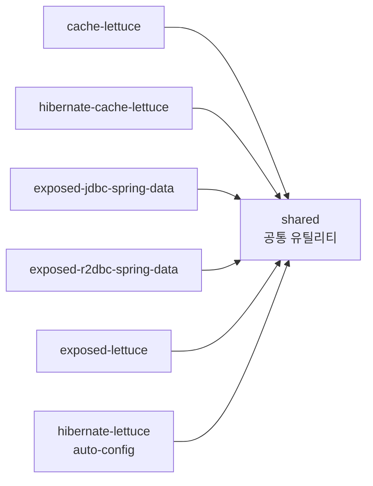

# shared

`bluetape4k-experimental` 프로젝트의 공통 유틸리티 모듈.

여러 실험 모듈에서 공유하는 공통 코드, 설정, 확장 함수 등을 위한 기반 모듈이다.

## 모듈 위치



## 의존성

```kotlin
dependencies {
    implementation("io.github.bluetape4k:bluetape4k-core")
}
```

## 테스트

```bash
./gradlew :shared:test
```
