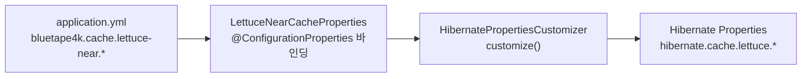
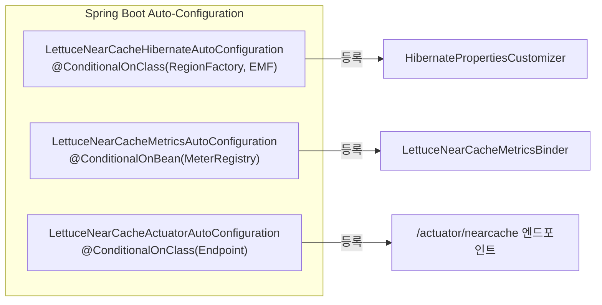

# spring-boot-hibernate-cache-lettuce-near

Hibernate 7 **2nd Level Cache** (Lettuce Near Cache) 를 위한 **Spring Boot 4 Auto-Configuration**.

`application.yml`에 `bluetape4k.cache.lettuce-near.*` 설정만 추가하면 별도 코드 없이 Hibernate Second Level Cache가 자동으로 활성화된다.
밀리초 단위 duration(`500ms`)도 Hibernate 설정으로 그대로 전달된다.

## 특징

- 의존성 추가 + `application.yml` 설정만으로 2nd Level Cache 활성화
- `@ConditionalOnClass` / `@ConditionalOnProperty` 기반 안전한 자동 구성
- **Actuator** 엔드포인트 (`GET /actuator/nearcache`) — region별 캐시 통계
- **Micrometer** 메트릭 (`lettuce.nearcache.*`) — region count, local size

## 최근 변경

- 기본 코덱 값을 `lz4fory`로 유지하고 Boot 4 기준 테스트를 정리
- 프로퍼티 바인딩/자동설정 테스트를 Boot 4 기준으로 정리

## 의존성

```kotlin
// build.gradle.kts
dependencies {
    implementation(project(":hibernate-redis-near"))

    // Spring Boot Starters
    implementation(Libs.springBootStarter("data-jpa"))
    implementation(Libs.springBootStarter("actuator"))   // Actuator 엔드포인트 (선택)
    implementation(Libs.micrometer_core)                 // Micrometer 메트릭 (선택)
}
```

## 빠른 시작

### 1. 의존성 추가 후 application.yml 설정

```yaml
bluetape4k:
    cache:
        lettuce-near:
            redis-uri: redis://localhost:6379
            local:
                max-size: 10000
                expire-after-write: 30m
            redis-ttl:
                default: 120s
            metrics:
                enabled: true
                enable-caffeine-stats: true

spring:
    jpa:
        hibernate:
            ddl-auto: update

management:
    endpoints:
        web:
            exposure:
                include: health, info, metrics, nearcache
```

### 2. Entity에 캐시 어노테이션 추가

```kotlin
@Entity
@Cacheable
@Cache(usage = CacheConcurrencyStrategy.NONSTRICT_READ_WRITE)
class Product(
    @Id @GeneratedValue
    val id: Long = 0,
    val name: String = "",
)
```

### 3. 실행 — 자동 설정 완료

Hibernate properties가 자동으로 주입되어 2nd Level Cache가 활성화된다.

## 설정 옵션 전체 목록

```yaml
bluetape4k:
    cache:
        lettuce-near:
            # 활성화 여부 (기본: true)
            enabled: true

            # Redis 연결 URI
            redis-uri: redis://localhost:6379

            # 직렬화 코덱 (lz4fory | fory | kryo | lz4kryo | lz4jdk | gzipfory | zstdfory | jdk)
            codec: lz4fory

            # RESP3 CLIENT TRACKING 활성화 (Redis 6+ 필요)
            use-resp3: true

            # L1 (Caffeine) 설정
            local:
                max-size: 10000
                expire-after-write: 30m

            # Redis TTL
            redis-ttl:
                default: 120s
                regions:
                    "[io.example.Product]": 300s   # Region별 TTL 오버라이드 (점 포함 키는 대괄호 표기)
                    "[io.example.Order]": 600s

            # Metrics / 통계
            metrics:
                enabled: true
                enable-caffeine-stats: true   # Caffeine CacheStats 수집 (localStats() 활성화)
```

### 설정값 → Hibernate properties 매핑



| Spring 설정                            | Hibernate property                                 |
|--------------------------------------|----------------------------------------------------|
| `redis-uri`                          | `hibernate.cache.lettuce.redis_uri`                |
| `codec`                              | `hibernate.cache.lettuce.codec`                    |
| `use-resp3`                          | `hibernate.cache.lettuce.use_resp3`                |
| `local.max-size`                     | `hibernate.cache.lettuce.local.max_size`           |
| `local.expire-after-write`           | `hibernate.cache.lettuce.local.expire_after_write` |
| `redis-ttl.default`                  | `hibernate.cache.lettuce.redis_ttl.default`        |
| `redis-ttl.regions[name]`            | `hibernate.cache.lettuce.redis_ttl.{name}`         |
| `metrics.enabled=true`               | `hibernate.generate_statistics=true`               |
| `metrics.enable-caffeine-stats=true` | `hibernate.cache.lettuce.local.record_stats=true`  |

## Auto-Configuration 클래스




| 클래스                                          | 조건                                                                   | 역할                                 |
|----------------------------------------------|----------------------------------------------------------------------|------------------------------------|
| `LettuceNearCacheHibernateAutoConfiguration` | `LettuceNearCacheRegionFactory`, `EntityManagerFactory` on classpath | `HibernatePropertiesCustomizer` 등록 |
| `LettuceNearCacheMetricsAutoConfiguration`   | `MeterRegistry` on classpath + Bean                                  | `LettuceNearCacheMetricsBinder` 등록 |
| `LettuceNearCacheActuatorAutoConfiguration`  | `Endpoint` (actuate) on classpath + `EntityManagerFactory` Bean      | `/actuator/nearcache` 엔드포인트 등록     |

## Actuator 엔드포인트

### 전체 Region 통계 조회

```bash
GET /actuator/nearcache
```

```json
{
  "regions": [
    "io.example.Product",
    "io.example.Order"
  ],
  "regionCount": 2,
  "totalLocalSize": 1523
}
```

### 특정 Region 상세 조회

```bash
GET /actuator/nearcache/{regionName}
```

```json
{
  "regionName": "io.example.Product",
  "localSize": 850,
  "localHitCount": 12453,
  "localMissCount": 203,
  "localHitRate": 0.984,
  "l2HitCount": 12050,
  "l2MissCount": 403,
  "l2PutCount": 1200
}
```

## Micrometer 메트릭

`metrics.enabled=true` 설정 시 다음 Gauge가 등록된다.

| 메트릭                              | 태그 | 설명                 |
|----------------------------------|----|--------------------|
| `lettuce.nearcache.region.count` | -  | 활성 Region 수        |
| `lettuce.nearcache.local.size`   | -  | 전체 L1 캐시 항목 수 (추정) |

```bash
# Micrometer 메트릭 조회
GET /actuator/metrics/lettuce.nearcache.region.count
GET /actuator/metrics/lettuce.nearcache.local.size
```

## 비활성화

```yaml
bluetape4k:
    cache:
        lettuce-near:
            enabled: false   # HibernatePropertiesCustomizer, MetricsBinder, Endpoint 모두 비활성화
```

## 테스트 실행

```bash
./gradlew :hibernate-redis-near:test
```

단위 테스트는 `ApplicationContextRunner`로 실제 Redis/DB 없이 실행된다. 통합 테스트(
`LettuceNearCacheIntegrationTest`)는 Testcontainers Redis + H2를 사용한다.

## 관련 모듈

- [`infra/cache-lettuce-near`](../../infra/cache-lettuce-near/README.md) — Near Cache 코어
- [`infra/hibernate-cache-lettuce-near`](../../infra/hibernate-cache-lettuce-near/README.md) — Hibernate Region Factory
- [`examples/hibernate-cache-lettuce-near-demo`](../../examples/hibernate-cache-lettuce-near-demo/) — 전체 동작 예제
