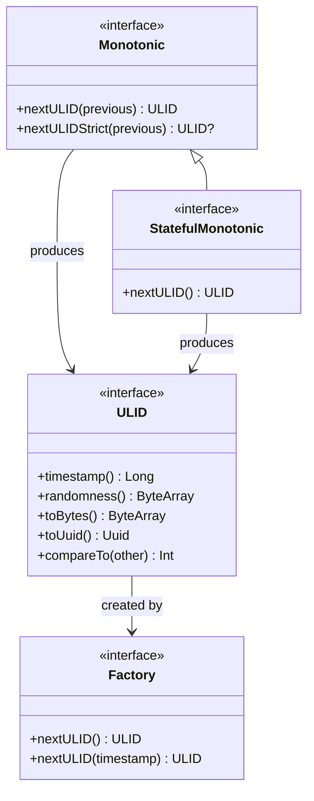
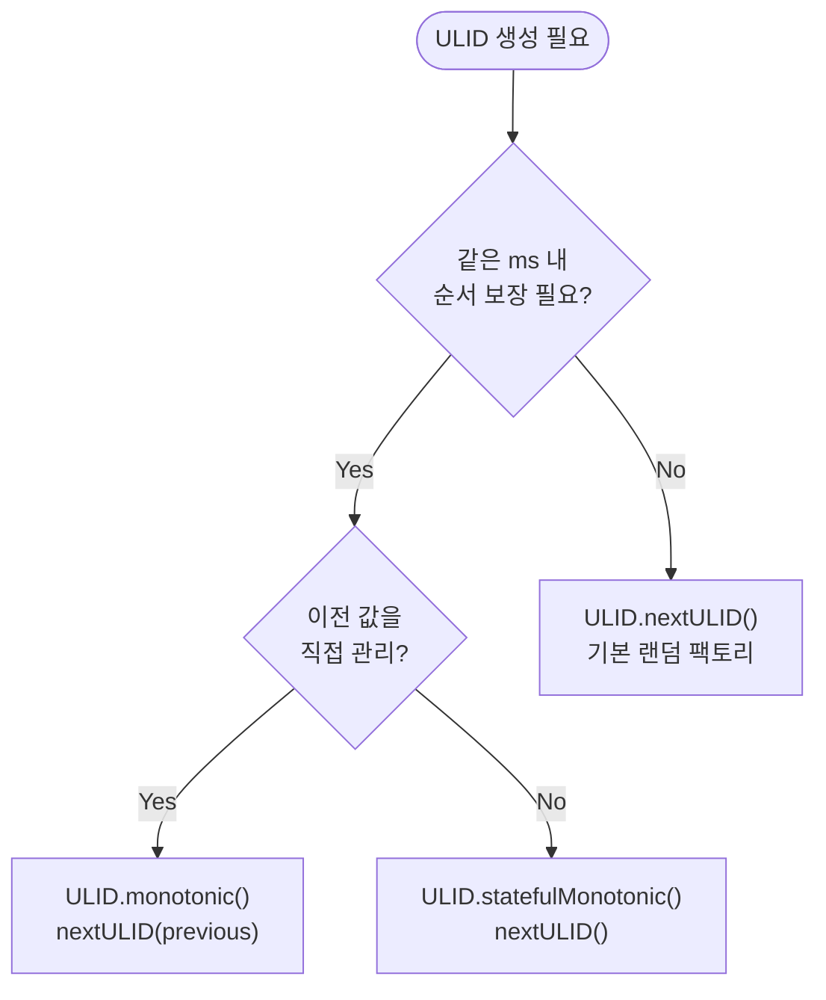

# utils-ulid

Kotlin 기반 **ULID (Universally Unique Lexicographically Sortable Identifier)** 구현체.

UUID와 달리 시간 기반으로 정렬 가능한 128비트 식별자를 제공한다. Crockford Base32 인코딩으로 26자 문자열 표현을 사용한다.

## ULID 구조

```
 01ARZ3NDEKTSV4RRFFQ69G5FAV

 |------------|------------|
  Timestamp    Randomness
   48bits       80bits
```

- **Timestamp (48비트)**: Unix timestamp (밀리초) — 사전순 정렬 보장
- **Randomness (80비트)**: 암호학적 난수 — 충돌 방지
- **인코딩**: Crockford Base32 (26자, 대소문자 무관)



## 제공 API

### `ULID` 인터페이스

| 구성요소                     | 설명                        |
|--------------------------|---------------------------|
| `ULID`                   | ULID 값 인터페이스 (Comparable) |
| `ULID.Factory`           | ULID 생성 팩토리               |
| `ULID.Monotonic`         | 단조 증가(Monotonic) 생성기      |
| `ULID.StatefulMonotonic` | 상태 보존 단조 증가 생성기           |

### Companion 메서드 (기본 팩토리)

```kotlin
// 랜덤 ULID 문자열 생성
val ulidString: String = ULID.randomULID()

// ULID 값 객체 생성
val ulid: ULID = ULID.nextULID()

// 문자열 파싱
val parsed: ULID = ULID.parseULID("01ARZ3NDEKTSV4RRFFQ69G5FAV")

// ByteArray로부터 복원
val fromBytes: ULID = ULID.fromByteArray(bytes)
```

### 커스텀 Random 팩토리

```kotlin
val factory: ULID.Factory = ULID.factory(random = SecureRandom())
val ulid = factory.nextULID()
```

### 단조 증가 (Monotonic)

같은 밀리초 내에서 생성된 ULID의 순서를 보장한다 (랜덤 비트 최하위 비트를 1씩 증가).

```kotlin
val monotonic: ULID.Monotonic = ULID.monotonic()

var previous = ULID.nextULID()
repeat(1000) {
    val next = monotonic.nextULID(previous)
    check(next > previous)
    previous = next
}
```

#### Strict 모드 (오버플로우 감지)

```kotlin
val next: ULID? = monotonic.nextULIDStrict(previous)
// 같은 밀리초 내에서 랜덤 비트가 오버플로우되면 null 반환
```

### 상태 보존 단조 증가 (StatefulMonotonic)

이전 값을 내부에 유지하므로 매 호출마다 이전 값을 넘길 필요가 없다.

```kotlin
val stateful: ULID.StatefulMonotonic = ULID.statefulMonotonic()

val a = stateful.nextULID()
val b = stateful.nextULID()
val c = stateful.nextULID()

check(a < b && b < c)
```

## UUID 변환

Kotlin `kotlin.uuid.Uuid` 및 Java `java.util.UUID`와 상호 변환을 지원한다.

```kotlin
// ULID → Kotlin Uuid
val uuid: Uuid = ulid.toUuid()

// Kotlin Uuid → ULID
val backToUlid: ULID = ULID.fromUuid(uuid)

// ULID → Java UUID
val javaUuid: java.util.UUID = ulid.toJavaUUID()

// Java UUID → ULID
val fromJava: ULID = ULID.fromJavaUUID(javaUuid)
```

#### 생성기 선택 가이드



## ULID vs UUID 비교

| 특성    | ULID                   | UUID v4       |
|-------|------------------------|---------------|
| 정렬 가능 | ✅ 시간 기반 사전순 정렬         | ❌             |
| 표현 길이 | 26자 (Crockford Base32) | 36자 (UUID 형식) |
| 단조 증가 | ✅ Monotonic 지원         | ❌             |
| 충돌 확률 | 동일 ms 내 1.21e+24       | 5.3e+36       |
| 이진 크기 | 16바이트                  | 16바이트         |

## 테스트

```bash
./gradlew :ulid:test
```
